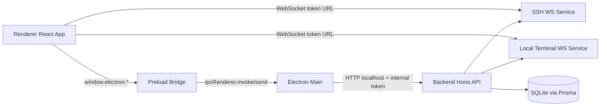
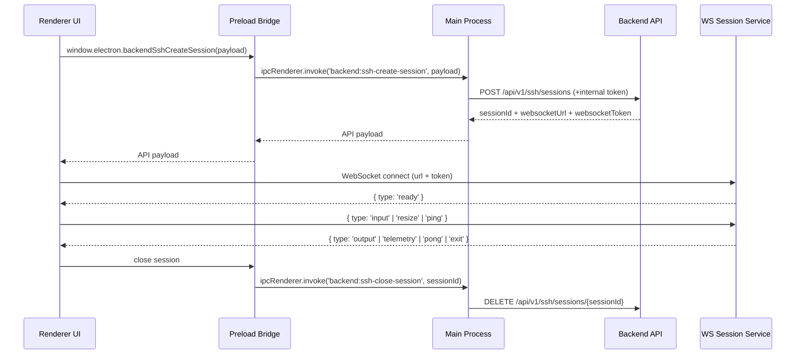
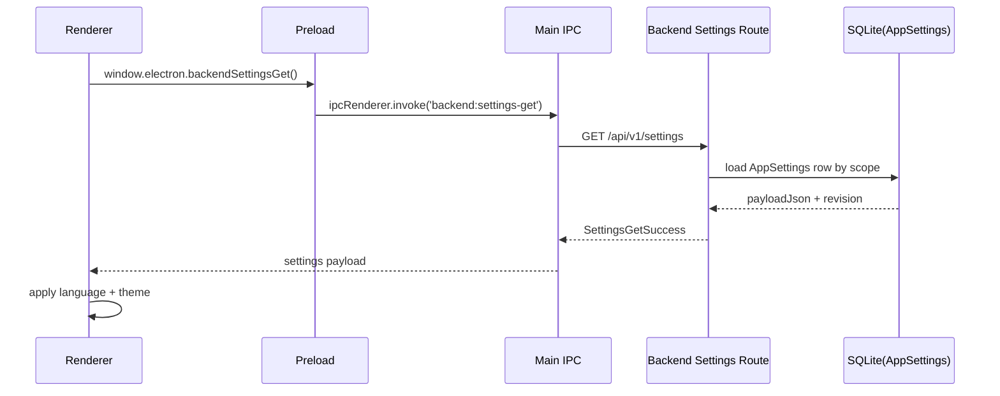
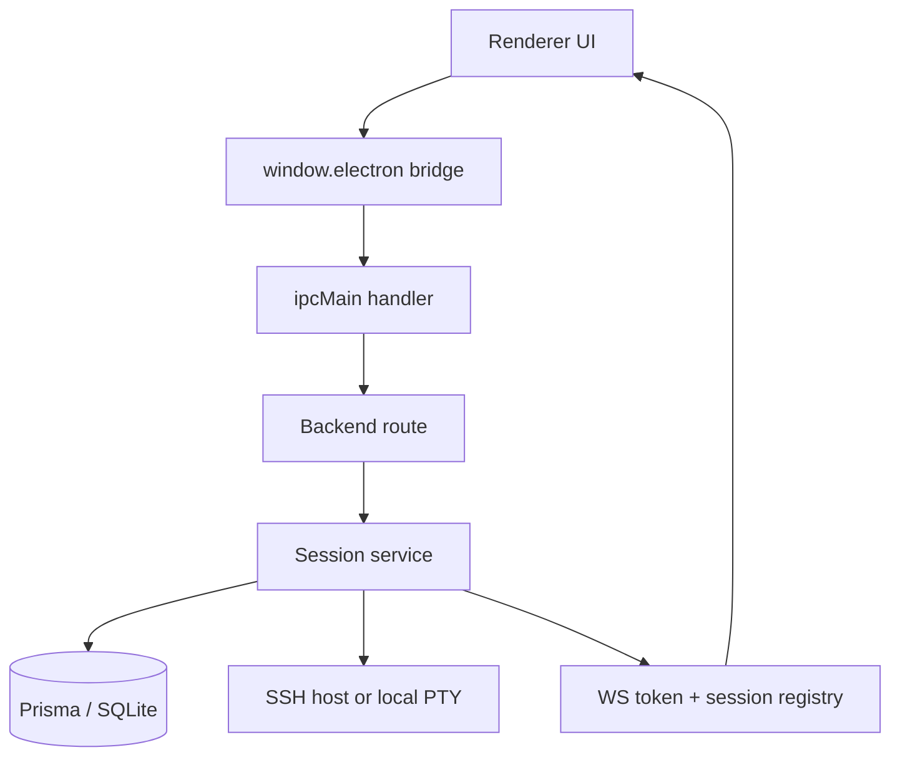
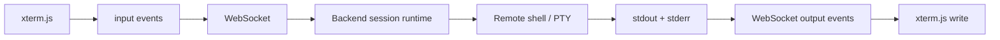
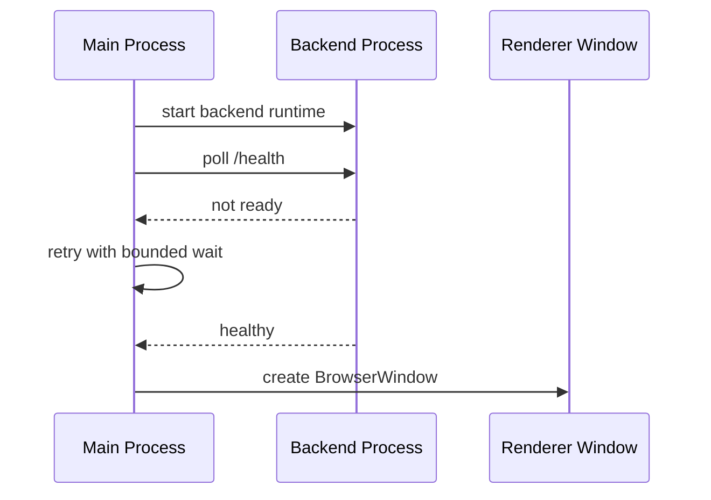
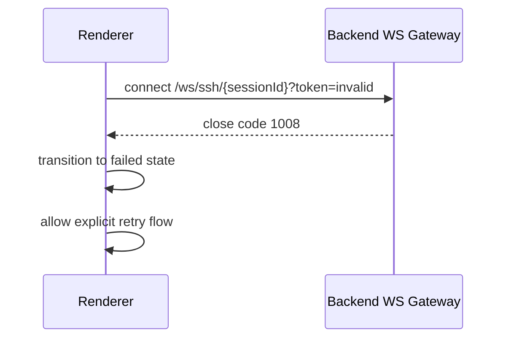
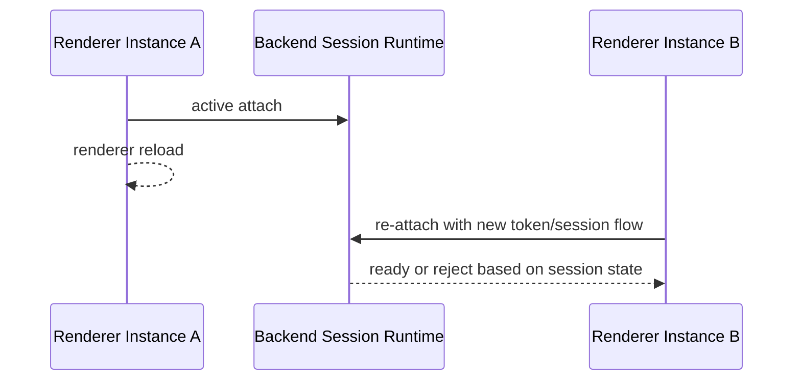
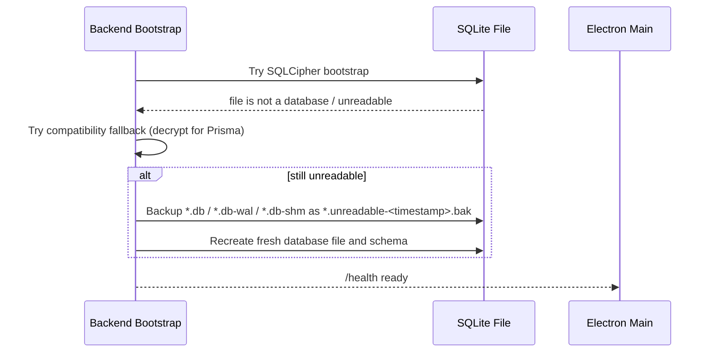

# Cosmosh Architecture

## 1. Runtime Topology

Cosmosh uses an Electron dual-process model with an embedded backend service:

- **Main Process** (`packages/main/src/index.ts`): app lifecycle, BrowserWindow creation, preload wiring, IPC registration, backend process orchestration.
- **Preload Bridge** (`packages/main/src/preload.ts`): strict API surface exposed via `contextBridge`.
- **Renderer Process** (`packages/renderer/src`): React UI, xterm UI, state orchestration.
- **Backend Process** (`packages/backend/src/index.ts`): Hono HTTP API + WebSocket session services for SSH and local terminal.

## 2. Main ↔ Renderer Responsibilities

### Main Process (`packages/main/src/index.ts`)

- Starts backend process and waits for `/health` before opening UI.
- Owns app-level capabilities: locale persistence (in-memory), window/devtools/file-manager actions.
- Proxies renderer requests to backend endpoints with:
  - `COSMOSH_INTERNAL_TOKEN` as internal auth header.
  - locale header for i18n-compatible backend responses.

### Backend Process (`packages/backend/src/index.ts`)

- Registers idempotent graceful-shutdown flow for runtime signals and fatal process events.
- Shutdown order is explicit: stop WS session services, close HTTP listener, then disconnect Prisma/SQLite handles.
- Windows-specific termination (`SIGBREAK`) is handled in the same path as POSIX signals to reduce stale DB lock cases.

### Renderer Process (`packages/renderer/src`)

- Uses `window.electron` bridge only (no direct Node API usage).
- Creates SSH/local terminal sessions through backend APIs.
- Connects terminal data channels through WebSocket and renders with `xterm.js`.

## 3. IPC Lifecycle (Current)

## 4. Security Model

### Electron Surface Hardening

- `nodeIntegration: false`
- `contextIsolation: true`
- Renderer gets only explicit bridge APIs via `contextBridge.exposeInMainWorld`.
- Internal privileged operations stay in Main/Backend process.

### Backend Access Boundary

- Backend is localhost-only and guarded by an internal runtime token (`COSMOSH_INTERNAL_TOKEN`) in electron-main mode.
- Main process injects headers and never exposes internal token to renderer.
- Credential encryption key is derived from `COSMOSH_SECRET_KEY`/internal token hash in backend bootstrap.
- HTTP i18n is request-scoped: backend middleware resolves locale from `x-cosmosh-locale` (fallback `accept-language`), then injects a per-request translator used by all route response messages.
- WS runtime i18n is session-scoped: session creation carries resolved locale into SSH/local terminal runtime so WS `error`/`exit` messages and close reasons are localized consistently.

### Session Channel Hardening

- WebSocket path includes sessionId and query token.
- Token mismatch or stale session causes immediate close (`1008`).
- Session attach timeout is enforced (30 seconds) to avoid orphaned resources.

## 5. Current Gaps / Planned Work

- SFTP runtime channel is not implemented yet; only SSH terminal and local terminal session channels are active.
- Renderer has SFTP entry placeholders in Home context menu; actual SFTP page/session wiring remains planned.

## 5.1 Settings Runtime (Implemented)

- Settings are now persisted by backend route `GET/PUT /api/v1/settings`.
- Storage model is a single-row JSON payload per scope (`scopeAccountId` + `scopeDeviceId`) in `AppSettings`.
- Scope defaults to local device (`deviceId=local-device`) while keeping account scope field for future sync.
- Renderer bootstrap (`packages/renderer/src/main.tsx`) applies persisted language/theme at startup.
- Non-visual settings (for example SSH runtime limits) are persisted and discoverable, but some are intentionally not bound to runtime behavior yet.
- All setting definitions (types, defaults, constraints, enum sets, UI metadata, categories) live in a single registry: `packages/api-contract/src/settings-registry.ts`. Adding or removing a setting only requires editing this file (plus i18n locale files).
- Validation logic in `packages/api-contract/src/settings.ts` is now generic and registry-driven: per-key rules (type check, enum, range, maxLength) are derived from the registry at runtime — no manual switch/case per key.
- The OpenAPI `SettingsValues` schema is intentionally loose (`type: object`); strict TypeScript types and constraints live exclusively in the code registry.
- Settings API response types (`ApiSettingsGetResponse`, `ApiSettingsUpdateResponse`) are hand-crafted in `packages/api-contract/src/index.ts` using the strict `SettingsValues` from the registry rather than generated from OpenAPI.
- Stored settings payload parsing is forward-compatible: missing/new fields are backfilled per-field from defaults instead of resetting the entire settings object.
- Strict full-schema validation is still enforced for update requests (`PUT /api/v1/settings`) to keep persisted payload shape deterministic.

## 6. Core Data-Flow Views

### 6.1 Session Bootstrap Data Flow

### 6.2 Runtime Stream Data Flow

### 6.3 Failure Boundary Model

- **Renderer boundary**: visual state and user interaction; failures should stay recoverable via UI retry.
- **Main boundary**: capability routing and internal auth injection; failures should never leak privileged tokens.
- **Backend boundary**: protocol validation, session lifecycle, and resource cleanup ownership.
- **Remote boundary**: SSH host / local shell instability is treated as external and mapped to stable UI error codes.

## 7. Architecture Decision Rationale

- Keep the backend as a separate runtime process to isolate protocol and credential handling from renderer attack surface.
- Use preload as a minimal bridge to reduce API exposure and preserve strict process contracts.
- Prefer WS data plane for terminal streams to avoid IPC bottlenecks on high-frequency I/O.
- Keep main as orchestrator/proxy instead of business-logic host for easier future server-client decoupling.

## 8. Boundary Case Playbook

### 8.1 Backend Not Ready at Startup

Handling principle:

- UI should open only after backend health is confirmed.
- Startup failure paths should be explicit and observable.

### 8.2 WS Attach Token Mismatch

Handling principle:

- Token/session mismatch is security-sensitive and must fail closed.
- Recovery should create a fresh session/token path.

### 8.3 Renderer Reload During Active Session

Handling principle:

- Session runtime must guard against stale attach state.
- Renderer should treat reload as a new lifecycle and re-establish state explicitly.

### 8.4 Unreadable SQLite File During Startup

Handling principle:

- Prefer preserving startup availability over hard-crashing on unreadable local state.
- Preserve forensic recoverability by backing up unreadable database artifacts before reset.
