# Cosmosh Architecture

## 1. Runtime Topology

Cosmosh uses an Electron dual-process model with an embedded backend service:

- **Main Process** (`packages/main/src/index.ts`): app lifecycle, BrowserWindow creation, preload wiring, IPC registration, backend process orchestration.
- **Preload Bridge** (`packages/main/src/preload.ts`): strict API surface exposed via `contextBridge`.
- **Renderer Process** (`packages/renderer/src`): React UI, xterm UI, state orchestration.
- **Backend Process** (`packages/backend/src/index.ts`): Hono HTTP API + WebSocket session services for SSH/local terminal, plus SFTP browser, download, file-operation sessions, and SSH port-forwarding runtimes.

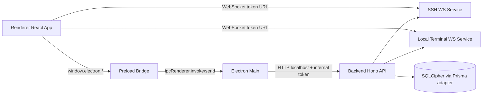
```mermaid
flowchart LR
  R[Renderer React App] -->|window.electron.*| P[Preload Bridge]
  P -->|ipcRenderer.invoke/send| M[Electron Main]
  M -->|HTTP localhost + internal token| B[Backend Hono API]
  R -->|WebSocket token URL| WS1[SSH WS Service]
  R -->|WebSocket token URL| WS2[Local Terminal WS Service]
  B --> WS1
  B --> WS2
  B --> DB[(SQLCipher via Prisma adapter)]
```

## 2. Main ↔ Renderer Responsibilities

### Main Process (`packages/main/src/index.ts`)

- Starts BrowserWindow and backend warmup in parallel during app bootstrap.
- Keeps a single in-flight backend startup promise to deduplicate concurrent startup triggers.
- Main-process backend proxy requests now ensure backend readiness before forwarding HTTP calls.
- In development startup, main uses an incremental preflight (`packages/main/scripts/dev-preflight.cjs`) and skips `@cosmosh/api-contract` / `@cosmosh/i18n` rebuilds when outputs are fresh. The same lifecycle probes the SQLCipher native binding under the system Node runtime and rebuilds it only when the current ABI is incompatible.
- Development profiles are managed by `pnpm dev:profile` (`scripts/dev-profile.mjs`). When a profile is selected or passed through `COSMOSH_DEV_PROFILE`, main applies it before window/backend startup so Electron `userData`, the SQLite file, and backend-only secret storage all resolve under `.cosmosh/dev-profiles/<name>/`.
- `packages/main/scripts/dev-main.cjs` runs under the workspace system Node, compiles Main, and passes that canonical Node executable to Electron through the development-only `COSMOSH_DEV_NODE_EXEC_PATH` handoff.
- Main launches the development backend directly with the validated system Node executable and `tsx`, avoiding both package-script orphan processes and Electron-versus-Node native ABI conflicts. Packaged Main continues to launch the synchronized backend with Electron's `process.execPath` plus `ELECTRON_RUN_AS_NODE=1`.
- Production packaging does not rely on the app asar to resolve backend packages. Main prebuild copies built backend/api-contract/i18n artifacts plus curated recursive third-party runtime dependencies into `packages/main/resources-runtime/node_modules`, then validates every non-workspace `@cosmosh/backend` production dependency resolves there. Any new backend production dependency must be covered by `packages/main/scripts/sync-backend-runtime.cjs`, otherwise installer builds fail before launch instead of shipping a missing module.
- CI packaging can also write `resources/remote-bootstrap/manifest-url.json` when `COSMOSH_REMOTE_BOOTSTRAP_MANIFEST_URL` is provided. Packaged main reads this resource only as a fallback after the environment variable, preserving local override behavior while allowing tagged release installers and `main` build artifacts to discover their intended bootstrap manifest automatically. Unpackaged development runs fall back once more to the rolling `remote-bootstrap-dev` manifest URL, so local Remote Enhancements testing does not require per-shell setup.
- Owns app-level capabilities: locale persistence (in-memory), window/devtools/file-manager actions.
- Owns the window/app close guard. Main prevents the initial close, queries backend-owned SSH/SFTP registries, delegates confirmation presentation to the renderer, and closes only after no activity is present or the user explicitly confirms interruption.
- Proxies renderer requests to backend endpoints with:
  - `COSMOSH_INTERNAL_TOKEN` as internal auth header.
  - locale header for i18n-compatible backend responses.

#### Development Backend Runtime Boundary

The development launcher owns the system Node executable handoff because it runs before Electron replaces `process.execPath`. Main accepts only an absolute path that resolves to a canonical regular file, requires the POSIX executable bits where applicable, rejects the Electron host executable itself, and removes the handoff variable before spawning Backend. This value is development orchestration metadata, not part of the Backend environment contract.

Development and packaging intentionally use different native targets. The Main and standalone Backend `predev` lifecycles, plus Backend `predb:init`, invoke `ensure-sqlcipher-native.cjs --runtime=node --if-needed`; packaging invokes the same script without arguments to force an Electron-targeted release rebuild. Both paths open and close an in-memory database under the selected runtime after building; a failed probe aborts before Backend startup or packaged-runtime synchronization. On Windows, all Cosmosh processes using the shared binding must be closed before switching targets because a loaded `.node` file cannot be replaced.

### Backend Process (`packages/backend/src/index.ts`)

- Registers idempotent graceful-shutdown flow for runtime signals and fatal process events.
- Exposes internal-token-protected runtime connection summary/close operations used only by Main's close guard; renderer does not receive a bulk-disconnect bridge.
- Shutdown order is explicit: stop WS session services, close HTTP listener, then disconnect Prisma/SQLite handles.
- Windows-specific termination (`SIGBREAK`) is handled in the same path as POSIX signals to reduce stale DB lock cases.
- Local terminal profile discovery now uses short-lived in-memory caching and parallel probing, reducing repeated profile scan latency on Home/Settings first-load paths.
- After the primary SSH transport authenticates and before it opens the interactive PTY, `SshSessionService` runs the Remote Enhancements ensure flow through `RemoteBootstrapService` when global and server-level gates allow it. Remote commands use a lazily opened temporary SSH transport with the same credential, host-trust, compression, and proxy policy; graceful teardown of that transport begins before the primary calls `shell()`. The primary transport therefore never opens a bootstrap `exec` channel, preserving server login messages while still allowing a newly installed profile hook to load in the first interactive shell. Backend owns manifest loading, remote probing, installed-status validation, conditional download orchestration, status forwarding, runtime event gating, and audit logging; `packages/remote-bootstrap` owns the downloaded user-scoped Go installer plus the generated helper's protocol/capability contract. The manifest URL comes from `COSMOSH_REMOTE_BOOTSTRAP_MANIFEST_URL` first, then the packaged CI resource when present, then the development-only `remote-bootstrap-dev` default for unpackaged runs. Tagged release packages point to a versioned release manifest; `main` packages point to the fixed `remote-bootstrap-dev` prerelease manifest; pushed branches whose name contains `remote-bootstrap` can point to branch-scoped temporary prerelease manifests for end-to-end CI testing. A current installed contract skips asset download; an ensure failure starts temporary-transport teardown, disables enhancement data for that session, and does not prevent the already-authenticated primary transport from opening an ordinary shell.
- `SshSessionService` preserves original PTY ordering when `RemoteShellEventOscParser` separates visible output from helper events. It forwards ordered frames instead of grouping them by type, so echoed input and line movement that precede `command-start` reach renderer xterm before command-marker geometry is captured. While the WebSocket is detached, both frame kinds share one bounded arrival-ordered queue; attach sends current control state first and then flushes retained frames without reordering them.
- `RemoteBootstrapService` shares concurrent manifest loads and caches only validated successes for five minutes. Session cancellation stops one waiter without aborting the shared request; failed loads remain immediately retryable.
- Startup includes idempotent Prisma migration-file execution in `initializeDatabase(...)`, so first install launch and every subsequent launch both converge local DB structure to the current backend schema contract before serving HTTP routes.
- Production constructs Prisma with `PrismaSqlCipherAdapterFactory`; the factory loads the `better-sqlite3-multiple-ciphers` native binding into Prisma's better-sqlite3 adapter and applies the database key before exposing the connection. Schema migrations and business queries therefore share one keyed SQLCipher connection path.
- A canonical plaintext SQLite header triggers a one-time copy/rekey/verify/replace migration. Unknown or wrong-key files fail without plaintext fallback, and fixed migration artifacts allow interrupted rename windows to recover on the next startup.
- Simple Prisma `ALTER TABLE ... ADD COLUMN` migrations are reconciled against live SQLite table metadata before execution. If a column already exists but `_prisma_migrations` lacks the row, startup records the migration as applied instead of re-running duplicate DDL; non-simple migration drift still fails fast.
- Schema sync is fail-fast: backend startup stops when required tables still cannot be reconciled after runtime migration execution, preventing partial/undefined API behavior.
- Migration ledger metadata is stored in Prisma-compatible `_prisma_migrations` format to keep a future path open for native `prisma migrate deploy/resolve` workflows.

### Renderer Process (`packages/renderer/src`)

- Uses `window.electron` bridge only (no direct Node API usage).
- Creates SSH/local terminal sessions and SFTP browser/download/file-operation sessions through backend APIs.
- Connects terminal data channels through WebSocket and renders with `xterm.js`.
- Non-home renderer pages, including SSH and the CodeMirror-backed settings editor, are lazy-loaded to keep heavyweight assets out of the default startup path.
- Renderer bootstrap hydrates settings from local cache first, then refreshes canonical values from backend in background.
- Development StrictMode is opt-in via `VITE_ENABLE_STRICT_MODE=true` to reduce duplicate effect execution during local performance profiling.
- SSH page uses tab-scoped connection intent snapshots and pane-scoped runtimes. Every primary/secondary pane owns its xterm, WebSocket/session, transport state, telemetry, completion state, Remote Enhancements state, debug history, and trusted command timeline markers; all inbound messages use one pane-aware reducer. Complete timeline command text is reconstructed from rendered xterm input and remains only in that pane runtime's memory.
- Terminal Presentation Integration is a separate pane-scoped renderer domain. PTY output reaches `terminal.write(...)` unchanged, and the xterm parser is the only control-sequence parser for OSC 0/2 application titles, OSC 9;4 progress, and standalone BEL events. The resulting memory-only state is reset on reconnect and removed with its pane, then projected through a pure tab aggregator into the active-pane title, prioritized progress, and retained Bell/error attention. `App` supplies this ephemeral projection to tab chrome without writing application titles into stored tab identity. It neither depends on nor enables Shell Integration, Remote Bootstrap, or OSC 777 Remote Enhancements.
- Hidden tabs cannot start new SSH connect side effects. On reactivation, the optional reconnect-on-focus path evaluates every failed pane independently, while the first activation always starts a deferred primary pane. Retrying or reconnecting one pane preserves all sibling pane runtimes.
- Renderer consumes backend `bootstrap-status`, `remote-enhancement-runtime-status`, and trusted protocol-v2 `remote-shell-event` messages per pane. Debug visibility is controlled by `remoteEnhancementsDebugEnabled`, and the overlay always reflects its source/active pane.

## 3. IPC Lifecycle (Current)

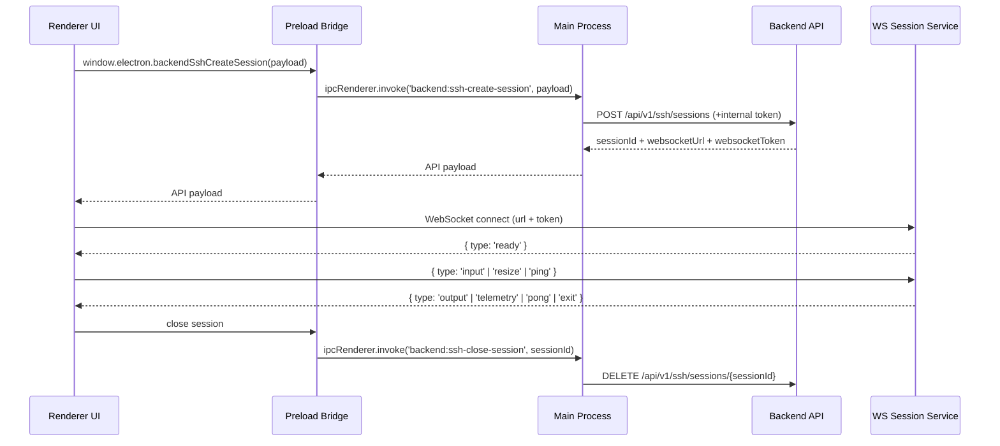
```mermaid
sequenceDiagram
  participant UI as Renderer UI
  participant PB as Preload Bridge
  participant MP as Main Process
  participant BE as Backend API
  participant WS as WS Session Service

  UI->>PB: window.electron.backendSshCreateSession(payload)
  PB->>MP: ipcRenderer.invoke('backend:ssh-create-session', payload)
  MP->>BE: POST /api/v1/ssh/sessions (+internal token)
  BE-->>MP: sessionId + websocketUrl + websocketToken
  MP-->>PB: API payload
  PB-->>UI: API payload

  UI->>WS: WebSocket connect (url + token)
  WS-->>UI: { type: 'ready' }
  UI->>WS: { type: 'input' | 'resize' | 'ping' }
  WS-->>UI: { type: 'output' | 'telemetry' | 'pong' | 'exit' }

  UI->>PB: close session
  PB->>MP: ipcRenderer.invoke('backend:ssh-close-session', sessionId)
  MP->>BE: DELETE /api/v1/ssh/sessions/{sessionId}
```

## 3.1 Guarded Window And App Close Lifecycle

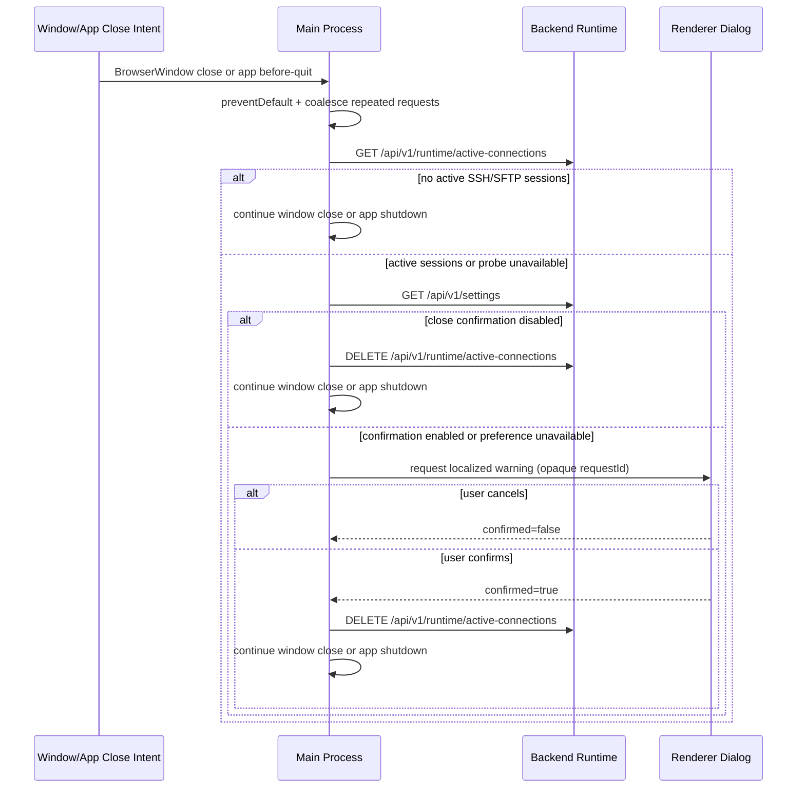
```mermaid
sequenceDiagram
  participant OS as Window/App Close Intent
  participant MP as Main Process
  participant BE as Backend Runtime
  participant RD as Renderer Dialog

  OS->>MP: BrowserWindow close or app before-quit
  MP->>MP: preventDefault + coalesce repeated requests
  MP->>BE: GET /api/v1/runtime/active-connections
  alt no active SSH/SFTP sessions
    MP->>MP: continue window close or app shutdown
  else active sessions or probe unavailable
    MP->>BE: GET /api/v1/settings
    alt close confirmation disabled
      MP->>BE: DELETE /api/v1/runtime/active-connections
      MP->>MP: continue window close or app shutdown
    else confirmation enabled or preference unavailable
      MP->>RD: request localized warning (opaque requestId)
      alt user cancels
        RD-->>MP: confirmed=false
      else user confirms
        RD-->>MP: confirmed=true
        MP->>BE: DELETE /api/v1/runtime/active-connections
        MP->>MP: continue window close or app shutdown
      end
    end
  end
```

- An active connection is an SSH or SFTP session still present in the backend service registry. Local terminals and port-forwarding runtimes are intentionally outside this warning scope.
- `windowCloseConfirmationEnabled` is registered under General > Behavior and defaults to `true`. Main reads this persisted backend setting only when active sessions exist or the activity probe is unavailable. Disabling it skips the renderer dialog but still closes registered SSH/SFTP sessions before window or application shutdown; a preference read failure preserves the default warning behavior.
- Main validates non-negative, internally consistent counts before using them. A failed or malformed probe follows the configured confirmation behavior instead of silently closing or permanently blocking exit.
- Repeated title-bar, last-tab, menu, and shortcut close requests share one in-flight decision. Main binds the renderer response to both an opaque request ID and the owning `webContents`; preload validates and buffers the request until the React listener is mounted. A responsive renderer timeout resolves to the safe cancel decision, while an unavailable or destroyed renderer is allowed to exit instead of becoming permanently blocked.
- On Windows and Linux, an approved main-window close continues through full application shutdown. On macOS, an approved window-only close disconnects SSH/SFTP sessions before destroying the window while leaving the application runtime available for activation; app quit still runs full shutdown.
- Fatal startup/process exits bypass interactive confirmation but retain the existing backend and SFTP temporary-root cleanup path.

## 4. Security Model

### Electron Surface Hardening

- `nodeIntegration: false`
- `contextIsolation: true`
- Renderer gets only explicit bridge APIs via `contextBridge.exposeInMainWorld`.
- Renderer Content Security Policy keeps `script-src` restricted to `'self'` plus `'wasm-unsafe-eval'`. The WebAssembly allowance is required by renderer-bundled libraries such as `@xterm/addon-image` for inline image decoding, and does not enable general JavaScript `eval`.
- The sandboxed preload script must not import workspace packages at runtime. It may use shared API contract types at compile time, but runtime validators used inside preload must stay local or be bundled so Electron does not need to resolve project modules before the bridge loads.
- Internal privileged operations stay in Main/Backend process.
- Renderer-requested app windows are denied by default. The current allow-list only permits same-renderer SFTP Properties popups, and those child windows reuse the secure preload with `nodeIntegration` disabled and `contextIsolation` enabled.

### Backend Access Boundary

- Backend HTTP explicitly binds to the IPv4 loopback interface (`127.0.0.1`) in every runtime mode. The listener must never rely on the Node server default, which can expose standalone development APIs on non-loopback interfaces.
- The Vite renderer development server also binds explicitly to `127.0.0.1`. Electron's development load URL, renderer popup trust origin, renderer CSP, and Backend CORS must use that exact origin and the shared `COSMOSH_RENDERER_DEV_PORT`; `localhost` is not an interchangeable development origin.
- Electron-main mode additionally guards `/api/v1/*` with an internal runtime token (`COSMOSH_INTERNAL_TOKEN`). Standalone mode remains loopback-only even though it does not require that token.
- Main process injects headers and never exposes internal token to renderer.
- Development request mirror: in unpackaged development runs, Main records sanitized mirrors of backend proxy requests into an in-memory ring buffer and exposes them to the custom DevTools panel through debug IPC. This does not change the real request path (`renderer -> preload IPC -> main -> backend`), does not issue mirror fetches, and does not add fake rows to the native Network tab. The mirror redacts internal auth headers, secret-like payload keys, and local absolute paths before renderer/DevTools visibility. Production packages do not collect traces or load the extension. If the `Cosmosh Requests` panel is missing in development, check the main-process terminal for the `[debug]` extension load/skip log first.
- Main also capability-gates local SFTP download destinations. App utility IPC authorizes an exact normalized path for the requesting renderer webContents, and the backend proxy rejects any download path without that owner-bound authorization. Temporary preview/open paths are reusable; Downloads and save-dialog paths are consumed after one request.
- Credential encryption key is derived from `COSMOSH_SECRET_KEY`/internal token hash in backend bootstrap.
- HTTP i18n is request-scoped: backend middleware resolves locale from `x-cosmosh-locale` (fallback `accept-language`), then injects a per-request translator used by all route response messages.
- WS runtime i18n is session-scoped: session creation carries resolved locale into SSH/local terminal runtime so WS `error`/`exit` messages and close reasons are localized consistently.
- i18n runtime is resource-injected: consumers register locale JSON payloads during `createI18n(...)` setup, so each process bundles only its required scope data.

### Session Channel Hardening

- WebSocket path includes sessionId and query token.
- Token mismatch or stale session causes immediate close (`1008`).
- Session attach timeout is enforced (30 seconds) to avoid orphaned resources.

### Release Supply-Chain Boundary

- Ordinary CI and rolling remote-bootstrap channels remain separate from versioned public releases. The rolling `remote-bootstrap-dev` and `remote-bootstrap-branch-*` assets are intentionally replaceable; tagged applications use only their exact versioned manifest URL.
- GitHub Actions are pinned to full commit SHAs and updated through reviewed Dependabot pull requests. Build jobs are repository read-only and stage short-lived workflow artifacts; only the final release job can create or update a draft.
- Formal release assembly validates the complete platform inventory, writes `SHA256SUMS`, creates GitHub provenance attestations, and refuses to modify a release after publication.
- Windows signing is currently policy-gated. `audit` permits a visibly marked unsigned draft for pipeline validation, while `enforce` requires valid Authenticode signatures, timestamps, and the configured publisher identity before draft creation.
- Draft mutability is intentional. Repository-side immutable releases, a protected `release` environment, and a `v*` tag ruleset complete the boundary before the first public release. See [Release Security](./release-security.md) for the operating contract and remaining setup.

## 5. Runtime Capabilities

- SSH and local terminal sessions use WebSocket data channels for terminal I/O.
- SSH sessions ensure the user-scoped Remote Enhancements runtime after primary transport authentication and before PTY creation when Settings `remoteEnhancementsEnabled`, the server record `remoteEnhancementsEnabled`, and a manifest URL allow it. The first remote command lazily opens a separate bootstrap transport; all probe/install/status `exec` channels stay there, and its teardown begins before `shell()` becomes the primary transport's first session channel. This optional pre-shell path has a shared 15-second budget across settings, manifest I/O, bootstrap transport/proxy connection, and exec work. Expiry cancels active work, destroys the temporary client, and opens an ordinary PTY with code `BOOTSTRAP_ENSURE_TIMEOUT`. Disabled gates emit `REMOTE_ENHANCEMENTS_DISABLED`; missing manifest configuration remains an explicit failed bootstrap status before any bootstrap transport or remote probe is opened. The installed Go binary is queried first; matching version, manifest asset SHA-256, protocol, helper, and profile state skips download, while missing or legacy status triggers reinstall and post-install verification. Tagged release installers, `main` build artifacts, and opted-in remote-bootstrap branch builds can provide the default manifest URL through the packaged `remote-bootstrap/manifest-url.json` resource, while `COSMOSH_REMOTE_BOOTSTRAP_MANIFEST_URL` remains the explicit override. Unpackaged development runs use `remote-bootstrap-dev` when neither override nor packaged resource is present. Ordinary PR and branch builds do not package a default manifest URL. The Go installer writes only remote user XDG/home files and shell profile hooks; see `packages/remote-bootstrap/README.md` for the module contract.

- Remote helper data uses a fail-closed `pending` → `active` / `disabled` state machine. A successful ensure enters `pending`; only a matching `integration-ready` event within 10 seconds activates consumption, and missing the deadline yields `HELPER_HANDSHAKE_TIMEOUT`. Protocol-v2 events must match the pre-shell helper version, protocol version, shell, capability set, and capability-specific required fields. Manifest/install/settings failure, legacy events without contract fields, a missing handshake, or any runtime mismatch leaves ordinary SSH usable while helper-derived state is ignored and trusted renderer cwd/line calibration is cleared.
- Renderer keeps current backend runtime state independently from a bounded 200-entry diagnostic history for each pane, so long sessions retain authoritative current diagnostics after older events are evicted. Structured command lifecycle events drive backend count/history refresh and pane-local xterm command timelines. Backend command counting/history refresh may retain raw Enter parsing as a degraded path, but the renderer timeline has no local fallback: it is visible only while an authenticated active helper advertises `command-start`.
- SFTP uses request/response IPC + backend HTTP routes for directory browsing, local-file upload, download, create, rename, copy, delete, batch file operations, and asynchronous remote archive jobs.
- Remote archive jobs reuse the active SFTP tab's authenticated SSH client but run only backend-generated POSIX command templates. `SftpArchiveService` probes a fixed tool list, owns one archive job per session, stages output beside the destination, creates validated missing destination directories, and exposes only structured state through HTTP/IPC. Extraction runs as a directly signallable remote executable, followed by a cancellable staged-tree verification phase that reuses SFTP directory metadata. Renderer input never becomes a command or flag.
- Port Forwarding uses request/response IPC + backend HTTP routes for persisted rule CRUD and manual start/stop. Runtime state stays in backend memory, so app/backend restart resets all rules to stopped.
- SFTP local OS-open flows download regular files into a Cosmosh-controlled temp root through the existing backend download endpoint, then ask main-process app utility IPC to open only validated temp files. Windows uses the shell `openas` verb for Open With, resolves the PowerShell primary route and rundll32/shell32 fallback independently from the kernel-owned `GLOBALROOT\SystemRoot\System32` namespace instead of inherited environment/PATH/CWD values, and enriches the primary child environment through Windows known-folder APIs. A blocked or unavailable PowerShell route cannot prevent the validated rundll32 fallback from running with a kernel-anchored minimal environment. Packaged macOS runs accept only the compiled NSWorkspace helper under `process.resourcesPath`; repository binary/source fallbacks are development-only and unavailable when `app.isPackaged` is true. Linux omits Open With.
- SFTP directory upload/download, chmod, generalized byte-transfer cancellation/resume, richer persisted transfer queues, and SSH terminal session reuse remain planned follow-up work. Archive jobs have their own bounded cancellation protocol and do not reuse a terminal shell.

## 5.1 SSH Port Forwarding Runtime (Implemented)

- Port forwarding rules are persisted in SQLite through `PortForwardRule`, with type-specific fields for local, remote, and dynamic SOCKS forwarding.
- `PortForwardSessionService` owns active SSH clients, `net.Server` listeners, sockets, channels, remote-forward listeners, and shutdown cleanup.
- Start opens SSH clients through the shared `packages/backend/src/ssh/connect.ts` helper, so keychain credential decryption and strict host-key behavior stay aligned with SSH/SFTP.
- Local forwarding listens on the backend host and opens `ssh2.Client.forwardOut(...)` per inbound local socket.
- Remote forwarding calls `client.forwardIn(...)` and connects accepted SSH channels from backend to the configured target host/port.
- Dynamic forwarding implements SOCKS5 no-auth TCP CONNECT for IPv4, IPv6, and domain targets; UDP ASSOCIATE, BIND, and SOCKS authentication are not supported.
- Default local bind host is `127.0.0.1`; non-localhost bind hosts are allowed only with renderer risk messaging.
- Each rule is capped at 64 concurrent connections with a 15-second connection setup timeout.

## 5.2 Settings Runtime (Implemented)

- Settings are now persisted by backend route `GET/PUT /api/v1/settings`.
- Storage model is a single-row JSON payload per scope (`scopeAccountId` + `scopeDeviceId`) in `AppSettings`.
- Scope defaults to local device (`deviceId=local-device`) while keeping account scope field for future sync.
- Renderer bootstrap (`packages/renderer/src/main.tsx`) applies persisted language/theme using cached settings at startup, then synchronizes with backend.
- Renderer date-time display uses persisted time-zone/date/time format settings through `packages/renderer/src/lib/date-time-format.ts`; `system` preserves the OS time zone, and the Settings UI lists runtime-supported IANA time zones with their current UTC offsets.
- Renderer terminal character width compatibility is stored as `terminalCharacterWidthCompatibilityModeEnabled`; SSH server records can opt out per server with `disableCharacterWidthCompatibilityMode`, while local terminal sessions only follow the global setting.
- Remote Enhancements use `global setting && persisted SshServer field && request override !== false`. The request override can only narrow access and cannot re-enable a server disabled in current backend state. `remoteEnhancementsDebugEnabled` independently controls pane-specific diagnostics and does not enable the remote runtime.
- Non-visual settings (for example SSH runtime limits) are persisted and discoverable, but some are intentionally not bound to runtime behavior yet.
- All setting definitions (types, defaults, constraints, enum sets, JSON schemas, UI metadata, categories) live in a single registry: `packages/api-contract/src/settings-registry.ts`. Adding or removing a setting only requires editing this file (plus i18n locale files).
- Validation logic in `packages/api-contract/src/settings.ts` is now generic and registry-driven for common scalar rules (type check, enum, range, maxLength), with narrow custom validators for settings that need runtime checks or structured JSON normalization such as IANA time-zone support and the SFTP directory-list view.
- Settings UI surfaces structured JSON settings as explicit rows, but they do not render inline editors or per-item Settings Editor actions. They provide a single Settings Editor link so full-object editing remains schema-backed and centralized, while default reset remains available through the regular item menu.
- The OpenAPI `SettingsValues` schema is intentionally loose (`type: object`); strict TypeScript types and constraints live exclusively in the code registry.
- Settings API response types (`ApiSettingsGetResponse`, `ApiSettingsUpdateResponse`) are hand-crafted in `packages/api-contract/src/index.ts` using the strict `SettingsValues` from the registry rather than generated from OpenAPI.
- Stored settings payload parsing is forward-compatible: missing/new fields are backfilled per-field from defaults instead of resetting the entire settings object.
- Strict full-schema validation is still enforced for update requests (`PUT /api/v1/settings`) to keep persisted payload shape deterministic.

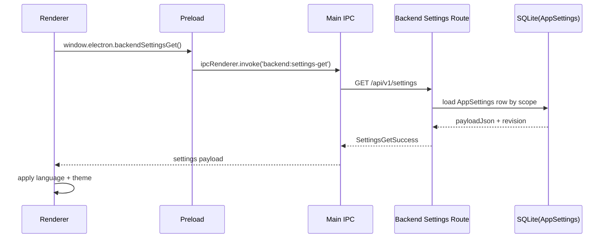
```mermaid
sequenceDiagram
  participant UI as Renderer
  participant PB as Preload
  participant MP as Main IPC
  participant BE as Backend Settings Route
  participant DB as SQLite(AppSettings)

  UI->>PB: window.electron.backendSettingsGet()
  PB->>MP: ipcRenderer.invoke('backend:settings-get')
  MP->>BE: GET /api/v1/settings
  BE->>DB: load AppSettings row by scope
  DB-->>BE: payloadJson + revision
  BE-->>MP: SettingsGetSuccess
  MP-->>UI: settings payload
  UI->>UI: apply language + theme
```

## 5.3 Local-First Audit Runtime (Implemented)

- Security-core operations are persisted to `AuditEvent` with stable correlation fields (`requestId`, `sessionId`, `entityId`, `relatedRecordId`) for forensic traceability.
- Existing `SshLoginAudit` remains active for backward-compatible SSH last-used sorting, while `AuditEvent` is used as the cross-domain audit stream.
- Audit writes are best-effort and non-blocking by contract: failures are logged in backend runtime and do not fail parent request/session flows.
- Metadata persistence is sanitized before storage (secret-like keys are redacted) and capped by serialized size limits to prevent payload inflation.
- Retention is local policy-driven (default 180 days) with periodic sweeps in audit service runtime.
- Future sync checkpoint state is pre-modeled by `AuditSyncCursor` without introducing current mandatory remote dependency.

Current event categories in runtime wiring include:

- `ssh-session`
- `ssh-host-trust`
- `ssh-server`
- `ssh-keychain`
- `port-forward`
- `settings`

## 6. Core Data-Flow Views

### 6.1 Session Bootstrap Data Flow

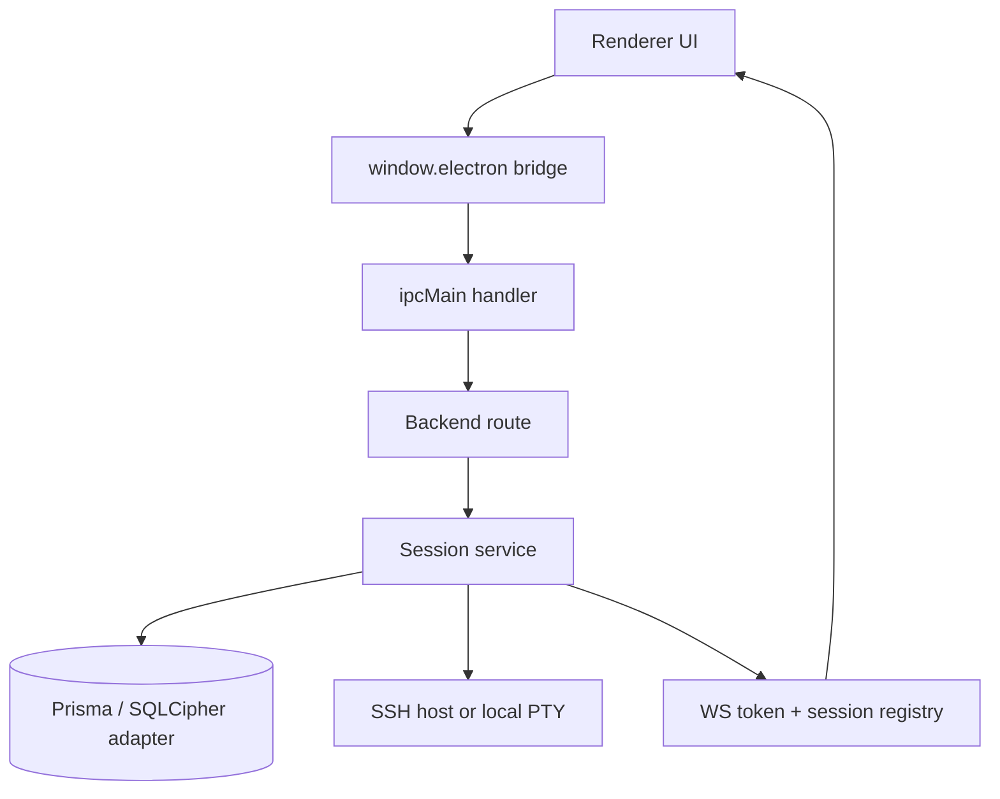
```mermaid
flowchart TD
  UI[Renderer UI] --> BRIDGE[window.electron bridge]
  BRIDGE --> MAIN[ipcMain handler]
  MAIN --> API[Backend route]
  API --> SERVICE[Session service]
  SERVICE --> DB[(Prisma / SQLCipher adapter)]
  SERVICE --> REMOTE[SSH host or local PTY]
  SERVICE --> TOKEN[WS token + session registry]
  TOKEN --> UI
```

### 6.2 Runtime Stream Data Flow

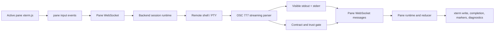
```mermaid
flowchart LR
  XT[Active pane xterm.js] --> IN[pane input events]
  IN --> WS[Pane WebSocket]
  WS --> SVC[Backend session runtime]
  SVC --> REM[Remote shell / PTY]
  REM --> PARSER[OSC 777 streaming parser]
  PARSER --> OUT[Visible stdout + stderr]
  PARSER --> GATE[Contract and trust gate]
  OUT --> WS2[Pane WebSocket messages]
  GATE --> WS2
  WS2 --> REDUCER[Pane runtime and reducer]
  REDUCER --> XT2[xterm write, completion, markers, diagnostics]
```

### 6.3 SFTP Transfer Progress Data Flow

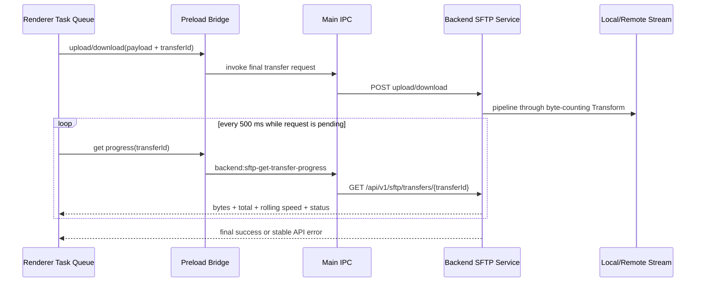
```mermaid
sequenceDiagram
  participant UI as Renderer Task Queue
  participant PB as Preload Bridge
  participant MP as Main IPC
  participant BE as Backend SFTP Service
  participant FS as Local/Remote Stream

  UI->>PB: upload/download(payload + transferId)
  PB->>MP: invoke final transfer request
  MP->>BE: POST upload/download
  BE->>FS: pipeline through byte-counting Transform
  loop every 500 ms while request is pending
    UI->>PB: get progress(transferId)
    PB->>MP: backend:sftp-get-transfer-progress
    MP->>BE: GET /api/v1/sftp/transfers/{transferId}
    BE-->>UI: bytes + total + rolling speed + status
  end
  BE-->>UI: final success or stable API error
```

- File bytes stay on the existing backend stream path; only bounded progress metadata crosses HTTP and IPC.
- Backend samples speed at most every 250 ms and retains terminal records in memory for 60 seconds. Renderer polling stops with the final transfer request.
- Renderer transfer progress is attached to concurrently started backend tasks. The task is polled with the session id captured at acceptance, while byte progress remains keyed by `transferId`; neither path provides generalized cancellation, resume, or persisted history.

### 6.4 SFTP Backend Task Scheduling Data Flow

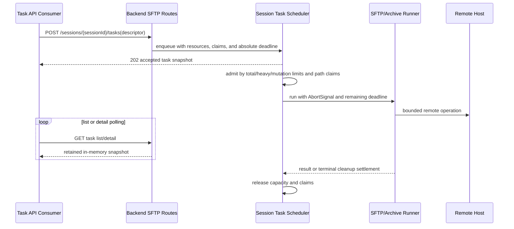
```mermaid
sequenceDiagram
  participant C as Task API Consumer
  participant API as Backend SFTP Routes
  participant SCH as Session Task Scheduler
  participant SVC as SFTP/Archive Runner
  participant RH as Remote Host

  C->>API: POST /sessions/{sessionId}/tasks(descriptor)
  API->>SCH: enqueue with resources, claims, and absolute deadline
  SCH-->>C: 202 accepted task snapshot
  SCH->>SCH: admit by total/heavy/mutation limits and path claims
  SCH->>SVC: run with AbortSignal and remaining deadline
  SVC->>RH: bounded remote operation
  loop list or detail polling
    C->>API: GET task list/detail
    API-->>C: retained in-memory snapshot
  end
  SVC-->>SCH: result or terminal cleanup settlement
  SCH->>SCH: release capacity and claims
```

- Each SFTP session has independent fixed limits: `total=3`, `heavy=2`, and `mutation=1`. Equal and ancestor/descendant POSIX path claims serialize, while disjoint sibling claims may run concurrently.
- Supported public task descriptors are `create-file`, `create-directory`, `rename`, `upload`, `download`, and `batch`. Preview `write-file` retains its synchronous HTTP contract but executes as hidden scheduler work; all legacy SFTP operation routes use that same coordinated service boundary.
- The absolute deadline includes queue wait. Deadline expiry publishes `failed` immediately; a running task continues to own capacity and claims until its runner settles, and timed-out mutations publish `outcomeUnknown: true`.
- Task records are memory-only, remain readable after a recent session close, and are bounded to 512 records per session with a seven-day post-release TTL. Backend stop clears all records. The task API exposes start, list, and detail only: there is no public task cancel, resume, or persistence contract.
- Renderer routes all six supported descriptors through Main/preload into this API. It starts unrelated tasks concurrently and retains a separate serial lane only for synchronous preview writes and stateful archive orchestration.

### 6.5 SFTP Remote Archive Data Flow

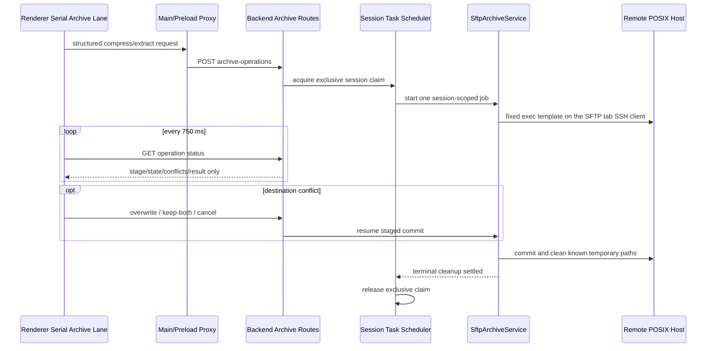
```mermaid
sequenceDiagram
  participant UI as Renderer Serial Archive Lane
  participant MP as Main/Preload Proxy
  participant API as Backend Archive Routes
  participant SCH as Session Task Scheduler
  participant AS as SftpArchiveService
  participant RH as Remote POSIX Host

  UI->>MP: structured compress/extract request
  MP->>API: POST archive-operations
  API->>SCH: acquire exclusive session claim
  SCH->>AS: start one session-scoped job
  AS->>RH: fixed exec template on the SFTP tab SSH client
  loop every 750 ms
    UI->>API: GET operation status
    API-->>UI: stage/state/conflicts/result only
  end
  opt destination conflict
    UI->>API: overwrite / keep-both / cancel
    API->>AS: resume staged commit
  end
  AS->>RH: commit and clean known temporary paths
  AS-->>SCH: terminal cleanup settled
  SCH->>SCH: release exclusive claim
```

- The remote command, tool output, and random staging paths are backend-private. Public contracts carry paths, format, level, destination mode, phase, conflict summaries, and stable errors only.
- Archive capability probing acquires the scheduler's exclusive session claim until the probe settles. Archive startup acquires the same claim and retains it through terminal cleanup. Both use immediate-only admission and report `SFTP_ARCHIVE_BUSY` instead of waiting without a pollable identifier. Renderer archive requests enter their serial lane, so multiple archive operations preserve selection order without globally serializing ordinary backend tasks.
- Closing a session first requests archive cancellation and bounded cleanup, then disconnects SSH. Bulk session close waits for sessions in parallel and preserves the existing active-connection count contract.

### 6.6 Failure Boundary Model

- **Renderer boundary**: visual state and user interaction; failures should stay recoverable via UI retry.
- **Main boundary**: capability routing and internal auth injection; failures should never leak privileged tokens.
- **Backend boundary**: protocol validation, session lifecycle, and resource cleanup ownership.
- **Remote boundary**: SSH host / local shell instability is treated as external and mapped to stable UI error codes.

## 7. SSH Keychain Credential Model (2026-03)

- SSH credentials are now persisted in `SshKeychain` and linked from `SshServer.keychainId`.
- `SshServer` keeps connection identity, host/transport policy (`host`, `port`, `username`, `strictHostKey`, `enableSshCompression`), and renderer terminal compatibility flags (`disableCharacterWidthCompatibilityMode`) but no longer stores encrypted password/private-key fields directly.
- SSH transport compression is disabled by default. When enabled on a server record, the backend applies the same compression negotiation policy to SSH shell sessions, SFTP sessions, and port-forwarding clients.
- Keychain organization metadata reuses the same `SshFolder` and `SshTag` domains used by servers (no separate keychain-only folder/tag tables).
- Existing per-server edit UX is preserved by allowing inline credential input in the SSH editor; backend transparently materializes/updates hidden keychains.
- Server updates that keep inline credential mode may omit password/private-key fields; the backend retains the existing encrypted values and only rejects the update when the stored credential material cannot satisfy the selected auth type.
- Shared keychains can be reused by multiple servers; hidden keychains are intended for single-server private use.
- SSH session creation resolves credentials through server → keychain relation before opening `ssh2` connections.

## 7.1 Development Profile Runtime

Development profile mode is a developer-only isolation layer for fresh-install verification. It does not change packaged production storage or database key policy.

The first non-help `pnpm dev:profile` command automatically imports the legacy implicit default identity into `.cosmosh/dev-profiles/default/`. The import copies the legacy workspace database, SQLite WAL/SHM sidecars, Electron `userData`, and backend secret storage on a best-effort basis. Missing or unreadable legacy sources are recorded in the profile manifest instead of aborting the command.

The `default` profile is a managed recovery snapshot, not a throwaway test profile. It can be selected with `pnpm dev:profile use default` or rebuilt with `pnpm dev:profile import-default --force --use`, but regular `create default`, `reset default`, and `delete default` commands are rejected to avoid losing the recovery path.

Use `pnpm dev:profile` to create, switch, reset, inspect, or delete local test profiles:

- `pnpm dev:profile create fresh --use` creates `.cosmosh/dev-profiles/fresh/` and makes it the default development profile.
- `pnpm dev:profile reset fresh` clears only that profile's runtime data so the next development launch behaves like a new install for the same identity.
- `pnpm dev:profile delete fresh --force` removes the profile and clears the current pointer if it was active.
- `pnpm dev:profile run fresh --create --reset -- pnpm dev:main` runs one command with an isolated, freshly reset profile. The root script `pnpm dev:main:fresh` is the shorthand for this flow.

A profile owns these paths:

- `.cosmosh/dev-profiles/<name>/user-data`: injected into Electron via `app.setPath('userData', ...)` before app storage is touched.
- `.cosmosh/dev-profiles/<name>/database/cosmosh.db`: injected as `COSMOSH_DB_PATH` and used by both main and backend database path resolvers.
- `.cosmosh/dev-profiles/<name>/backend-storage`: injected as `COSMOSH_BACKEND_STORAGE_PATH` for backend-only secret material such as `secret.key`.
- `.cosmosh/dev-profiles/default/profile.json`: import manifest for the managed default profile, including source paths and per-source copy status.

If no development profile is active, direct development launches keep the legacy workspace database path `.dev_data/cosmosh.db` and default Electron development storage. This preserves existing local data unless a developer explicitly opts into profile isolation.

## 8. Architecture Decision Rationale

- Keep the backend as a separate runtime process to isolate protocol and credential handling from renderer attack surface.
- Use preload as a minimal bridge to reduce API exposure and preserve strict process contracts.
- Prefer WS data plane for terminal streams to avoid IPC bottlenecks on high-frequency I/O.
- Keep main as orchestrator/proxy instead of business-logic host for easier future server-client decoupling.

## 9. Boundary Case Playbook

### 9.1 Backend Not Ready at Startup

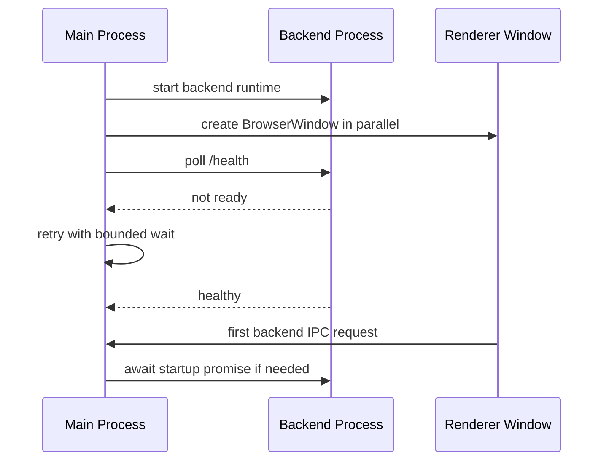
```mermaid
sequenceDiagram
  participant MAIN as Main Process
  participant BE as Backend Process
  participant UI as Renderer Window

  MAIN->>BE: start backend runtime
  MAIN->>UI: create BrowserWindow in parallel
  MAIN->>BE: poll /health
  BE-->>MAIN: not ready
  MAIN->>MAIN: retry with bounded wait
  BE-->>MAIN: healthy
  UI->>MAIN: first backend IPC request
  MAIN->>BE: await startup promise if needed
```

Handling principle:

- UI should become visible as early as possible while backend continues warming in parallel.
- First backend-bound IPC request must still observe backend ready-state before forwarding.
- Startup failure paths should be explicit and observable.

### 9.2 WS Attach Token Mismatch

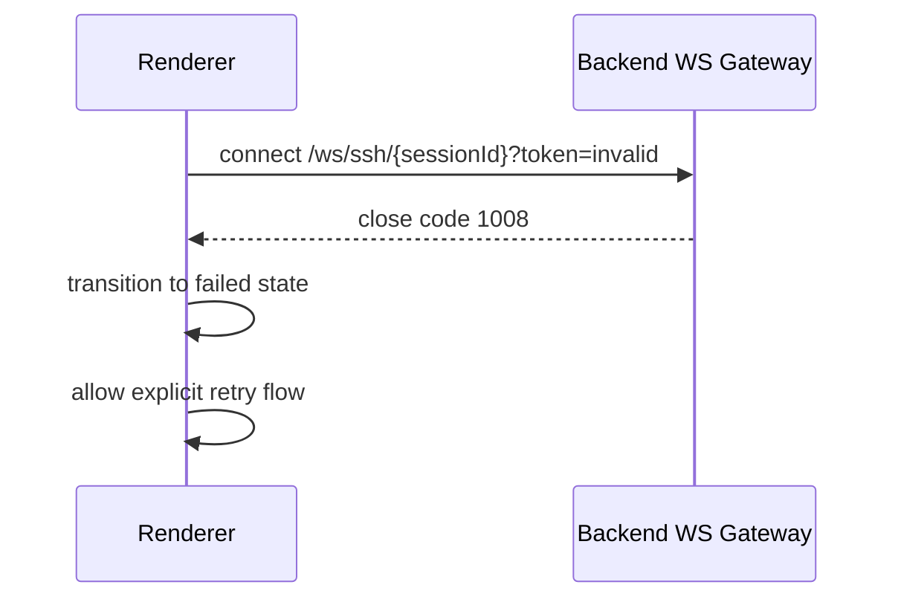
```mermaid
sequenceDiagram
  participant UI as Renderer
  participant WS as Backend WS Gateway

  UI->>WS: connect /ws/ssh/{sessionId}?token=invalid
  WS-->>UI: close code 1008
  UI->>UI: transition to failed state
  UI->>UI: allow explicit retry flow
```

Handling principle:

- Token/session mismatch is security-sensitive and must fail closed.
- Recovery should create a fresh session/token path.

### 9.3 Renderer Reload During Active Session

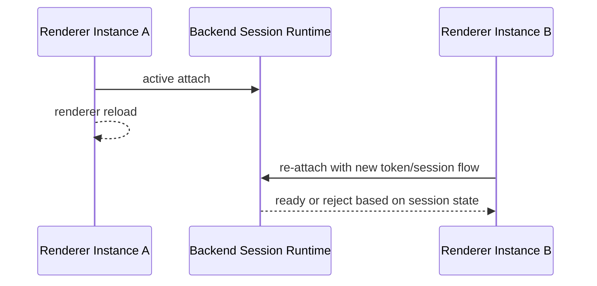
```mermaid
sequenceDiagram
  participant UI1 as Renderer Instance A
  participant WS as Backend Session Runtime
  participant UI2 as Renderer Instance B

  UI1->>WS: active attach
  UI1-->>UI1: renderer reload
  UI2->>WS: re-attach with new token/session flow
  WS-->>UI2: ready or reject based on session state
```

Handling principle:

- Session runtime must guard against stale attach state.
- Renderer should treat reload as a new lifecycle and re-establish state explicitly.

### 8.4 Production Database Encryption and Recovery

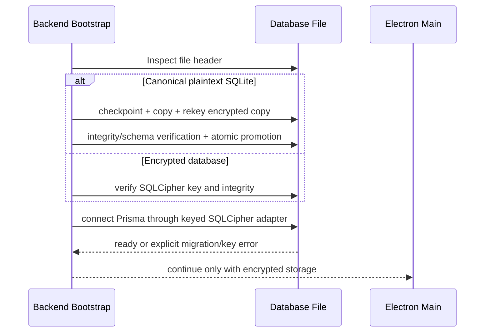
```mermaid
sequenceDiagram
  participant BE as Backend Bootstrap
  participant DB as Database File
  participant MAIN as Electron Main

  BE->>DB: Inspect file header
  alt Canonical plaintext SQLite
    BE->>DB: checkpoint + copy + rekey encrypted copy
    BE->>DB: integrity/schema verification + atomic promotion
  else Encrypted database
    BE->>DB: verify SQLCipher key and integrity
  end
  BE->>DB: connect Prisma through keyed SQLCipher adapter
  DB-->>BE: ready or explicit migration/key error
  BE-->>MAIN: continue only with encrypted storage
```

Handling principle:

- Production has no plaintext Prisma fallback. Only a canonical plaintext header enters the one-time migration; unknown/corrupt files and incorrect keys fail without rotating key material.
- Migration keeps the source authoritative until an encrypted copy passes integrity and schema-count checks. Fixed `.sqlcipher-migration` and `.plaintext-backup` artifacts support restart recovery across rename interruptions. An encrypted temp that fails verification is preserved with its plaintext backup and causes startup to fail; recovery never rotates the database key by silently restoring and re-encrypting with an unverified key.

### 8.5 Startup Schema Upgrade Path

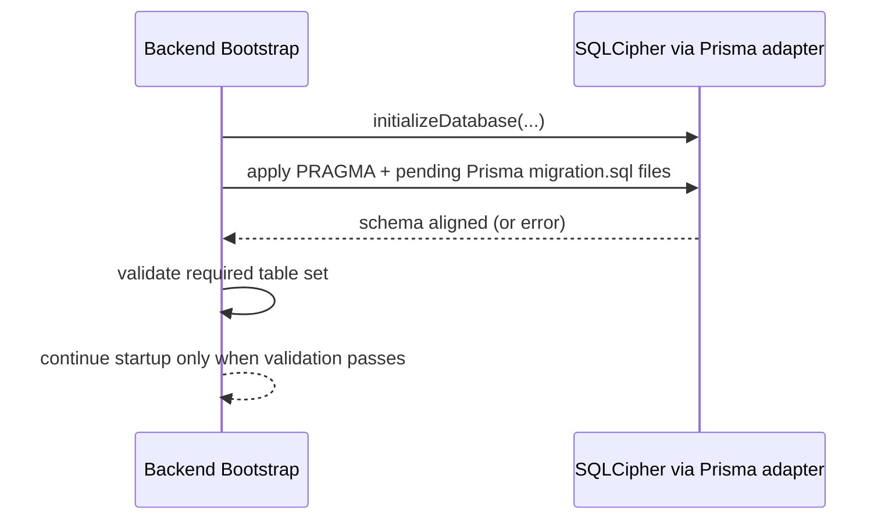
```mermaid
sequenceDiagram
  participant BE as Backend Bootstrap
  participant DB as SQLCipher via Prisma adapter

  BE->>DB: initializeDatabase(...)
  BE->>DB: apply PRAGMA + pending Prisma migration.sql files
  DB-->>BE: schema aligned (or error)
  BE->>BE: validate required table set
  BE-->>BE: continue startup only when validation passes
```

Handling principle:

- Runtime migration sync is idempotent and executes on every startup.
- Existing user data must remain intact while structural drift is repaired incrementally.

## 10. Server Proxy Runtime

- Global settings define `serverProxyMode = off | system | custom` and `serverProxyUrl`; the default is `system`.
- Each `SshServer` defines `proxyMode = default | off | custom` and an optional `proxyUrl`. `default` inherits the global policy.
- Renderer resolves system/PAC proxy rules through the privileged `app:resolve-system-proxy` Main IPC only when the effective mode is `system`.
- Backend remains the policy authority. `packages/backend/src/ssh/proxy.ts` reloads persisted global settings, applies the server override, parses ordered Chromium proxy rules, and creates HTTP, HTTPS CONNECT, SOCKS5, or explicit `DIRECT` sockets.
- The prepared socket is injected through `ssh2` `ConnectConfig.sock`, so SSH shell, SFTP, and port-forwarding connections share one proxy implementation.
- Proxy candidates share the configured SSH connection timeout. Proxy failure never silently falls back to direct transport; direct transport is allowed only for `off` mode or an explicit system `DIRECT` candidate.
- Audit metadata records only proxy mode and protocol. Proxy URLs and embedded credentials are never written to audit metadata.
