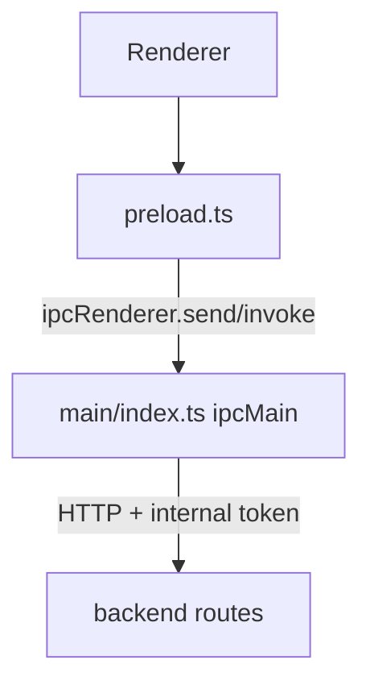

# IPC Protocol Dictionary

## 1. Channel Topology

## 2. Channel Dictionary

| Channel | IPC Type | Params | Return Schema | Main Handler Behavior |
|---|---|---|---|---|
| `app:close-window` | `send` | none | none | Closes focused window or main window |
| `i18n:get-locale` | `invoke` | none | `Promise<string>` | Returns current resolved locale |
| `i18n:set-locale` | `invoke` | `locale: string` | `Promise<string>` | Resolves/persists in-memory locale and updates title |
| `app:get-runtime-user-name` | `invoke` | none | `Promise<string>` | Returns OS username fallback chain |
| `app:get-version-info` | `invoke` | none | `Promise<{ appName: string; version: string; buildVersion: string; buildTime: string; commit: string; electron: string; chromium: string; node: string; v8: string; os: string }>` | Returns About metadata including app version/build plus runtime technical information |
| `app:get-pending-launch-working-directory` | `invoke` | none | `Promise<string \| null>` | Returns current pending context-launch working directory parsed from CLI |
| `app:get-database-security-info` | `invoke` | none | `Promise<{ runtimeMode: 'development' \| 'production'; resolverMode: 'development-fixed-key' \| 'safe-storage' \| 'master-password-fallback'; safeStorageAvailable: boolean; databasePath: string; securityConfigPath: string; hasEncryptedDbMasterKey: boolean; hasMasterPasswordHash: boolean; hasMasterPasswordSalt: boolean; hasMasterPasswordEnv: boolean; fallbackReady: boolean }>` | Returns non-sensitive database encryption bootstrap diagnostics for Settings → Advanced |
| `app:launch-working-directory` | `event (main -> renderer)` | `cwd: string` | none | Pushes context-launch working directory when a second instance is invoked |
| `app:open-devtools` | `invoke` | none | `Promise<boolean>` | Opens devtools when unpackaged |
| `app:show-in-file-manager` | `invoke` | `targetPath?: string` | `Promise<boolean>` | Opens file/folder in OS file manager |
| `app:open-external-url` | `invoke` | `targetUrl: string` | `Promise<boolean>` | Opens trusted HTTP(S) URL with system default browser |
| `app:import-private-key` | `invoke` | none | `Promise<{ canceled: boolean; content?: string }>` | Opens native file picker and returns UTF-8 private key content when selected |
| `backend:test-ping` | `invoke` | none | `Promise<ApiTestPingResponse \| ApiErrorResponse>` | Calls backend health test endpoint |
| `backend:settings-get` | `invoke` | none | `Promise<ApiSettingsGetResponse \| ApiErrorResponse>` | GET persisted application settings |
| `backend:settings-update` | `invoke` | `payload: ApiSettingsUpdateRequest` | `Promise<ApiSettingsUpdateResponse \| ApiErrorResponse>` | PUT application settings snapshot |
| `backend:ssh-list-servers` | `invoke` | none | `Promise<ApiSshListServersResponse \| ApiErrorResponse>` | GET SSH server list |
| `backend:ssh-create-server` | `invoke` | `payload: ApiSshCreateServerRequest` | `Promise<ApiSshCreateServerResponse \| ApiErrorResponse>` | POST create SSH server |
| `backend:ssh-update-server` | `invoke` | `serverId: string, payload: ApiSshUpdateServerRequest` | `Promise<ApiSshUpdateServerResponse \| ApiErrorResponse>` | PUT update SSH server |
| `backend:ssh-get-server-credentials` | `invoke` | `serverId: string` | `Promise<ApiSshGetServerCredentialsResponse \| ApiErrorResponse>` | GET decrypted credentials |
| `backend:ssh-list-folders` | `invoke` | none | `Promise<ApiSshListFoldersResponse \| ApiErrorResponse>` | GET folder list |
| `backend:ssh-create-folder` | `invoke` | `payload: ApiSshCreateFolderRequest` | `Promise<ApiSshCreateFolderResponse \| ApiErrorResponse>` | POST create folder |
| `backend:ssh-update-folder` | `invoke` | `folderId: string, payload: ApiSshUpdateFolderRequest` | `Promise<ApiSshUpdateFolderResponse \| ApiErrorResponse>` | PUT update folder |
| `backend:ssh-list-tags` | `invoke` | none | `Promise<ApiSshListTagsResponse \| ApiErrorResponse>` | GET tag list |
| `backend:ssh-create-tag` | `invoke` | `payload: ApiSshCreateTagRequest` | `Promise<ApiSshCreateTagResponse \| ApiErrorResponse>` | POST create tag |
| `backend:ssh-create-session` | `invoke` | `payload: ApiSshCreateSessionRequest` | `Promise<ApiSshCreateSessionResponse \| ApiSshCreateSessionHostVerificationRequiredResponse \| ApiErrorResponse>` | POST create SSH shell session |
| `backend:ssh-trust-fingerprint` | `invoke` | `payload: ApiSshTrustFingerprintRequest` | `Promise<ApiSshTrustFingerprintResponse \| ApiErrorResponse>` | POST trust host fingerprint |
| `backend:ssh-close-session` | `invoke` | `sessionId: string` | `Promise<{ success: boolean }>` | DELETE SSH session |
| `backend:ssh-delete-server` | `invoke` | `serverId: string` | `Promise<{ success: boolean }>` | DELETE SSH server |
| `backend:ssh-delete-folder` | `invoke` | `folderId: string` | `Promise<{ success: boolean }>` | DELETE SSH folder |
| `backend:local-terminal-list-profiles` | `invoke` | none | `Promise<ApiLocalTerminalListProfilesResponse \| ApiErrorResponse>` | GET local terminal profile list |
| `backend:local-terminal-create-session` | `invoke` | `payload: ApiLocalTerminalCreateSessionRequest` | `Promise<ApiLocalTerminalCreateSessionResponse \| ApiErrorResponse>` | POST local terminal session (Main may inject one-shot `cwd` from launch context) |
| `backend:local-terminal-close-session` | `invoke` | `sessionId: string` | `Promise<{ success: boolean }>` | DELETE local terminal session |

## 3. Schema Sources

- API payload types come from `@cosmosh/api-contract`, generated from `packages/api-contract/openapi/cosmosh.openapi.yaml`.
- Backend, Main IPC proxy, and renderer HTTP callers must use `API_PATHS` and related generated contract exports from `@cosmosh/api-contract` instead of hard-coded route strings.

## 3.1 Terminal WebSocket Contract (Renderer ↔ Backend)

Although terminal stream messages are not Electron IPC channels, they are part of the same cross-process contract surface and must be versioned together.

- Client to server (`/ws/ssh/{sessionId}` and `/ws/local-terminal/{sessionId}`):
  - `input`, `resize`, `ping`, `close`, `history-delete`
  - `completion-request` with `requestId`, `linePrefix`, `cursorIndex`, optional `limit`, optional `fuzzyMatch`, and `trigger` (`typing` or `manual`)
- Server to client:
  - `ready`, `output`, `telemetry`, `history`, `pong`, `error`, `exit`
  - `completion-response` with `requestId`, `replacePrefixLength`, and ranked completion `items`

Current implementation note:

- Completion messages are handled in `SshSessionService` and `LocalTerminalSessionService` via shared normalization in `terminal/shared.ts` and shared ranking engine in `terminal/completion/engine.ts`.

## 4. Change Rules

When adding/modifying a channel, update in one commit:

1. `packages/main/src/preload.ts`
2. `packages/main/src/index.ts`
3. `packages/renderer/src/vite-env.d.ts`
4. relevant renderer transport/service wrappers
5. this file (`docs/developer/core/ipc-protocol.md`)

## 5. Channel Addition Template

Use this checklist when introducing a new channel:

1. Channel name: `domain:action-name`
2. IPC type: `invoke` or `send`
3. Params schema: explicit type in bridge and renderer declarations
4. Return schema: success and error shape
5. Main behavior: backend proxy or privileged local action
6. Security notes: token/header handling, permission boundary, exposure limits
7. Docs sync: update EN + ZH protocol pages in same change set
