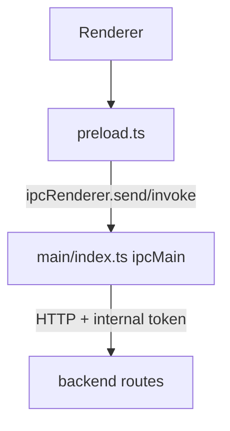

# IPC Protocol Dictionary

## 1. Channel Topology

```mermaid
flowchart TB
  R[Renderer] --> P[preload.ts]
  P -->|ipcRenderer.send/invoke| M[main/index.ts ipcMain]
  M -->|HTTP + internal token| B[backend routes]
```

## 2. Channel Dictionary

| Channel                                    | IPC Type                   | Params                                                                                                                     | Return Schema                                                                                                                                                                                                                                                                                                                                                                                                       | Main Handler Behavior                                                                                                                                                                        |
| ------------------------------------------ | -------------------------- | -------------------------------------------------------------------------------------------------------------------------- | ------------------------------------------------------------------------------------------------------------------------------------------------------------------------------------------------------------------------------------------------------------------------------------------------------------------------------------------------------------------------------------------------------------------- | -------------------------------------------------------------------------------------------------------------------------------------------------------------------------------------------- |
| `app:close-window`                         | `send`                     | none                                                                                                                       | none                                                                                                                                                                                                                                                                                                                                                                                                                | Requests focused/main window close; the main window close guard checks backend SSH/SFTP activity before allowing destruction                                                                 |
| `app:close-confirmation-request`           | Main-to-renderer event     | `{ requestId: string }`                                                                                                    | none                                                                                                                                                                                                                                                                                                                                                                                                                | Requests the shared renderer close-warning dialog; preload validates the opaque ID and buffers one early request until the React listener mounts                                             |
| `app:close-confirmation-response`          | `send`                     | `{ requestId: string, confirmed: boolean }`                                                                                | none                                                                                                                                                                                                                                                                                                                                                                                                                | Resolves only the pending close decision owned by the sending `webContents` and matching opaque request ID                                                                                   |
| `app:set-terminal-window-activity`         | `send`                     | `{ progressState: 'none' \| 'normal' \| 'error' \| 'indeterminate' \| 'warning'; progressValue: number \| null; bellAttention: boolean; bellAudibleEnabled: boolean; bellFlashEnabled: boolean; latestBellEvent: { tabId: string; paneId: string; sequence: number; receivedAt: number } \| null }` | none | Validates the snapshot, resolves its owner from sender `webContents`, maps window taskbar progress, and applies independently throttled sound/unfocused-window Flash for each new standalone Bell according to policy |
| `i18n:get-locale`                          | `invoke`                   | none                                                                                                                       | `Promise<string>`                                                                                                                                                                                                                                                                                                                                                                                                   | Returns current resolved locale                                                                                                                                                              |
| `i18n:set-locale`                          | `invoke`                   | `locale: string`                                                                                                           | `Promise<string>`                                                                                                                                                                                                                                                                                                                                                                                                   | Resolves/persists in-memory locale and updates title                                                                                                                                         |
| `app:get-runtime-user-name`                | `invoke`                   | none                                                                                                                       | `Promise<string>`                                                                                                                                                                                                                                                                                                                                                                                                   | Returns OS username fallback chain                                                                                                                                                           |
| `app:get-version-info`                     | `invoke`                   | none                                                                                                                       | `Promise<{ appName: string; version: string; buildVersion: string; buildTime: string; commit: string; electron: string; chromium: string; node: string; v8: string; os: string }>`                                                                                                                                                                                                                                  | Returns About metadata including app version/build plus runtime technical information                                                                                                        |
| `app:get-pending-launch-working-directory` | `invoke`                   | none                                                                                                                       | `Promise<string \| null>`                                                                                                                                                                                                                                                                                                                                                                                           | Returns current pending context-launch working directory parsed from CLI                                                                                                                     |
| `app:get-downloads-path`                   | `invoke`                   | none                                                                                                                       | `Promise<string>`                                                                                                                                                                                                                                                                                                                                                                                                   | Returns the OS downloads directory for local save defaults                                                                                                                                   |
| `app:create-sftp-temporary-file`           | `invoke`                   | `fileName: string`                                                                                                         | `Promise<string>`                                                                                                                                                                                                                                                                                                                                                                                                   | Creates a unique local destination under the Cosmosh SFTP temp root for backend download/open flows                                                                                          |
| `app:create-sftp-downloads-file`           | `invoke`                   | `fileName: string`                                                                                                         | `Promise<string>`                                                                                                                                                                                                                                                                                                                                                                                                   | Authorizes one exact single-use destination under the OS Downloads directory for the requesting renderer                                                                                     |
| `app:select-sftp-upload-files`             | `invoke`                   | none                                                                                                                       | `Promise<{ canceled: boolean; files: Array<{ name: string; localPath: string; size: number; modifiedAt: string }> }>`                                                                                                                                                                                                                                                                                               | Opens a native multi-file picker and copies selected regular files into isolated directories under the controlled SFTP temp root                                                             |
| `app:stage-sftp-dropped-upload-files`      | `invoke`                   | `entries: Array<{ name: string; localPath?: string }>`                                                                     | `Promise<{ canceled: false; files: Array<{ name: string; localPath: string; size: number; modifiedAt: string }>; rejectedEntries?: Array<{ name: string; reason: 'directory-unsupported' \| 'not-file' \| 'path-unavailable' \| 'unreadable' }> }>`                                                                                                                                                                 | Stages preload-resolved local files dropped onto SFTP directory targets and reports unsupported folders/non-files without exposing raw path staging to renderer                              |
| `app:cleanup-sftp-temporary-files`         | `invoke`                   | `localPaths: string[]`                                                                                                     | `Promise<boolean>`                                                                                                                                                                                                                                                                                                                                                                                                  | Best-effort removes validated staged upload files and their now-empty isolated temp directories                                                                                              |
| `app:open-sftp-temporary-file`             | `invoke`                   | `localPath: string`                                                                                                        | `Promise<boolean>`                                                                                                                                                                                                                                                                                                                                                                                                  | Opens an existing file under the Cosmosh SFTP temp root with the OS default application                                                                                                      |
| `app:read-sftp-temporary-image-preview`    | `invoke`                   | `localPath: string`                                                                                                        | `Promise<string>`                                                                                                                                                                                                                                                                                                                                                                                                   | Validates an existing image file under the Cosmosh SFTP temp root and returns a bounded data URL for renderer image preview                                                                  |
| `app:start-sftp-temporary-file-watch`      | `invoke`                   | `localPath: string`                                                                                                        | `Promise<string>`                                                                                                                                                                                                                                                                                                                                                                                                   | Starts a debounced watcher for one existing file under the Cosmosh SFTP temp root and returns a watch id                                                                                     |
| `app:stop-sftp-temporary-file-watch`       | `invoke`                   | `watchId: string`                                                                                                          | `Promise<boolean>`                                                                                                                                                                                                                                                                                                                                                                                                  | Stops a previously created SFTP temp-file watcher                                                                                                                                            |
| `app:show-sftp-open-with-dialog`           | `invoke`                   | `localPath: string`                                                                                                        | `Promise<boolean>`                                                                                                                                                                                                                                                                                                                                                                                                  | Windows only: validates a temp file path and opens the system Open With picker through the shell `openas` verb                                                                               |
| `app:list-sftp-open-with-applications`     | `invoke`                   | `localPath: string`                                                                                                        | `Promise<Array<{ id: string; name: string; path: string; bundleIdentifier?: string; iconDataUrl?: string }>>`                                                                                                                                                                                                                                                                                                       | macOS only: validates a temp file path and returns NSWorkspace applications that can open it                                                                                                 |
| `app:open-sftp-file-with-application`      | `invoke`                   | `localPath: string, applicationPath: string`                                                                               | `Promise<boolean>`                                                                                                                                                                                                                                                                                                                                                                                                  | macOS only: validates the temp file and selected app against the available application list, then opens the file with that app                                                               |
| `app:sftp-temporary-file-changed`          | `event (main -> renderer)` | `{ watchId: string; localPath: string; size: number; modifiedAt: string }`                                                 | none                                                                                                                                                                                                                                                                                                                                                                                                                | Pushes one debounced change event for a watched SFTP temp file owned by the renderer webContents                                                                                             |
| `app:get-database-security-info`           | `invoke`                   | none                                                                                                                       | `Promise<{ runtimeMode: 'development' \| 'production'; resolverMode: 'development-fixed-key' \| 'safe-storage' \| 'master-password-fallback'; safeStorageAvailable: boolean; databasePath: string; securityConfigPath: string; hasEncryptedDbMasterKey: boolean; hasMasterPasswordHash: boolean; hasMasterPasswordSalt: boolean; hasMasterPasswordEnv: boolean; fallbackReady: boolean }>`                          | Returns non-sensitive database encryption bootstrap diagnostics for Settings → Advanced                                                                                                      |
| `app:resolve-system-proxy`                 | `invoke`                   | `{ host: string; port: number }`                                                                                           | `Promise<{ proxyRules: string }>`                                                                                                                                                                                                                                                                                                                                                                                   | Validates one SSH server destination and resolves Chromium system/PAC proxy rules for `https://host:port/`                                                                                   |
| `app:launch-working-directory`             | `event (main -> renderer)` | `cwd: string`                                                                                                              | none                                                                                                                                                                                                                                                                                                                                                                                                                | Pushes context-launch working directory when a second instance is invoked                                                                                                                    |
| `app:menu-action`                          | `event (main -> renderer)` | `action: 'open-about' \| 'open-settings' \| 'new-tab' \| 'close-current-tab' \| 'close-right-tabs' \| 'show-tab-switcher'` | none                                                                                                                                                                                                                                                                                                                                                                                                                | Dispatches validated app-menu commands from the macOS system menu to renderer tab/state handlers                                                                                             |
| `app:open-devtools`                        | `invoke`                   | none                                                                                                                       | `Promise<boolean>`                                                                                                                                                                                                                                                                                                                                                                                                  | Opens devtools for the current main window when available                                                                                                                                    |
| `app:toggle-devtools`                      | `invoke`                   | none                                                                                                                       | `Promise<boolean>`                                                                                                                                                                                                                                                                                                                                                                                                  | Toggles detached DevTools for the current main window (open when closed, close when open)                                                                                                    |
| `app:reload-webview`                       | `invoke`                   | none                                                                                                                       | `Promise<boolean>`                                                                                                                                                                                                                                                                                                                                                                                                  | Reloads the active renderer webContents and bypasses cache for deterministic debug refresh                                                                                                   |
| `app:restart-backend-runtime`              | `invoke`                   | none                                                                                                                       | `Promise<boolean>`                                                                                                                                                                                                                                                                                                                                                                                                  | Restarts backend runtime in-place during development without full app restart                                                                                                                |
| `app:show-in-file-manager`                 | `invoke`                   | `targetPath?: string`                                                                                                      | `Promise<boolean>`                                                                                                                                                                                                                                                                                                                                                                                                  | Opens file/folder in OS file manager                                                                                                                                                         |
| `app:open-external-url`                    | `invoke`                   | `targetUrl: string`                                                                                                        | `Promise<boolean>`                                                                                                                                                                                                                                                                                                                                                                                                  | Opens trusted HTTP(S) URL with system default browser                                                                                                                                        |
| `app:set-windows-system-menu-symbol-color` | `invoke`                   | `symbolColor: string`                                                                                                      | `Promise<boolean>`                                                                                                                                                                                                                                                                                                                                                                                                  | Applies token-driven Windows title bar system-menu symbol color to current main window overlay                                                                                               |
| `app:show-save-file-dialog`                | `invoke`                   | `defaultPath?: string`                                                                                                     | `Promise<{ canceled: boolean; filePath?: string }>`                                                                                                                                                                                                                                                                                                                                                                 | Opens a native save dialog and authorizes the selected path for one SFTP download by the requesting renderer                                                                                 |
| `app:import-private-key`                   | `invoke`                   | none                                                                                                                       | `Promise<{ canceled: boolean; fileName?: string; content?: string }>`                                                                                                                                                                                                                                                                                                                                               | Opens native file picker and returns the selected file name plus UTF-8 private key content                                                                                                   |
| `app:get-process-performance-stats`        | `invoke`                   | none                                                                                                                       | `Promise<{ sampledAt: number; cpuPercent: number \| null; mainProcessMemory: { rssBytes: number; heapTotalBytes: number; heapUsedBytes: number; externalBytes: number; arrayBuffersBytes: number }; rendererProcessMemory: { residentSetBytes: number; privateBytes: number; sharedBytes: number } \| null; backendProcess: { pid: number; cpuPercent: number \| null; memoryRssBytes: number \| null } \| null }>` | Samples main process CPU + memory, resolves renderer process memory from active window, and includes backend child-process CPU/RSS memory for debug monitoring overlay                       |
| `app:export-main-heap-snapshot`            | `invoke`                   | none                                                                                                                       | `Promise<{ ok: boolean; filePath?: string; message?: string }>`                                                                                                                                                                                                                                                                                                                                                     | Writes a V8 heap snapshot for the main process into app user-data debug snapshot directory                                                                                                   |
| `debug:backend-request-trace-list`         | `invoke`                   | none                                                                                                                       | `Promise<BackendRequestTrace[]>`                                                                                                                                                                                                                                                                                                                                                                                    | Returns the retained sanitized backend request mirror list and subscribes the renderer webContents to future trace events; empty when request tracing is disabled                            |
| `debug:backend-request-trace-clear`        | `invoke`                   | none                                                                                                                       | `Promise<boolean>`                                                                                                                                                                                                                                                                                                                                                                                                  | Clears the retained development request mirror ring buffer                                                                                                                                   |
| `debug:backend-request-trace-event`        | `event (main -> renderer)` | `BackendRequestTrace`                                                                                                      | none                                                                                                                                                                                                                                                                                                                                                                                                                | Pushes one completed sanitized backend proxy request mirror to subscribed renderer webContents                                                                                               |
| `backend:test-ping`                        | `invoke`                   | none                                                                                                                       | `Promise<ApiTestPingResponse \| ApiErrorResponse>`                                                                                                                                                                                                                                                                                                                                                                  | Calls backend health test endpoint                                                                                                                                                           |
| `backend:settings-get`                     | `invoke`                   | none                                                                                                                       | `Promise<ApiSettingsGetResponse \| ApiErrorResponse>`                                                                                                                                                                                                                                                                                                                                                               | GET persisted application settings                                                                                                                                                           |
| `backend:settings-update`                  | `invoke`                   | `payload: ApiSettingsUpdateRequest`                                                                                        | `Promise<ApiSettingsUpdateResponse \| ApiErrorResponse>`                                                                                                                                                                                                                                                                                                                                                            | PUT application settings snapshot                                                                                                                                                            |
| `backend:audit-list-events`                | `invoke`                   | `query?: ApiAuditEventListQuery`                                                                                           | `Promise<ApiAuditEventListResponse \| ApiErrorResponse>`                                                                                                                                                                                                                                                                                                                                                            | GET audit event list with filter + pagination                                                                                                                                                |
| `backend:audit-get-event-by-id`            | `invoke`                   | `eventId: string`                                                                                                          | `Promise<ApiAuditEventDetailResponse \| ApiErrorResponse>`                                                                                                                                                                                                                                                                                                                                                          | GET single audit event detail                                                                                                                                                                |
| `backend:ssh-list-servers`                 | `invoke`                   | none                                                                                                                       | `Promise<ApiSshListServersResponse \| ApiErrorResponse>`                                                                                                                                                                                                                                                                                                                                                            | GET SSH server list                                                                                                                                                                          |
| `backend:ssh-create-server`                | `invoke`                   | `payload: ApiSshCreateServerRequest`                                                                                       | `Promise<ApiSshCreateServerResponse \| ApiErrorResponse>`                                                                                                                                                                                                                                                                                                                                                           | POST create SSH server                                                                                                                                                                       |
| `backend:ssh-update-server`                | `invoke`                   | `serverId: string, payload: ApiSshUpdateServerRequest`                                                                     | `Promise<ApiSshUpdateServerResponse \| ApiErrorResponse>`                                                                                                                                                                                                                                                                                                                                                           | PUT update SSH server                                                                                                                                                                        |
| `backend:ssh-get-server-credentials`       | `invoke`                   | `serverId: string`                                                                                                         | `Promise<ApiSshGetServerCredentialsResponse \| ApiErrorResponse>`                                                                                                                                                                                                                                                                                                                                                   | GET decrypted credentials                                                                                                                                                                    |
| `backend:ssh-list-folders`                 | `invoke`                   | none                                                                                                                       | `Promise<ApiSshListFoldersResponse \| ApiErrorResponse>`                                                                                                                                                                                                                                                                                                                                                            | GET folder list                                                                                                                                                                              |
| `backend:ssh-create-folder`                | `invoke`                   | `payload: ApiSshCreateFolderRequest`                                                                                       | `Promise<ApiSshCreateFolderResponse \| ApiErrorResponse>`                                                                                                                                                                                                                                                                                                                                                           | POST create folder                                                                                                                                                                           |
| `backend:ssh-update-folder`                | `invoke`                   | `folderId: string, payload: ApiSshUpdateFolderRequest`                                                                     | `Promise<ApiSshUpdateFolderResponse \| ApiErrorResponse>`                                                                                                                                                                                                                                                                                                                                                           | PUT update folder                                                                                                                                                                            |
| `backend:ssh-list-tags`                    | `invoke`                   | none                                                                                                                       | `Promise<ApiSshListTagsResponse \| ApiErrorResponse>`                                                                                                                                                                                                                                                                                                                                                               | GET tag list                                                                                                                                                                                 |
| `backend:ssh-create-tag`                   | `invoke`                   | `payload: ApiSshCreateTagRequest`                                                                                          | `Promise<ApiSshCreateTagResponse \| ApiErrorResponse>`                                                                                                                                                                                                                                                                                                                                                              | POST create tag                                                                                                                                                                              |
| `backend:ssh-list-keychains`               | `invoke`                   | none                                                                                                                       | `Promise<ApiSshListKeychainsResponse \| ApiErrorResponse>`                                                                                                                                                                                                                                                                                                                                                          | GET keychain list                                                                                                                                                                            |
| `backend:ssh-create-keychain`              | `invoke`                   | `payload: ApiSshCreateKeychainRequest`                                                                                     | `Promise<ApiSshCreateKeychainResponse \| ApiErrorResponse>`                                                                                                                                                                                                                                                                                                                                                         | POST create keychain                                                                                                                                                                         |
| `backend:ssh-update-keychain`              | `invoke`                   | `keychainId: string, payload: ApiSshUpdateKeychainRequest`                                                                 | `Promise<ApiSshUpdateKeychainResponse \| ApiErrorResponse>`                                                                                                                                                                                                                                                                                                                                                         | PUT update keychain                                                                                                                                                                          |
| `backend:ssh-get-keychain-credentials`     | `invoke`                   | `keychainId: string`                                                                                                       | `Promise<ApiSshGetKeychainCredentialsResponse \| ApiErrorResponse>`                                                                                                                                                                                                                                                                                                                                                 | GET decrypted keychain credentials                                                                                                                                                           |
| `backend:ssh-create-session`               | `invoke`                   | `payload: ApiSshCreateSessionRequest`                                                                                      | `Promise<ApiSshCreateSessionResponse \| ApiSshCreateSessionHostVerificationRequiredResponse \| ApiErrorResponse>`                                                                                                                                                                                                                                                                                                   | POST create SSH shell session                                                                                                                                                                |
| `backend:ssh-trust-fingerprint`            | `invoke`                   | `payload: ApiSshTrustFingerprintRequest`                                                                                   | `Promise<ApiSshTrustFingerprintResponse \| ApiErrorResponse>`                                                                                                                                                                                                                                                                                                                                                       | POST trust host fingerprint                                                                                                                                                                  |
| `backend:ssh-close-session`                | `invoke`                   | `sessionId: string`                                                                                                        | `Promise<{ success: boolean }>`                                                                                                                                                                                                                                                                                                                                                                                     | DELETE SSH session                                                                                                                                                                           |
| `backend:ssh-delete-server`                | `invoke`                   | `serverId: string`                                                                                                         | `Promise<{ success: boolean }>`                                                                                                                                                                                                                                                                                                                                                                                     | DELETE SSH server                                                                                                                                                                            |
| `backend:ssh-delete-folder`                | `invoke`                   | `folderId: string`                                                                                                         | `Promise<{ success: boolean }>`                                                                                                                                                                                                                                                                                                                                                                                     | DELETE SSH folder                                                                                                                                                                            |
| `backend:ssh-delete-keychain`              | `invoke`                   | `keychainId: string`                                                                                                       | `Promise<{ success: boolean }>`                                                                                                                                                                                                                                                                                                                                                                                     | DELETE SSH keychain                                                                                                                                                                          |
| `backend:port-forward-list-rules`          | `invoke`                   | none                                                                                                                       | `Promise<ApiPortForwardListRulesResponse \| ApiErrorResponse>`                                                                                                                                                                                                                                                                                                                                                      | GET persisted SSH port-forwarding rules and merge in-memory runtime status                                                                                                                   |
| `backend:port-forward-create-rule`         | `invoke`                   | `payload: ApiPortForwardCreateRuleRequest`                                                                                 | `Promise<ApiPortForwardCreateRuleResponse \| ApiErrorResponse>`                                                                                                                                                                                                                                                                                                                                                     | POST create a stopped port-forwarding rule                                                                                                                                                   |
| `backend:port-forward-update-rule`         | `invoke`                   | `ruleId: string, payload: ApiPortForwardUpdateRuleRequest`                                                                 | `Promise<ApiPortForwardUpdateRuleResponse \| ApiErrorResponse>`                                                                                                                                                                                                                                                                                                                                                     | PUT update a stopped port-forwarding rule                                                                                                                                                    |
| `backend:port-forward-start-rule`          | `invoke`                   | `ruleId: string, payload: ApiPortForwardStartRuleRequest`                                                                  | `Promise<ApiPortForwardStartRuleResponse \| ApiErrorResponse>`                                                                                                                                                                                                                                                                                                                                                      | POST start one rule with optional transient system proxy rules; may return shared `SSH_HOST_UNTRUSTED` payload for fingerprint trust retry                                                   |
| `backend:port-forward-stop-rule`           | `invoke`                   | `ruleId: string`                                                                                                           | `Promise<ApiPortForwardStopRuleResponse \| ApiErrorResponse>`                                                                                                                                                                                                                                                                                                                                                       | POST stop one active rule; stopped rules are handled idempotently by backend                                                                                                                 |
| `backend:port-forward-delete-rule`         | `invoke`                   | `ruleId: string`                                                                                                           | `Promise<{ success: boolean }>`                                                                                                                                                                                                                                                                                                                                                                                     | DELETE one stopped port-forwarding rule                                                                                                                                                      |
| `backend:sftp-create-session`              | `invoke`                   | `payload: ApiSftpCreateSessionRequest`                                                                                     | `Promise<ApiSftpCreateSessionResponse \| ApiSftpCreateSessionHostVerificationRequiredResponse \| ApiErrorResponse>`                                                                                                                                                                                                                                                                                                 | POST create SFTP file-system session                                                                                                                                                         |
| `backend:sftp-list-directory`              | `invoke`                   | `sessionId: string, query?: ApiSftpListDirectoryQuery`                                                                     | `Promise<ApiSftpListDirectoryResponse \| ApiErrorResponse>`                                                                                                                                                                                                                                                                                                                                                         | GET one SFTP directory listing                                                                                                                                                               |
| `backend:sftp-get-entry-details`           | `invoke`                   | `sessionId: string, payload: ApiSftpEntryDetailsRequest`                                                                   | `Promise<ApiSftpEntryDetailsResponse \| ApiErrorResponse>`                                                                                                                                                                                                                                                                                                                                                          | POST fetch non-recursive metadata for selected SFTP entries                                                                                                                                  |
| `backend:sftp-read-file`                   | `invoke`                   | `sessionId: string, query: ApiSftpReadFileQuery`                                                                           | `Promise<ApiSftpReadFileResponse \| ApiErrorResponse>`                                                                                                                                                                                                                                                                                                                                                              | GET bounded UTF-8 file preview from one SFTP session                                                                                                                                         |
| `backend:sftp-write-file`                  | `invoke`                   | `sessionId: string, payload: ApiSftpWriteFileRequest`                                                                      | `Promise<ApiSftpWriteFileResponse \| ApiErrorResponse>`                                                                                                                                                                                                                                                                                                                                                             | POST save editable UTF-8 SFTP preview content back to one regular remote file after remote size/mtime conflict checks; remote conflicts return `SFTP_UPLOAD_CONFLICT`                        |
| `backend:sftp-download-file`               | `invoke`                   | `sessionId: string, payload: ApiSftpDownloadFileRequest`                                                                   | `Promise<ApiSftpDownloadFileResponse \| ApiErrorResponse>`                                                                                                                                                                                                                                                                                                                                                          | POST stream one regular remote SFTP file only into an exact owner-bound path authorized by app utility IPC                                                                                   |
| `backend:sftp-upload-file`                 | `invoke`                   | `sessionId: string, payload: ApiSftpUploadFileRequest`                                                                     | `Promise<ApiSftpUploadFileResponse \| ApiErrorResponse>`                                                                                                                                                                                                                                                                                                                                                            | POST stream one controlled local temp file to a new remote path, or replace an existing regular file after snapshot/explicit overwrite confirmation; conflicts return `SFTP_UPLOAD_CONFLICT` |
| `backend:sftp-get-transfer-progress`       | `invoke`                   | `transferId: string`                                                                                                       | `Promise<ApiSftpTransferProgressResponse \| ApiErrorResponse>`                                                                                                                                                                                                                                                                                                                                                       | GET byte progress, rolling speed, status, and optional failure reason for one active or recently completed SFTP transfer                                                                     |
| `backend:sftp-create-directory`            | `invoke`                   | `sessionId: string, payload: ApiSftpCreateDirectoryRequest`                                                                | `Promise<ApiSftpCreateDirectoryResponse \| ApiErrorResponse>`                                                                                                                                                                                                                                                                                                                                                       | POST create remote SFTP directory                                                                                                                                                            |
| `backend:sftp-create-file`                 | `invoke`                   | `sessionId: string, payload: ApiSftpCreateFileRequest`                                                                     | `Promise<ApiSftpCreateFileResponse \| ApiErrorResponse>`                                                                                                                                                                                                                                                                                                                                                            | POST create empty remote SFTP file                                                                                                                                                           |
| `backend:sftp-rename-entry`                | `invoke`                   | `sessionId: string, payload: ApiSftpRenameRequest`                                                                         | `Promise<ApiSftpRenameResponse \| ApiErrorResponse>`                                                                                                                                                                                                                                                                                                                                                                | POST rename or move remote SFTP entry                                                                                                                                                        |
| `backend:sftp-copy-entry`                  | `invoke`                   | `sessionId: string, payload: ApiSftpCopyRequest`                                                                           | `Promise<ApiSftpCopyResponse \| ApiErrorResponse>`                                                                                                                                                                                                                                                                                                                                                                  | POST copy remote SFTP file or directory tree                                                                                                                                                 |
| `backend:sftp-delete-entry`                | `invoke`                   | `sessionId: string, payload: ApiSftpDeleteRequest`                                                                         | `Promise<ApiSftpDeleteResponse \| ApiErrorResponse>`                                                                                                                                                                                                                                                                                                                                                                | POST delete remote SFTP file, symlink, or directory tree                                                                                                                                     |
| `backend:sftp-batch-operation`             | `invoke`                   | `sessionId: string, payload: ApiSftpBatchOperationRequest`                                                                 | `Promise<ApiSftpBatchOperationResponse \| ApiErrorResponse>`                                                                                                                                                                                                                                                                                                                                                        | POST ordered batch copy, move, link, or delete across SFTP entries                                                                                                                           |
| `backend:sftp-start-task`                  | `invoke`                   | `sessionId: string, payload: ApiSftpStartTaskRequest`                                                                      | `Promise<ApiSftpStartTaskResponse \| ApiErrorResponse>`                                                                                                                                                                                                                                                                                                                                                             | POST one asynchronous SFTP task; download admission consumes the exact owner/path/`transferId` authorization before forwarding                                                              |
| `backend:sftp-list-tasks`                  | `invoke`                   | `sessionId: string`                                                                                                        | `Promise<ApiSftpListTasksResponse \| ApiErrorResponse>`                                                                                                                                                                                                                                                                                                                                                             | GET retained task snapshots and release terminal download authorization leases owned by the calling renderer                                                                                |
| `backend:sftp-get-task`                    | `invoke`                   | `sessionId: string, taskId: string`                                                                                        | `Promise<ApiSftpGetTaskResponse \| ApiErrorResponse>`                                                                                                                                                                                                                                                                                                                                                               | GET one retained task snapshot using its accepted session id; terminal download observation releases the owner-bound authorization lease                                                    |
| `backend:sftp-get-archive-capabilities`    | `invoke`                   | `sessionId: string`                                                                                                        | `Promise<ApiSftpArchiveCapabilitiesResponse \| ApiErrorResponse>`                                                                                                                                                                                                                                                                                                                                                   | GET the fixed remote archive-tool capability matrix cached for one SFTP session                                                                                                              |
| `backend:sftp-start-archive-operation`     | `invoke`                   | `sessionId: string, payload: ApiSftpArchiveOperationRequest`                                                               | `Promise<ApiSftpArchiveOperationAcceptedResponse \| ApiErrorResponse>`                                                                                                                                                                                                                                                                                                                                              | POST a structured compression or extraction request; Main never accepts or constructs command text                                                                                          |
| `backend:sftp-get-archive-operation`       | `invoke`                   | `sessionId: string, operationId: string`                                                                                   | `Promise<ApiSftpArchiveOperationStatusResponse \| ApiErrorResponse>`                                                                                                                                                                                                                                                                                                                                                | GET retained archive state, named phase (including post-extraction `verifying`), conflict summary, cancellation state, and stable terminal result                                              |
| `backend:sftp-resolve-archive-conflict`    | `invoke`                   | `sessionId: string, operationId: string, payload: ApiSftpArchiveConflictResolutionRequest`                                 | `Promise<ApiSftpArchiveConflictResolutionResponse \| ApiErrorResponse>`                                                                                                                                                                                                                                                                                                                                             | POST one task-wide `overwrite`, `keep-both`, or `cancel` decision for staged extraction conflicts                                                                                            |
| `backend:sftp-cancel-archive-operation`    | `invoke`                   | `sessionId: string, operationId: string`                                                                                   | `Promise<ApiSftpArchiveCancelResponse \| ApiErrorResponse>`                                                                                                                                                                                                                                                                                                                                                         | DELETE requests bounded cancellation; terminal state is observed through archive-operation polling                                                                                          |
| `backend:sftp-close-session`               | `invoke`                   | `sessionId: string`                                                                                                        | `Promise<{ success: boolean }>`                                                                                                                                                                                                                                                                                                                                                                                     | DELETE SFTP session                                                                                                                                                                          |
| `backend:local-terminal-list-profiles`     | `invoke`                   | none                                                                                                                       | `Promise<ApiLocalTerminalListProfilesResponse \| ApiErrorResponse>`                                                                                                                                                                                                                                                                                                                                                 | GET local terminal profile list                                                                                                                                                              |
| `backend:local-terminal-create-session`    | `invoke`                   | `payload: ApiLocalTerminalCreateSessionRequest`                                                                            | `Promise<ApiLocalTerminalCreateSessionResponse \| ApiErrorResponse>`                                                                                                                                                                                                                                                                                                                                                | POST local terminal session (Main may inject one-shot `cwd` from launch context)                                                                                                             |
| `backend:local-terminal-close-session`     | `invoke`                   | `sessionId: string`                                                                                                        | `Promise<{ success: boolean }>`                                                                                                                                                                                                                                                                                                                                                                                     | DELETE local terminal session                                                                                                                                                                |

## 3. Schema Sources

- API payload types come from `@cosmosh/api-contract`, generated from `packages/api-contract/openapi/cosmosh.openapi.yaml`.
- Backend, Main IPC proxy, and renderer HTTP callers must use `API_PATHS` and related generated contract exports from `@cosmosh/api-contract` instead of hard-coded route strings.
- Archive IPC accepts only generated structured paths, enums, and conflict decisions. Remote command text, flags, tool output, and temporary paths never cross the preload boundary.
- IPC-only payloads that are not generated from OpenAPI, including `AppMenuAction`, `TerminalWindowActivity`, `SftpOpenWithApplication`, `SftpTemporaryFileWatchChange`, and `BackendRequestTrace`, are defined in `packages/api-contract/src/ipc.ts` and consumed by main, preload, and renderer type declarations.
- `TerminalWindowActivity` is memory-only. Preload exposes only the fixed `setTerminalWindowActivity` bridge method and cannot select an arbitrary IPC channel; Main validates the payload with the shared runtime contract before applying it. Determinate progress must be an integer from 0 through 100; `none` and `indeterminate` require `progressValue: null`; Bell effect flags must be booleans; Bell source IDs are bounded and reject terminal controls. Main records every new Bell edge before applying effect policy, so settings changes cannot replay old events. Renderer cannot select a target window because Main derives it from `event.sender`.
- Terminal WebSocket payloads and Remote Enhancements protocol constants are defined in `packages/api-contract/src/terminal-protocol.ts`; backend and renderer import those discriminated unions directly.
- `BackendRequestTrace` is development diagnostics only. It is populated by the main-process backend proxy in unpackaged development runs; production packages do not collect traces or load the DevTools extension.

### 3.1 SSH Visual Metadata Fields

The following SSH entity payloads now include visual metadata for persistent icon/color customization:

- `ApiSshCreateServerRequest` / `ApiSshUpdateServerRequest`: optional `iconKey`, optional `colorKey`.
- `ApiSshCreateFolderRequest` / `ApiSshUpdateFolderRequest`: optional `iconKey`, optional `colorKey`.
- `ApiSshListServersResponse`: each server item includes `iconKey` and `colorKey`.
- `ApiSshListFoldersResponse`: each folder item includes `iconKey` and `colorKey`.

`colorKey` is constrained to the predefined palette enum in the API contract.

SSH security policy fields in current contract:

- `ApiSshCreateServerRequest` / `ApiSshUpdateServerRequest`: host/transport and renderer policy fields include `strictHostKey`, `enableSshCompression`, `remoteEnhancementsEnabled`, `disableCharacterWidthCompatibilityMode`, `terminalClipboardAccess`, and proxy policy.
- `ApiSshListServersResponse`: every server item requires persisted `strictHostKey`, `enableSshCompression`, `remoteEnhancementsEnabled`, `disableCharacterWidthCompatibilityMode`, `terminalClipboardAccess`, and `proxyMode`; consumers must not fail open with local defaults when a response omits policy.
- `ApiSshCreateSessionRequest`: optional `strictHostKey`, `enableSshCompression`, and `remoteEnhancementsEnabled` values bind one attempt to its resolved snapshot. The Remote Enhancements request field is disable-only: effective access is the current global setting, persisted server field, and `request !== false`.
- Character width compatibility is not sent to SSH session creation or terminal WS messages; renderer applies it when creating xterm instances.

### 3.2 SSH Port Forwarding Contract

Port forwarding payloads are generated from the OpenAPI source and consumed by backend, main, preload, and renderer wrappers:

- `ApiPortForwardListRulesResponse`
- `ApiPortForwardCreateRuleRequest` / `ApiPortForwardCreateRuleResponse`
- `ApiPortForwardUpdateRuleRequest` / `ApiPortForwardUpdateRuleResponse`
- `ApiPortForwardStartRuleResponse`
- `ApiPortForwardStopRuleResponse`

Rule type is `local`, `remote`, or `dynamic`.

Type-specific fields:

- Local: `localBindHost`, `localBindPort`, `targetHost`, `targetPort`
- Remote: `remoteBindHost`, `remoteBindPort`, `targetHost`, `targetPort`
- Dynamic: `localBindHost`, `localBindPort`

Runtime status is returned as `runtime.status` and is not persisted. Start can return `SSH_HOST_UNTRUSTED`; renderer must trust the fingerprint through `backend:ssh-trust-fingerprint` before retrying.

### 3.3 SFTP Batch Operation Contract

SFTP batch payloads are generated from OpenAPI and used unchanged by renderer, main IPC proxy, and backend routes.

- `ApiSftpBatchOperationRequest.operation` is `copy`, `move`, `link`, or `delete`.
- `targetDirectoryPath` is required for `copy`, `move`, and `link`; it is ignored for `delete`.
- `link` creates an absolute symbolic link in the target directory that points to the source remote absolute path. The target name uses the source basename and the same conflict suffix policy as copy.
- The response shape stays `ApiSftpBatchOperationResponse`: ordered per-entry results, completed/failed/skipped counts, fail-fast execution, and no rollback of already completed entries.

### 3.4 Terminal WebSocket Contract (Renderer ↔ Backend)

Although terminal stream messages are not Electron IPC channels, they are part of the same cross-process contract surface. `terminal-protocol.ts` is the source of truth, and the current remote helper protocol version is 2.

- Client to server (`/ws/ssh/{sessionId}` and `/ws/local-terminal/{sessionId}`):
  - `input`, `resize`, `ping`, `close`, `history-delete`
  - `completion-request` with `requestId`, `linePrefix`, `cursorIndex`, optional `workingDirectoryHint`, optional `limit`, optional `fuzzyMatch`, optional source filters (`includeHistory`, `includeBuiltInCommands`, `includePathSuggestions`, `includePasswordSuggestions`), and `trigger` (`typing` or `manual`)
- Server to client:
  - `ready`, `output`, `telemetry`, `history`, `pong`, `error`, `exit`
  - `completion-response` with `requestId`, `replacePrefixLength`, and ranked completion `items`
  - `bootstrap-status` for side-channel Remote Bootstrap install/probe status
  - `remote-enhancement-runtime-status` with backend-owned state (`pending`, `active`, or `disabled`), optional `helperVersion`, `protocolVersion`, `capabilities`, `code`, and `message`
  - `remote-shell-event` for runtime shell state emitted by the installed helper over OSC 777; every event requires `helperVersion`, integer `protocolVersion`, `capabilities`, `shell`, `event`, and `timestamp`

Remote shell event union rules:

- `cwd` requires an absolute decoded `cwd` and the `cwd` capability.
- `command-start` and `foreground-command` require sanitized `command` plus `commandId`; `command-end` additionally requires integer `exitCode` and `durationMs`.
- `line-state` requires `lineLength`, `cursorIndex`, and `promptGeneration`, carries no input text, and is currently advertised only by Zsh.
- Sh/Ash advertise only `cwd` and `prompt-ready`. No event is accepted unless its name and required fields agree with the exact pre-shell capability contract.

Completion item contract notes:

- `items[].source` includes `history`, `inshellisense`, and runtime-computed `runtime`.
- `items[].kind` includes existing command-spec/history categories plus runtime categories (`path`, `secret`).
- Runtime categories are used for path candidates and interactive secret-fill actions while preserving the same `completion-response` envelope.

Current implementation note:

- Completion messages are handled in `SshSessionService` and `LocalTerminalSessionService` via shared normalization in `terminal/shared.ts` and shared ranking engine in `terminal/completion/engine.ts`.
- `remote-enhancement-runtime-status` and `remote-shell-event` are SSH-only and never appear on local-terminal sessions. A successful pre-shell Bootstrap ensure starts the runtime as `pending`; a matching `integration-ready` event within 10 seconds changes it to `active`. Ensure failure, `BOOTSTRAP_ENSURE_TIMEOUT`, `HELPER_HANDSHAKE_TIMEOUT`, or any live contract mismatch changes it to `disabled`. Renderer keeps the latest runtime status separately from bounded event history and must treat it as diagnostics, not as authority to reconstruct backend helper state.
- `remote-shell-event` payloads must not carry passwords, secrets, full terminal output, full command lines, line-buffer contents, or large arbitrary data. Dynamic helper cwd/command fields are canonical Base64 inside the OSC JSON envelope, then decoded and validated before forwarding. Backend caps decoded OSC payloads at 8 KiB, strips Cosmosh OSC, and streams non-Cosmosh OSC unchanged.
- Renderer routes the complete server message union through the source pane's runtime/reducer. Completion responses, password prompts, status, telemetry, errors, exits, debug events, reconnect, and command markers must never fall back to primary/active pane state implicitly.

### 3.5 Main-Owned Active Connection Contract

The close guard keeps activity authority in authenticated Main-to-Backend HTTP calls and exposes only a narrow renderer confirmation handshake:

- `GET /api/v1/runtime/active-connections` returns `sshCount`, `sftpCount`, and their `totalCount` from backend session registries.
- `DELETE /api/v1/runtime/active-connections` closes all currently registered SSH/SFTP sessions and returns the counts closed by that call.
- Both HTTP operations require the internal token in Electron Main mode. They are not exposed by `preload.ts`, so renderer code cannot bulk-disconnect sessions or supply activity counts to the guard.
- `app:close-window` keeps its existing fire-and-forget signature. Guarding is attached to the main `BrowserWindow` close lifecycle, so title-bar close, last-tab close, macOS close role, and app quit share the same authority.
- Main sends `app:close-confirmation-request` only after the authoritative probe requires confirmation. Renderer presents the shared `Dialog` and returns `app:close-confirmation-response`; Main accepts the response only from the owning `webContents` with the matching opaque request ID.

## 4. Change Rules

When adding/modifying a channel, update in one commit:

1. `packages/main/src/preload.ts`
2. `packages/main/src/index.ts`
3. `packages/renderer/src/vite-env.d.ts`
4. relevant renderer transport/service wrappers
5. this file (`docs/developer/core/ipc-protocol.md`)

## 5. Channel Addition Template

Use this checklist when introducing a new channel:

1. Channel name: `domain:action-name`
2. IPC type: `invoke` or `send`
3. Params schema: explicit type in bridge and renderer declarations
4. Return schema: success and error shape
5. Main behavior: backend proxy or privileged local action
6. Security notes: token/header handling, permission boundary, exposure limits
7. Docs sync: update EN + ZH protocol pages in same change set

## 6. Server Proxy Contract

- `ApiSshCreateServerRequest` / `ApiSshUpdateServerRequest` carry optional `proxyMode = default | off | custom` and optional `proxyUrl`.
- `ApiSshListServersResponse` returns persisted proxy mode and URL for editing and connection planning.
- `ApiSshCreateSessionRequest`, `ApiSftpCreateSessionRequest`, and `ApiPortForwardStartRuleRequest` carry optional transient `systemProxyRules`; this field is never persisted.
- `SystemProxyResolveRequest` and `SystemProxyResolveResult` are IPC-only types in `packages/api-contract/src/ipc.ts`.
- Main constructs the resolution URL from validated host/port fields. Renderer cannot submit an arbitrary URL to `Session.resolveProxy`.
