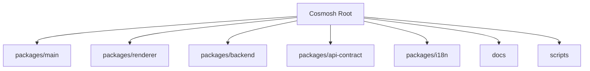
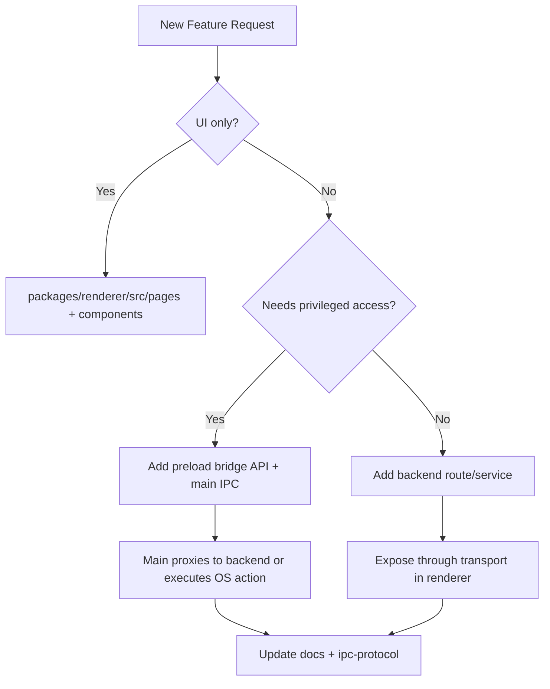

# Cosmosh Project Map

## 1. Monorepo Layout

## 2. Directory Responsibilities

### `packages/main`

- **Role**: Electron host process.
- **Key files**:
  - `src/index.ts`: app bootstrap, BrowserWindow config, IPC handlers, backend subprocess management.
  - `src/preload.ts`: secure renderer bridge.
  - `src/security/database-encryption.ts`: DB path/key handling helpers.

### `packages/renderer`

- **Role**: React UI layer.
- **Key folders**:
  - `src/pages`: feature pages (`Home`, `SSH`, `SSHEditor`, `Settings`, `SettingsEditor`, etc.).
  - `src/components/ui`: Radix-based primitive wrappers and styling contracts.
  - `src/lib`: backend transport, i18n, settings bootstrap (`app-settings.ts`), utility abstractions.
  - `theme`: token source used to generate CSS variable system.

### `packages/backend`

- **Role**: Internal API + session orchestration runtime.
- **Key folders**:
  - `src/http/routes`: REST endpoints for settings, SSH entities, and local terminal actions.
  - `src/ssh`: SSH auth/session logic (`ssh2`, known-host trust, telemetry).
  - `src/settings`: settings payload defaults and validation parsers.
  - `src/local-terminal`: local PTY session logic (`node-pty`).
  - `src/db`: Prisma initialization and DB lifecycle.

### `packages/api-contract`

Shared protocol constants, request/response types, OpenAPI source, generated contracts.

- `src/settings-registry.ts`: **single source of truth** for all settings definitions — types, defaults, constraints, enum sets, UI control metadata, categories, and helper functions. Adding/removing a setting only requires editing this file.
- `src/settings.ts`: generic, registry-driven validation and normalization helpers (`normalizeSettingsValuesStrict`, `normalizeSettingsValuesWithDefaults`) shared by backend and renderer.

### `packages/i18n`

Locale JSON source files and i18n runtime package for main/backend/renderer scopes.

## 3. Feature Placement Rules

## 4. Naming & Structure Guidelines

- Keep cross-process contracts in `api-contract` first, then consume in backend/main/renderer.
- Keep renderer side effects in `src/lib` (transport/services), not directly in presentational components.
- Add new IPC channels only via preload and mirror declaration in `renderer/src/vite-env.d.ts`.
- For backend features:
  - route in `http/routes/*`
  - business/session logic in dedicated service module
  - input validation in `ssh/validation.ts`-style parser modules.

## 5. Not Implemented Yet (Planned)

- Full SFTP feature module (backend service, WebSocket/file transfer protocol, renderer explorer page).
- Dedicated shared `common` package is not present yet; current sharing is done through `api-contract` + `i18n`.

## 6. Common Change Scenarios

### Add New IPC Action

1. Define or reuse contract types in `packages/api-contract` when needed.
2. Expose the bridge API in `packages/main/src/preload.ts`.
3. Add `ipcMain` handler and backend proxy in `packages/main/src/index.ts`.
4. Wire renderer transport wrapper in `packages/renderer/src/lib`.
5. Update `docs/developer/core/ipc-protocol.md` in the same change set.

### Add New Backend Capability

1. Add route under `packages/backend/src/http/routes`.
2. Add service logic in domain module (`ssh`, `local-terminal`, or new module).
3. Add validation/parser layer for input boundaries.
4. Expose consumption path to renderer via main bridge.
5. Sync architecture/runtime docs.

### Add New Application Setting

1. In `packages/api-contract/src/settings-registry.ts`:
   - Add the key and its type to the `SettingsValues` interface.
   - Add a `SettingDefinition` entry to the `SETTINGS_REGISTRY` array (default value, constraints, UI control, category, i18n keys, etc.).
2. Add i18n keys in `packages/i18n/locales/en/*.json` and `zh-CN/*.json`.
3. No other files need changes — validation, defaults, and UI rendering are derived from the registry automatically.
