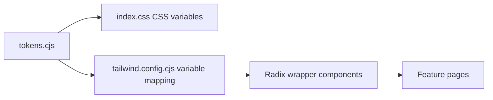
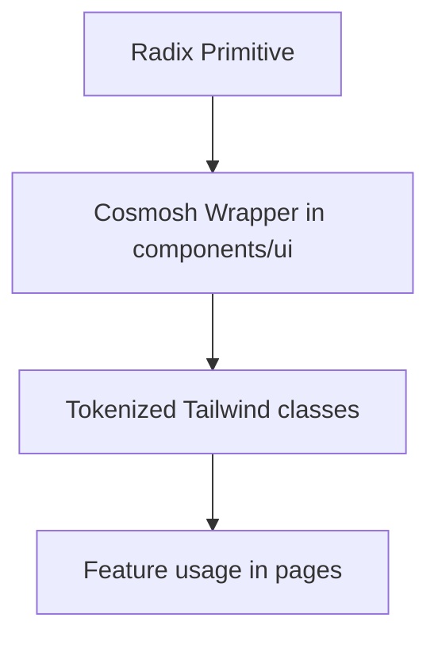

# UI/UX Standards

## 1. Design System Pipeline

Rules:

- Theme values originate from `packages/renderer/theme/tokens.cjs`.
- Tailwind colors/radius/shadow map to CSS variables (no hard-coded ad-hoc palette in feature code).
- UI primitives are wrapped in `packages/renderer/src/components/ui/*` and consumed by pages.

## 2. Visual Consistency Principles

- Define all visual primitives (color, radius, shadow, blur, spacing) through tokens.
- Reuse established surface and control styles instead of per-page one-off styling.
- Keep contrast and state feedback clear for focus, hover, active, and disabled states.

## 3. Typography Standard

- Keep typography compact, readable, and consistent across controls and content areas.
- Preserve a stable body/control baseline and avoid arbitrary size jumps between adjacent components.
- Use clear hierarchy for titles, labels, helper text, and status messages.

## 4. Radius Logic

- Keep corner radius semantics coherent across surfaces and interactive controls.
- Prefer token-level radius presets; avoid introducing ad-hoc radius values.
- Ensure radius choices match component purpose (containers, controls, overlays).

## 5. Radix UI Encapsulation Principle

Implementation principles:

- Use Radix primitives only via internal wrappers (`dialog.tsx`, `menubar.tsx`, `toast.tsx`, etc.).
- Store style contracts in dedicated style maps (`menu-styles.ts`, `form-styles.ts`, `dialog-styles.ts`, `toast-styles.ts`).
- Keep accessibility/state selectors (`data-state`, collision handling, keyboard semantics) inside wrappers.

## 6. Interaction Density Rules

- Keep layout dense but breathable, prioritizing efficient scanning and frequent actions.
- Maintain consistent control rhythm and spacing within each feature surface.
- Avoid decorative patterns that reduce clarity or compete with task-focused content.

## 7. Compliance Checklist

Before merging UI changes:

1. New colors/radius/shadow values must come from token pipeline.
2. New interactive primitives should be Radix wrappers under `components/ui`.
3. Typography and spacing follow existing system-level scale.
4. Component behavior and states stay consistent with existing wrappers.
