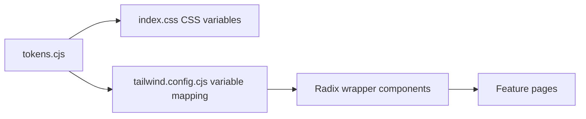
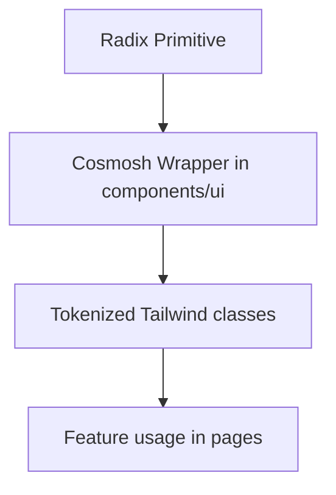

# UI/UX Standards

## 1. Design System Pipeline

```mermaid
flowchart LR
  TOK[tokens.cjs] --> CSS[index.css CSS variables]
  TOK --> TW[tailwind.config.cjs variable mapping]
  TW --> UI[Radix wrapper components]
  UI --> PAGES[Feature pages]
```

Rules:

- Theme values originate from `packages/renderer/theme/tokens.cjs`.
- Tailwind colors/radius/shadow map to CSS variables (no hard-coded ad-hoc palette in feature code).
- UI primitives are wrapped in `packages/renderer/src/components/ui/*` and consumed by pages.
- Windows title-bar system menu symbol color must come from token `color.windows.system-menu-symbol` and be synchronized to main-process overlay at runtime.
- CodeMirror syntax highlighting must use the shared `color.syntax.*` token family and the shared renderer CodeMirror highlighter instead of page-local color maps.

## 2. Visual Consistency Principles

- Define all visual primitives (color, radius, shadow, blur, spacing) through tokens.
- Reuse established surface and control styles instead of per-page one-off styling.
- Keep contrast and state feedback clear for focus, hover, active, and disabled states.

## 3. Typography Standard

- Keep typography compact, readable, and consistent across controls and content areas.
- Preserve a stable body/control baseline and avoid arbitrary size jumps between adjacent components.
- Use clear hierarchy for titles, labels, helper text, and status messages.

## 4. Radius Logic

- Keep corner radius semantics coherent across surfaces and interactive controls.
- Prefer token-level radius presets; avoid introducing ad-hoc radius values.
- Ensure radius choices match component purpose (containers, controls, overlays).

## 5. Radix UI Encapsulation Principle

```mermaid
flowchart TD
  A[Radix Primitive] --> B[Cosmosh Wrapper in components/ui]
  B --> C[Tokenized Tailwind classes]
  C --> D[Feature usage in pages]
```

Implementation principles:

- Use Radix primitives only via internal wrappers (`dialog.tsx`, `menubar.tsx`, `toast.tsx`, etc.).
- Store style contracts in dedicated style maps (`menu-styles.ts`, `form-styles.ts`, `dialog-styles.ts`, `toast-styles.ts`).
- Keep accessibility/state selectors (`data-state`, collision handling, keyboard semantics) inside wrappers.
- Floating menu wrappers must cap their size with Radix available-size custom properties plus the shared viewport gutter so dropdowns, context menus, menubars, and selects never render outside the visible app viewport.
- Scroll affordances inside menu wrappers must stay outside normal item flow; showing or hiding up/down indicators must not reserve blank rows, resize the active viewport, or shift the current scroll position. Overlay affordances must carry a tokenized surface background and backdrop blur so translucent menus do not reveal items underneath.
- Menu single-choice/radio items must use the shared leading checkmark indicator, matching checkbox/menu selection affordances instead of dot markers.
- Third-party editor overlays that cannot use Radix wrappers, such as CodeMirror autocomplete and info tooltips, must still use the shared menu/tooltip token rhythm: `bg-bg-subtle`, `shadow-menu-content` or `shadow-soft`, 4px panel gutters, 6px/10px item padding, `rounded-lg` panels, `rounded-md` items, and `bg-menu-control-hover` for hover/selection.
- Reusable search/replace panels must use `SearchReplacePanel` from `packages/renderer/src/components/ui`. The panel is controlled by its caller, supports hidden/readonly/editable replacement modes, configurable filter toggles, match-count display, compact density, and action-level disabled/hidden states. Surface-specific adapters own search algorithms and map their state into this generic panel instead of forking the UI.
- CodeMirror editor syntax uses a VS Code-inspired default palette through semantic tokens; editor chrome, autocomplete, diagnostics, search/replace panels, and context menus still follow Cosmosh surface/menu tokens.

### 5.1 Dialog Exit-State Lifecycle

- Setting `open` to `false` starts the dialog exit animation; it must not make dynamic labels, prompt payloads, or controlled field values disappear before the content leaves the viewport.
- Shared dialog exit behavior lives in `packages/renderer/src/components/ui/dialog-lifecycle.ts`. `DialogContent` and `AlertDialogContent` expose `onExitComplete`, which runs only after the content element's own `data-state="closed"` animation finishes.
- Prompt-driven dialogs whose owners clear nullable payloads immediately must render through `useDialogExitSnapshot` and release that snapshot from `onExitComplete`.
- Form and draft state should be reset from `onExitComplete`, or initialized immediately before the next open operation when retaining closed state is acceptable. Do not synchronize cleanup with hard-coded animation-duration timers.

## 6. Interaction Density Rules

- Keep layout dense but breathable, prioritizing efficient scanning and frequent actions.
- Maintain consistent control rhythm and spacing within each feature surface.
- Scrollable category or navigation changes, including Settings page categories, should reset the content pane to the top of the newly selected surface.
- Avoid decorative patterns that reduce clarity or compete with task-focused content.

### 6.1 Entity Visual Picker Virtualization

- `EntityVisualPicker` uses `@tanstack/react-virtual` to keep the full Lucide icon catalog searchable while mounting only visible fixed-grid rows plus a small overscan window.
- The virtual grid preserves the established eight-column, 32 px icon-button rhythm and 4 px gap; virtualization must not resize or shift the picker while scrolling.
- TanStack Virtual owns range calculation, total scroll size, overscan, and row scrolling. Feature code owns search, selection, keyboard semantics, and focus restoration; do not add a parallel manual windowing algorithm.
- Arrow-key and forward-Tab navigation must call the virtualizer to reveal an offscreen target row before moving focus. Search updates keep the selected icon, or the first filtered icon when the selection is absent, as the active grid item.
- Virtualization reduces mounted DOM only. Changes to icon-module loading or bundle composition remain a separate concern.

### 6.2 SFTP Collection Virtualization

- The SFTP directory tree and center file list use `@tanstack/react-virtual` with stable remote-path keys, fixed 30 px tree rows, fixed 34 px directory rows, and a small overscan window. The 30 px sticky directory header remains outside the logical row collection.
- Virtualization changes mounted DOM only. `SFTP.tsx` continues to own the complete filtered/sorted entry collection, expanded tree order, selection model, keyboard navigation order, and drag/drop contracts.
- The active roving-focus row and rows that own inline editing, an open context menu, or the native drag source stay mounted when necessary. Keyboard movement to an offscreen row must reveal it through the virtualizer before focus moves, and virtualized options/tree items must expose their logical position, collection size, and tree hierarchy to assistive technology.
- Current-directory tree positioning uses flattened logical row geometry and preserves the existing upper-third target when the parent/current/expanded-child context does not fit in the viewport.
- Directory marquee selection resolves intersections from the complete fixed-row model, including unmounted rows reached through edge auto-scroll. Virtualization must not weaken blank-area selection, modifier extension, drag/drop targeting, inline editing, or dirty-preview protection.

## 7. Orbit Bar Standard

Terminal text selection interactions in SSH pages must follow these rules:

- Use tokenized Menubar-like surface style (`menu-control`, `menu-divider`, `shadow-menu`) for the Orbit Bar.
- Show Orbit Bar only when terminal selection exists and place it above selection first.
- If above placement would overlap selection or exceed viewport bounds, place it below selection.
- Keep Orbit Bar position synchronized with selection movement and viewport/layout updates.
- Provide tooltip labels for each icon action and keep labels localized through renderer i18n resources.
- Non-implemented actions must use explicit "coming soon" feedback instead of silent no-op behavior.

## 7.1 SSH Split-Pane And Command Timeline Standard

- SSH terminal split/close actions are exposed only through the terminal context menu.
- Split progression is intentionally constrained to a fixed dense layout sequence (1 → 2 → 3 → 4 panes) to keep power-user scanning rhythm predictable.
- Pane separators must use tokenized divider colors with lighter contrast than card boundaries.
- SSH split-pane separators should use the dedicated token `color.ssh.terminal.split.divider` (Tailwind: `border-ssh-terminal-split-divider`) instead of reusing generic home/card divider colors.
- Each split pane is an independent command surface and therefore owns its own xterm, backend session, WebSocket, completion/status state, and command markers against the same resolved target. UI actions and overlays must route by explicit pane id.
- Pane close action must be available on each pane context menu while keeping at least one visible pane. Closing any pane, including the original primary, must leave surviving ids and runtimes intact.
- When Command Timeline is enabled and authenticated Remote Enhancements are active with `command-start`, each eligible pane uses a fixed 40 px command gutter on its right edge: a 34 px recent-command rail immediately left of xterm's 6 px scrollbar, with no trailing pane padding between the gutter and pane edge. Terminal columns are reserved through xterm padding while the native scrollbar remains inside its expanded scrollable element, preserving xterm's own hover reveal, track click, and thumb drag behavior. The rail stays in the pane DOM for its complete eligible lifetime so visual state changes never remount xterm or change PTY columns. Disabling Command Timeline removes only this pane-local rail and menu; it does not disable other Remote Enhancements capabilities.
- The recent-command entry is eligible only when the normal buffer contains more than two visible screens of content and more than three retained trusted commands. This threshold controls only the entry and menu; the fixed rail remains reserved for the complete eligible helper lifetime so crossing the threshold never changes terminal columns. The entry is hidden during alternate-screen programs; in the normal buffer, terminal pointer movement reveals it and five seconds without pointer movement hides it. Keyboard/IME input or paste inside xterm immediately closes the recent-command surface and hides the entry so it does not compete with active typing. Pointer activity is observed at the pane capture boundary so xterm canvas or scrollbar handlers cannot block the reveal, and newly eligible trusted history starts a fresh visibility window even after a visual-only remount. Idle hiding removes keyboard focus and accessibility exposure but keeps the compact pointer target active so pointer movement over that target can reveal and open it reliably. An open menu pins the entry until that menu closes or xterm input dismisses it.
- The entry is a vertically centered group containing at most the newest eight decorative lines. Every line is 12 px wide, 2 px high, separated by 10 px, centered horizontally in the rail, and rendered with `color.text` at approximately 60% opacity. Lines are a single list affordance and do not encode command output size or act as independent navigation targets.
- Pointer hit testing is limited to the line group's visual height plus 8 px of padding above and below. The rest of the 34 px rail must remain pointer-transparent, and both the adjacent scrollbar track and thumb must remain directly draggable.
- Pointer hover morphs the complete line group into one fixed 256 px shared-menu card that stays anchored to the scrollbar edge and expands left over the rail. The card mounts normally and uses CSS `@starting-style` with transform/opacity for a 180 ms entry; only a pointer-leave exit retains the portal for its 140 ms transform/opacity transition, allowing rapid reversal without leaving a hidden menu in the focus or Escape handling chain. Trigger, command-card, and row-action-menu `relatedTarget` checks plus one shared 80 ms portal-crossing grace window prevent intermittent hover loss, including pointer movement after opening a row context menu. The row action menu must ignore the hover-open parent's deliberate xterm focus restoration as a focus-out dismissal; pointer departure, outside interaction, Escape, and item selection remain valid close paths. The compact hit target keeps the default arrow cursor because hover opens the menu without a click. Neither the compact hit target nor the menu surface draws an outer focus outline; keyboard focus raises the compact lines to full opacity and retains highlighted menu-item treatment. The transition keeps the scrollbar exposed and crossfades the tokenized lines into command rows; keyboard opening remains immediate, and reduced-motion mode keeps only a short opacity transition.
- The card projects only the newest 100 retained commands through the shared menu wrappers, or the full retained collection when fewer than 100 exist. The bounded projection preserves oldest-to-newest order and initially scrolls to the bottom. Rows use the standard UI typeface and show only reconstructed user input, excluding virtual-environment, user, host, working-directory, and prompt text. Selecting a command reveals its pane-local xterm input marker. Right-clicking a row exposes `Copy Command` and `Insert into Terminal`; insertion writes text without Enter. Leaving the entry/menu or pressing Escape closes the surface.
- `Remote Enhancements Debug` is shown only when `remoteEnhancementsDebugEnabled` is enabled and must display the source/active pane's data rather than primary-pane fallback data.

### 7.1.1 Agent Terminal Attachment Standard

- Every attached SSH pane shows one compact, unframed status bar above xterm with the Agent/client name, `Idle` or `Running` state, and a direct indication that visible terminal output is shared. The bar must not cover xterm or change size as state text changes.
- Stop and Detach are icon buttons with localized tooltips. Stop is enabled only while that attachment owns a running Agent command and sends ordinary `Ctrl+C`; Detach removes Agent authority while preserving the SSH terminal.
- Agent-created tabs receive a recognizable Bot marker and focus immediately after approval. Existing attached tabs receive the marker while attached. Inactive SSH tabs stay mounted so attachment state does not recreate xterm or its backend session.
- The attach authorization selector defaults to the current eligible SSH pane and lists all SSH panes. Connecting, failed, non-prompt-ready, untrusted/degraded, and already-attached panes remain visible with a localized disabled reason. Local terminal panes are excluded in v1.
- Internal tab, pane, SSH session, launch, and WebSocket-token identifiers are control-plane details and must never appear in Agent-facing copy or results.
- The status bar and selector must retain the existing dense Cosmosh hierarchy, theme tokens, shared `Select`/`Tooltip` wrappers, and usable icon hit targets in light mode, dark mode, split panes, and narrow windows.

## 7.2 Tab Reorder Runtime Continuity

- Dragging/reordering tabs should affect strip order only; it must not remount/recreate page runtimes.
- Runtime-heavy pages (for example SSH/xterm sessions) must preserve in-memory session state when tab order changes.
- Reorder state updates should be id-based and must preserve the latest tab objects from state instead of writing stale drag snapshots back.
- Global tab creation entry points, including the tab-strip plus button, Header user menu, app menu, and command palette, append new tabs to the end of the strip.
- The tab-strip plus button keeps single-click creation as the fastest path, while hover or keyboard focus held for 500 ms and right-click open its add menu below the button.
- The plus-button add menu must expose Command Palette, Servers, Keychains, and Port Forwarding using the shared menu wrapper; arrow keys navigate items, `Esc` closes the menu, and moving the pointer away from the button/menu closes it.
- Contextual tab creation from inside an existing tab must pass an explicit anchor id and insert the new tab immediately to the right of that source tab.
- The tab context menu exposes `New Tab to the Right` as the explicit user-facing affordance for anchored tab creation.

## 7.3 Server-Backed Tab Visuals

- In light mode, active server-backed tabs must deepen the server color through `color.header.tab.server-active-overlay`; do not change the generic `color.header.tab.active` token to solve server-color contrast.
- SSH and SFTP tabs may apply the source server color background when the shared server-visual tab setting is enabled.
- SFTP tabs must keep a folder icon even when they inherit server color, so users can distinguish file-system tabs from terminal tabs quickly.
- Inactive server-backed tabs must dim through the theme-aware `color.header.tab.server-inactive-overlay` token family rather than hard-coded black overlays, so light mode preserves a clean inactive tint.
- Colorized command-palette rows must use the matching `color.command.item.color-visual-active-overlay` and `color.command.item.color-visual-overlay` token families so active route switching visuals stay clearly distinguishable while remaining aligned with tab chrome across themes.

## 7.4 Page-State Tab Identity

- Pages with major internal categories should keep the tab strip aligned with the active category when that category changes the user's task context.
- Home tabs in Keychains or Port Forwarding mode must show that category's localized title and matching icon; returning to SSH mode restores the standard Home title and icon.

### 7.4.1 Home Entity Card Context Menus

- Home entity cards must use the shared `ContextMenu` wrapper and keep the card's primary click and roving-focus behavior intact.
- Keychain card menus expose favorite/unfavorite, copy name, edit, and delete in that order, with separators between action groups.
- Favorite changes for keychains must use metadata-only updates. Context-menu actions must never fetch, copy, or resubmit passwords, private keys, or private-key passphrases.
- Keychain deletion requires explicit confirmation. A rejected delete keeps the keychain visible and reports the backend error without closing the confirmation surface.

## 7.5 Plain Text Selection Context Menu

- Non-editable DOM text selections should expose a minimal fallback context menu with Copy only.
- The fallback menu must open only when the pointer is inside the selected text rectangle, not merely because the page has an active selection.
- Existing specialized menus keep priority: inputs, textareas, contenteditable regions, CodeMirror editor surfaces, xterm/terminal surfaces, SFTP rows, tabs, and any component-level context menu trigger must not be replaced by the fallback menu. CodeMirror editor surfaces that need text editing commands should expose those commands through the shared internal `ContextMenu` styling and localized text-editing labels instead of falling back to the browser menu.
- The fallback menu must reuse the internal `ContextMenu` wrapper, tokenized menu styles, localized renderer copy, and platform shortcut hint.
- Standalone renderer documents, including SFTP entry properties popup windows, must mount the same fallback provider at the renderer root.

## 7.6 Command Palette Keyboard Focus

- The global quick-pick overlay is shared by the command palette and tab switcher: a query starting with `>` shows commands, while a query without `>` shows the tab list.
- Command-palette shortcuts must open the shared overlay with the `>` prefix already present; `Ctrl+Tab` must open the same overlay in tab-list mode and only the real held `Ctrl+Tab` flow may commit on Control key release.
- When a command palette displays its search input, the input owns navigation keys even if a mouse click or nested control focus temporarily moves DOM focus to a list action or footer control.
- Arrow navigation and palette-close shortcuts from non-text-entry descendants must first restore focus to the input, then run the same handler path used by the input.
- Nested buttons must keep their normal activation semantics; focus handoff should not convert every descendant key into a command selection.

## 7.7 Composite Control Accessibility

- Custom command/search controls that render option lists must expose a labeled `combobox` tied to a labeled `listbox` with stable `aria-controls`, `aria-expanded`, `aria-activedescendant`, and per-option `aria-selected`.
- Icon-only controls must carry a localized accessible name through `aria-label`; tooltips remain visual help and must not be the only name.
- Every dialog must pair its title with a meaningful `DialogDescription`; dense form dialogs may visually hide the description with `sr-only` when persistent helper copy would be redundant.
- Registry-driven settings controls must connect visible labels to the rendered control with stable `htmlFor`/`id` pairs, including switches, selects, text fields, textareas, and JSON edit buttons.
- SFTP directory rows that support roving focus or selection must use `listbox`/`option` semantics and keep `aria-selected` aligned with entry selection instead of mixing selectable rows with `role="button"`.
- SFTP directory lists must support desktop-style pointer marquee selection from list whitespace and the panel padding beside the list. The marquee must use a clearly visible token-based border and fill, preview intersecting rows as selected while dragging, and continuously auto-scroll near the list's vertical edges. It must not replace entry drag-and-drop, header column dragging, or inline editing; `Ctrl`/`Cmd` extends the existing selection.

## 7.8 Renderer Window Close Guard

- Main-window close and app-quit requests must check backend-owned SSH/SFTP activity before destroying the renderer.
- General > Behavior exposes `Ask Before Closing Window` as a switch that defaults on. Turning it off suppresses only the renderer prompt; active SSH/SFTP sessions must still be disconnected before close. If the persisted preference cannot be read, retain the default prompt.
- Present the warning with the shared renderer `Dialog` component. Main retains lifecycle authority and sends only an opaque confirmation request after its backend activity check requires user input.
- Use the concise title `Close window?` and description `There are still sessions in progress. Are you sure you want to close the window?`; do not expose implementation details or per-protocol counts in this dialog.
- The safe action (`Cancel`) is the default focus and cancel action. Closing requires an explicit `Close` command.
- Repeated close requests must share one in-flight prompt, and canceling must leave both the window and active sessions unchanged.

## 7.9 SFTP Transfer Task Feedback

- Reuse the existing tab-local toolbar task menu for upload/download progress; do not introduce a floating transfer window, page banner, or modal for routine progress.
- Supported backend tasks may run concurrently, but the compact menu keeps one stable creation-time identity per operation and sorts active states before recent terminal states. Preview writes and archive orchestration remain serialized without changing the visual surface.
- Running byte transfers show a stable progress bar, percentage, transferred/total size, and current speed. Polling updates should be throttled so stream chunks do not directly drive React renders.
- Failed tasks keep the original operation label and file detail, add a localized backend reason in the semantic error color, and raise the shared error toast. Error text must wrap within the dense task surface without resizing the toolbar trigger.
- A failed task remains in renderer state while its attention is `unseen`. Opening the task menu marks visible failures `viewed`; a visible document whose window has focus marks them `focus-exposed`. Only then may the normal short inspection retention remove them.
- Successful, cancelled, viewed, and focus-exposed terminal tasks may remain briefly for inspection, but this surface is not persisted transfer history and must not imply cancellation or resume controls that are not implemented.

## 7.10 First-Run Experience

- The first main-window render presents a non-dismissible OOBE dialog before the workbench mounts. Standalone renderer documents, including SFTP entry properties windows, bypass OOBE.
- The dialog shell is capped at 800 × 800 px and keeps at least `calc(100% - 5rem)` of window-edge breathing room on every axis; OOBE must not force tighter edge margins.
- The window margins around the OOBE dialog behave like the hidden title bar (drag to move, double-click to maximize/restore) through a dedicated full-screen drag layer; the dialog surface opts out with an explicit `no-drag` region because Chromium computes drag regions as union/subtraction rather than topmost hit-testing.
- The welcome, personalization, and completion screens share one stable dialog shell. Only the content viewport slides horizontally (500 ms with the `ease-slide` timing-function token); footer hints and navigation actions remain fixed.
- Personalization edits the existing Settings contract for language, theme, remote enhancements, terminal auto-complete, and Orbit Bar, reusing canonical Settings labels and descriptions. OOBE must merge those choices into the latest canonical settings snapshot instead of maintaining a second settings model. Theme choices preview immediately through the shared `applyThemeSetting` path, and only the OOBE root opts into the 500 ms color cross-fade (`.oobe-theme-transition`); the rest of the app shell must not inherit this transition.
- Theme cards render fixed-color miniature skeleton previews (dark-dominant, light-dominant, and a clip-path diagonal half-dark/half-light split for system) that intentionally bypass theme tokens; the split must use clip-path, not gradients, to avoid anti-aliased seams along the diagonal. Cards stay compact, borderless, and background-free, and selection is expressed through an outline-like accent ring inside an accessible radio-group contract, with no check badges. Setting rows keep label-left/control-right geometry, connect labels to controls, and reuse the canonical Settings descriptions in helper tooltips only for non-obvious options; self-explanatory items such as theme and language render without helper tooltips.
- The workbench must not render behind OOBE. Completion saves settings, persists the versioned renderer completion marker, plays the shared dialog exit animation, and only then reloads the WebView (with a timed fallback if the animation event never fires) so language/theme-sensitive surfaces initialize consistently without a background-content flash.
- The final resource cards open only approved HTTPS destinations through the preload bridge. Opening or persistence failures remain visible in the fixed footer and must not silently dismiss OOBE.

## 8. Compliance Checklist

Before merging UI changes:

1. New colors/radius/shadow values must come from token pipeline.
2. New interactive primitives should be Radix wrappers under `components/ui`.
3. Typography and spacing follow existing system-level scale.
4. Component behavior and states stay consistent with existing wrappers.
