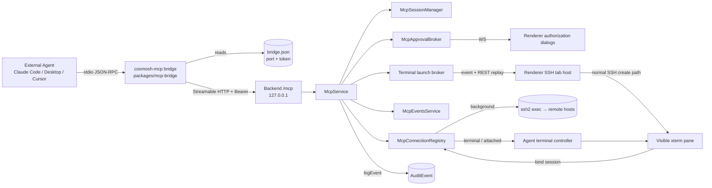

# Cosmosh MCP Server

Cosmosh MCP exposes a local [Model Context Protocol](https://modelcontextprotocol.io/) server so external AI agents (Claude Code, Claude Desktop, Cursor, and other MCP clients) can use the SSH servers a user has already configured in Cosmosh — without re-entering hosts or credentials anywhere else. By default an approved Agent connection is a visible, focused Cosmosh SSH tab; agents may explicitly request isolated background execution or ask the user to attach an existing SSH pane. The feature is off by default, every connection is human-authorized, and every operation is audited.

## 1. Product rules

- The feature is **off by default** (`mcpEnabled` setting, default `false`).
- **Opening an SSH connection always requires explicit user authorization** through a dialog in the Cosmosh window. There is no bypass.
- `open_connection` defaults to `terminal`, which creates and focuses a normal Cosmosh SSH tab. `background` preserves isolated `ssh2.exec` automation. `attach_terminal` lets the user choose an existing eligible SSH pane without exposing Cosmosh terminal identifiers to the Agent.
- Shared PTY execution is available only through a complete, trusted Remote Enhancements lifecycle. Missing trust, a non-ready prompt, unsubmitted user input, or another running command fails closed with a stable terminal error; Cosmosh never silently changes the requested mode.
- Connection authorization is bound to the displayed server name, host, port, and username. Cosmosh rechecks that snapshot immediately before SSH bootstrap and requires a new prompt if any field changed.
- Command execution is governed by a configurable policy (`mcpCommandPolicy`, global default `ask`) with a per-server override (`SshServer.mcpCommandPolicy`, default `default` = inherit):
  - `off` — agent commands are rejected.
  - `ask` — every command needs a confirmation dialog.
  - `allowWithinConnection` — the first command on a connection asks once; the user may allow the rest of that connection.
- The current per-server policy is read before every command. Editing the server invalidates any connection-scoped command pre-approval.
- Every MCP operation — client sessions, authorization decisions, connection lifecycle, every executed command, token rotation — is written to the audit log under the `mcp` category. See [Local-First Audit Events](./audit-events).
- Authorization request and explicit decision records are fail-closed: Cosmosh does not expose the prompt, accept the decision, or perform the remote action unless the corresponding audit event is persisted first.

## 2. Architecture



The agent never speaks to the backend directly. It launches the **`cosmosh-mcp` stdio bridge**, which reads the discovery file for the current `{port, token}` and forwards JSON-RPC verbatim to the backend `/mcp` Streamable-HTTP endpoint over loopback with a `Bearer` token. The backend `McpService` owns the tool surface, three-mode connection registry, approval and launch brokers, and audit trail. The renderer subscribes to the MCP event WebSocket, replays pending launches through REST, and uses the ordinary SSH tab/session path so visible Agent terminals inherit system proxy resolution, host trust, Remote Bootstrap, xterm, split panes, and reconnect behavior.

## 3. Backend layout (`packages/backend/src/mcp/`)

| File                        | Role                                                                                                                                                        |
| --------------------------- | ----------------------------------------------------------------------------------------------------------------------------------------------------------- |
| `constants.ts`              | Numeric bounds/timeouts and identifiers (connection cap, timeouts, byte caps, discovery filename, server name, session header).                             |
| `types.ts`                  | Internal runtime types (`McpClock`, `McpConnectionState`, `McpClientSessionState`, `McpApprovalRecord`, …) and `systemMcpClock`.                            |
| `tools.ts`                  | Registers the six MCP tools, their Zod input schemas, and response shaping; defines `McpToolRuntime`.                                                       |
| `service.ts`                | `McpService` facade: lifecycle/enable-gate, pairing, authorization gates, tool runtime impl, audit; `handleRequest`/`validateBearer` entry points.          |
| `pairing.ts`                | `McpPairingService`: encrypted pairing-token lifecycle + `bridge.json` discovery-file management.                                                           |
| `sessions.ts`               | `McpSessionManager`: MCP protocol sessions, Streamable-HTTP transport, DNS-rebinding config, session audit/events.                                          |
| `connection-registry.ts`    | `McpConnectionRegistry`: owns background clients and visible terminal attachments, session ownership, idle timers, and mode-specific close/detach behavior. |
| `connection-capacity.ts`    | Shared atomic eight-connection budget across live background/visible connections and in-progress opens/launches.                                            |
| `terminal-launch-broker.ts` | In-memory 60-second launch records, event emission, REST replay, idempotent bind, cancellation, and expiry.                                                 |
| `approval-broker.ts`        | `McpApprovalBroker`: turns authorization requests into promises resolved by decision/timeout/teardown.                                                      |
| `exec.ts`                   | `executeMcpSshCommand`: bounded SSH command execution capturing stdout/stderr/exit/truncation/duration.                                                     |
| `events-service.ts`         | `McpEventsService`: renderer authorization-event WebSocket listener with one-time channel tokens.                                                           |

`packages/backend/src/ssh/agent-terminal.ts` owns the testable shared-PTY attachment and command state machine. It consumes trusted command lifecycle events from `SshSessionService`; the MCP runtime never infers command completion from terminal text.

## 4. Tools

Registered by `registerMcpTools()` in `tools.ts`. Bounds live in `constants.ts`.

| Tool               | Input                                                                                                              | Behavior                                                                                                                                                                                                                                             |
| ------------------ | ------------------------------------------------------------------------------------------------------------------ | ---------------------------------------------------------------------------------------------------------------------------------------------------------------------------------------------------------------------------------------------------- |
| `list_servers`     | `query?` (string, ≤200)                                                                                            | Returns `{ servers, count }`; each entry has `serverId`, `name`, `host`, `port`, `username`, effective `commandPolicy`, `folder?`, `tags`, `note?`. Never returns credentials. Read-only.                                                            |
| `open_connection`  | `serverId` (required), `reason?` (string, ≤500), `mode?` (`terminal` or `background`, default `terminal`)          | Always raises an authorization prompt. `terminal` requests a renderer-created, focused SSH tab and waits for its primary pane to bind; `background` opens an isolated SSH client. Returns `{ connection }` or `{ error, message }`.                  |
| `attach_terminal`  | `reason?` (string, ≤500)                                                                                           | Always raises an authorization prompt whose selector defaults to the current eligible SSH pane. The Agent receives only the resulting connection summary, never terminal lists or internal ids.                                                      |
| `list_connections` | _(none)_                                                                                                           | Returns `{ connections, count }` for the agent's live connections. Read-only.                                                                                                                                                                        |
| `run_command`      | `connectionId` (required), `command` (required, ≤8192 bytes), `timeoutMs?` (≤120000), `maxOutputBytes?` (≤1048576) | Applies the live command policy. `background` returns `{ mode, stdout, stderr, exitCode, exitSignal, truncated, timedOut, durationMs }`. `terminal`/`attached` return `{ mode, output, exitCode, truncated, timedOut, durationMs, userIntervened }`. |
| `close_connection` | `connectionId` (required)                                                                                          | No prompt. Closes a background client, detaches an attached pane, or closes an Agent-created terminal tab/session. Returns `{ closed: true, connectionId }`.                                                                                         |

Failure reasons are enumerated (not thrown). Connection/open/attach failures include `denied`, `timeout`, `audit-unavailable`, `server-not-found`, `server-changed`, `host-untrusted`, `limit-reached`, `terminal-launch-failed`, `terminal-automation-unavailable`, `terminal-not-ready`, `terminal-busy`, `no-eligible-terminal`, and `failed`. Command failures additionally include `policy-off`, `connection-not-found`, `command-too-large`, and `invalid-terminal-command`.

Cancelling an MCP tool call immediately withdraws its pending authorization request. An approved `background` open propagates cancellation into SSH bootstrap. A pending visible launch is cancelled when its caller stops waiting. Cancelling or timing out a shared-PTY `run_command` stops only the MCP wait and output capture; it deliberately does not send `Ctrl+C`, and the connection remains `busy` until the trusted command end and next prompt.

`audit-unavailable` is a security failure, not a transient permission result. No prompt or remote action is released when a required authorization audit write fails.

`server-changed` means the persisted server destination no longer matches the target shown in the authorization prompt. No SSH connection was attempted; the agent must list servers again and raise a fresh request.

Background `ssh2.exec` preserves separate stdout/stderr and existing transport-error semantics. Visible commands capture merged PTY output by matching `commandId` from trusted `command-start` to `command-end`; user input remains enabled and sets `userIntervened=true` while a command is active. Raw user input and command output are never audited.

**Limits (`constants.ts`):** max 8 concurrent connections (`MCP_MAX_CONNECTIONS`), 10-minute idle cleanup (`MCP_CONNECTION_IDLE_TIMEOUT_MS`), 120 s approval lifetime (`MCP_APPROVAL_TIMEOUT_MS`, expiry = deny), 60 s terminal launch lifetime, default/max command timeout 15 s / 120 s, default/max output 256 KiB / 1 MiB, max command 8 KiB, and 45 s background SSH connect timeout. The connection cap counts live background/visible connections plus atomically reserved in-progress opens and launches.

## 5. The `/mcp` endpoint

Registered by `registerMcpEndpoint()` in `packages/backend/src/http/routes/mcp.ts` (`app.all('/mcp', …)`, mounted last in `create-app.ts`). Request handling:

1. MCP disabled → **503** (`API_CODES.mcpDisabled`).
2. Missing/invalid `Authorization: Bearer <token>` → **401** (`API_CODES.authInvalidToken`). The token is compared to the active pairing token in constant time (`timingSafeEqual`).
3. Otherwise delegated to `McpService.handleRequest(c.req.raw)`.

Sessions use `WebStandardStreamableHTTPServerTransport` (`sessions.ts`) with `sessionIdGenerator: randomUUID`, `enableDnsRebindingProtection: true`, and an exact runtime allowlist of `127.0.0.1:<httpPort>` and `localhost:<httpPort>`. The MCP SDK compares the complete `Host` header, including a non-default port, so `McpService` passes the active backend listener port into each session manager. This keeps DNS rebinding protection strict while allowing only the loopback endpoint that Cosmosh actually bound. The session id travels in the `mcp-session-id` header. A session is established only by a JSON-RPC `initialize` POST; an unknown session id yields JSON-RPC `-32001` (HTTP 404), a non-POST without a session yields `-32000` (HTTP 400), and malformed JSON yields `-32700` (HTTP 400). `/mcp` is JSON-RPC and is deliberately **not** part of the OpenAPI schema.

## 6. Management REST (`/api/v1/mcp/*`)

Renderer-facing management endpoints (behind the shared internal-token guard), defined in `packages/api-contract/src/protocol.ts` and handled by `registerMcpManagementRoutes()`:

| Method + path                                           | Purpose                                                                                                                                                               |
| ------------------------------------------------------- | --------------------------------------------------------------------------------------------------------------------------------------------------------------------- |
| `GET /api/v1/mcp/status`                                | Runtime status snapshot + discovery/bridge-launcher paths.                                                                                                            |
| `POST /api/v1/mcp/pairing-token`                        | Rotate the pairing token; returns `{ token, createdAt }` (plaintext shown once).                                                                                      |
| `DELETE /api/v1/mcp/pairing-token`                      | Revoke the active token (404 if none).                                                                                                                                |
| `GET /api/v1/mcp/clients`                               | List active protocol sessions.                                                                                                                                        |
| `GET /api/v1/mcp/connections`                           | List live agent connections.                                                                                                                                          |
| `DELETE /api/v1/mcp/connections/{connectionId}`         | Close one connection from the UI.                                                                                                                                     |
| `POST /api/v1/mcp/connections/{connectionId}/detach`    | Revoke a visible attachment while preserving its SSH tab/session.                                                                                                     |
| `POST /api/v1/mcp/connections/{connectionId}/interrupt` | Send `Ctrl+C` only when that attachment owns a running Agent command.                                                                                                 |
| `GET /api/v1/mcp/approvals`                             | List pending authorization prompts.                                                                                                                                   |
| `POST /api/v1/mcp/approvals/{approvalId}/decision`      | Submit a decision and optional renderer-only `terminalSessionId` for `attach_terminal`; returns 503 without resolving the prompt when its required audit write fails. |
| `GET /api/v1/mcp/terminal-launches`                     | Replay all unexpired visible-tab launches after renderer reconnect.                                                                                                   |
| `DELETE /api/v1/mcp/terminal-launches/{launchId}`       | Cancel an unbound launch.                                                                                                                                             |
| `POST /api/v1/mcp/terminal-launches/{launchId}/bind`    | Bind the ready primary SSH session to a launch exactly once.                                                                                                          |
| `POST /api/v1/mcp/events-channel`                       | Mint a one-time renderer WebSocket channel (503 when disabled).                                                                                                       |

Launch and approval ids belong only to the authenticated renderer/backend control plane. MCP responses never expose tab ids, pane ids, SSH terminal session ids, WebSocket tokens, or credentials.

## 7. Pairing token & discovery file

The pairing token authenticates the bridge to the backend. It is stored **encrypted** (AES-256-GCM, reusing `ssh/crypto.ts`) in the `McpPairingToken` model; v1 keeps a single active row and rotation revokes the previous one. Because the backend port changes every launch, the backend writes the plaintext token into a discovery file the bridge reads on each start.

`McpPairingService.writeDiscoveryFile()` writes `<userData>/mcp/bridge.json` only while MCP is enabled (and removes it on disable/shutdown):

```json
{
  "version": 1,
  "port": 51763,
  "token": "…base64url…",
  "pid": 12345,
  "appVersion": "0.1.0",
  "startedAt": "2026-07-26T12:00:00.000Z"
}
```

The `mcp/` directory is created `0700` and the file written `0600` (best-effort `chmod`; win32 relies on user ACLs, consistent with `secret.key`). The bridge resolves the path via `--discovery <path>` → `COSMOSH_MCP_DISCOVERY` → the platform-default userData location.

## 8. stdio bridge (`packages/mcp-bridge`)

A standalone package bundled with esbuild into a single self-contained CJS file (`dist/cosmosh-mcp.cjs`, SDK inlined):

- `src/discovery.ts` — resolves and parses `bridge.json` (pure, unit-tested).
- `src/proxy.ts` — transport-level passthrough: `StdioServerTransport` ↔ `StreamableHTTPClientTransport`, forwarding every message verbatim; plus a cheap reachability probe.
- `src/index.ts` — CLI entry (`-h`/`--help`, `-v`/`--version`); prints a single actionable stderr line and exits `1` when the app is down, MCP is disabled, or the token is stale.

**Packaging.** `packages/main`'s `prebuild` builds the bridge and runs `scripts/sync-mcp-bridge.cjs`, copying the bundle to `packages/main/resources/helpers/mcp-bridge/cosmosh-mcp.cjs` (gitignored). The existing `resources/helpers → helpers` extraResources mapping ships it; no electron-builder change is needed.

**Launcher.** On packaged startup, `packages/main/src/mcp-bridge-launcher.ts` writes a small wrapper to `<userData>/bin/` — `cosmosh-mcp.cmd` (Windows) or `cosmosh-mcp` (chmod 0755, macOS/Linux) — that runs the bundle under the Electron binary as plain Node (`ELECTRON_RUN_AS_NODE=1 "<exe>" "<cjs>" --discovery "<bridge.json>"`). The resolved launcher path is advertised to the backend via `COSMOSH_MCP_BRIDGE_LAUNCHER` and surfaced in `GET /api/v1/mcp/status` as `bridgeLauncherPath`, which the `Settings > MCP` management section uses to generate client config. In development there is no bundled bridge, so the launcher is a no-op and the section falls back to raw-command guidance.

## 9. Client configuration

Because the launcher pins `--discovery`, all clients share the same `mcpServers` shape. The `Settings > MCP` management section generates paste-ready snippets:

```json
{
  "mcpServers": {
    "cosmosh": {
      "command": "<bridge launcher path>"
    }
  }
}
```

- **Claude Code** — add to the project's `.mcp.json` (Cursor uses the same `mcpServers` shape).
- **Claude Desktop** — add to `claude_desktop_config.json` and restart.
- **Raw** — `command` / `args` / `env` fields for form-based clients.

## 10. Audit taxonomy (`category: 'mcp'`)

Actions written under the `mcp` category (`entityType` one of `mcp-session`, `mcp-connection`, `mcp-approval`, `mcp-pairing-token`):

| Action                                               | Fires when                                                                                                |
| ---------------------------------------------------- | --------------------------------------------------------------------------------------------------------- |
| `client-session-started` / `client-session-ended`    | An agent session is initialized / disposed.                                                               |
| `pairing-token-generated` / `pairing-token-revoked`  | Token rotated / revoked (severity `warning`).                                                             |
| `authorization-requested` / `authorization-resolved` | A prompt is raised / settles (the resolved event carries the `decision`).                                 |
| `connection-open`                                    | Every `open_connection` or `attach_terminal` outcome, including mode and status-only failure context.     |
| `connection-close`                                   | Any connection teardown (tool / ui / idle / shutdown / error / disabled).                                 |
| `command-execute`                                    | Every `run_command`, including mode, status, exit code, timeout, truncation, and user-intervention flags. |
| `list-servers`                                       | Each `list_servers` call.                                                                                 |

`authorization-requested` and explicit `authorization-resolved` decisions are synchronous required writes. A failed request write discards the unexposed prompt; a failed decision write leaves the prompt pending and prevents the waiting tool call from continuing. Automatic timeout/supersede events and non-authorization lifecycle events retain the local-first audit service's best-effort error policy.

Audit metadata never contains PTY output or raw user input. Agent command text is shown only in the authorization surface and is not copied into MCP audit metadata.

## 11. Contract, settings & persistence

- **Shared types:** `packages/api-contract/src/mcp.ts` — command policies, `McpConnectionMode`, mode/status connection summaries, terminal launches, approvals, and event payloads; `terminal-protocol.ts` owns renderer-safe attachment status.
- **Settings:** `mcpEnabled` (default `false`) and `mcpCommandPolicy` (default `ask`) live in the settings registry under the `mcp` category (sections `mcpAccess` / `mcpPolicy`). Runtime status, pairing, client configuration, connections, and approvals are composed into that same Settings category; MCP has no standalone workbench page or tab.
- **Persistence:** `SshServer.mcpCommandPolicy String @default("default")` and the `McpPairingToken` model (`tokenEncrypted`, `label`, `createdAt`, `lastUsedAt`, `revokedAt`), migration `20260726000100_mcp_pairing_and_policy`.

## 12. Testing & verification

- **Unit tests** (`tsx --test`): backend MCP/SSH suites cover approval and required-audit fail-closed behavior, target snapshot verification, shared connection capacity, launch replay/bind/expiry, trusted automation gates, single attachment/single command ownership, command-id output capture, UTF-8 truncation, user intervention, timeout recovery, mode-specific lifecycle, pairing, background exec, policy resolution, and protocol-session isolation. Renderer tests cover terminal surface eligibility/default selection, launch deduplication/focus/binding, and close-versus-preserve semantics.
- **Manual E2E:** verify a default open creates and focuses a visible Agent-marked tab; command text/output appears in xterm; user input and `Ctrl+C` remain functional and set `userIntervened`; current and non-current pane attachment never leaks an internal terminal id; `background` creates no tab and preserves separate stdout/stderr; degraded Remote Enhancements fail closed; explicit terminal close removes an Agent-created tab while client disconnect preserves and normalizes it. Check light/dark, single/split pane, and narrow-window layouts.

## Known limitations (v1)

- Background connections do not carry renderer-resolved `systemProxyRules`; a global `system` proxy mode may fall back to direct. Default visible terminals use the normal renderer SSH path and do inherit system proxy resolution.
- Each SSH connection is owned by the MCP protocol session that opened it. Other clients cannot list, execute through, or close it.
- On owner disconnect, token revocation, MCP disablement, or idle cleanup, background connections close while visible terminal/attached connections detach and preserve the user's SSH tab.
- Shared PTY automation requires trusted Remote Enhancements and supports SSH panes only; local terminal attachment is not part of v1.
- The discovery file contains a plaintext token (user-ACL directory + POSIX `0600`, same trust boundary as `secret.key`); the real gate is the authorization prompt plus the audit trail.
- With no Cosmosh window open, authorization requests can only time out to _denied_.
- A single pairing token is shared by all clients; per-client tokens and host-trust delegation are future work.
