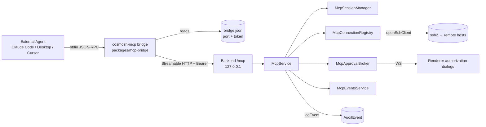

# Cosmosh MCP Server

Cosmosh MCP exposes a local [Model Context Protocol](https://modelcontextprotocol.io/) server so external AI agents (Claude Code, Claude Desktop, Cursor, and other MCP clients) can use the SSH servers a user has already configured in Cosmosh — without re-entering hosts or credentials anywhere else. The feature is off by default, every connection is human-authorized, and every operation is audited.

## 1. Product rules

- The feature is **off by default** (`mcpEnabled` setting, default `false`).
- **Opening an SSH connection always requires explicit user authorization** through a dialog in the Cosmosh window. There is no bypass.
- Command execution is governed by a configurable policy (`mcpCommandPolicy`, global default `ask`) with a per-server override (`SshServer.mcpCommandPolicy`, default `default` = inherit):
  - `off` — agent commands are rejected.
  - `ask` — every command needs a confirmation dialog.
  - `allowWithinConnection` — the first command on a connection asks once; the user may allow the rest of that connection.
- Every MCP operation — client sessions, authorization decisions, connection lifecycle, every executed command, token rotation — is written to the audit log under the `mcp` category. See [Local-First Audit Events](./audit-events).
- Authorization request and explicit decision records are fail-closed: Cosmosh does not expose the prompt, accept the decision, or perform the remote action unless the corresponding audit event is persisted first.

## 2. Architecture



The agent never speaks to the backend directly. It launches the **`cosmosh-mcp` stdio bridge**, which reads the discovery file for the current `{port, token}` and forwards JSON-RPC verbatim to the backend `/mcp` Streamable-HTTP endpoint over loopback with a `Bearer` token. The backend `McpService` owns the tool surface, SSH connection registry, approval broker, and audit trail; the renderer subscribes to a per-session WebSocket to render authorization dialogs.

## 3. Backend layout (`packages/backend/src/mcp/`)

| File | Role |
|---|---|
| `constants.ts` | Numeric bounds/timeouts and identifiers (connection cap, timeouts, byte caps, discovery filename, server name, session header). |
| `types.ts` | Internal runtime types (`McpClock`, `McpConnectionState`, `McpClientSessionState`, `McpApprovalRecord`, …) and `systemMcpClock`. |
| `tools.ts` | Registers the five MCP tools, their Zod input schemas, and response shaping; defines `McpToolRuntime`. |
| `service.ts` | `McpService` facade: lifecycle/enable-gate, pairing, authorization gates, tool runtime impl, audit; `handleRequest`/`validateBearer` entry points. |
| `pairing.ts` | `McpPairingService`: encrypted pairing-token lifecycle + `bridge.json` discovery-file management. |
| `sessions.ts` | `McpSessionManager`: MCP protocol sessions, Streamable-HTTP transport, DNS-rebinding config, session audit/events. |
| `connection-registry.ts` | `McpConnectionRegistry`: opens/tracks/closes agent SSH connections, idle timers, connection-cap enforcement. |
| `approval-broker.ts` | `McpApprovalBroker`: turns authorization requests into promises resolved by decision/timeout/teardown. |
| `exec.ts` | `executeMcpSshCommand`: bounded SSH command execution capturing stdout/stderr/exit/truncation/duration. |
| `events-service.ts` | `McpEventsService`: renderer authorization-event WebSocket listener with one-time channel tokens. |

## 4. Tools

Registered by `registerMcpTools()` in `tools.ts`. Bounds live in `constants.ts`.

| Tool | Input | Behavior |
|---|---|---|
| `list_servers` | `query?` (string, ≤200) | Returns `{ servers, count }`; each entry has `serverId`, `name`, `host`, `port`, `username`, effective `commandPolicy`, `folder?`, `tags`, `note?`. Never returns credentials. Read-only. |
| `open_connection` | `serverId` (required), `reason?` (string, ≤500) | Always raises an authorization prompt, then opens and registers an SSH connection; returns `{ connection }` (with `connectionId`) or `{ error, message }`. |
| `list_connections` | *(none)* | Returns `{ connections, count }` for the agent's live connections. Read-only. |
| `run_command` | `connectionId` (required), `command` (required, ≤`MCP_MAX_COMMAND_BYTES` = 8192 bytes), `timeoutMs?` (≤120000), `maxOutputBytes?` (≤1048576) | Applies the command policy, runs one bounded non-interactive command, returns `{ stdout, stderr, exitCode, exitSignal, truncated, timedOut, durationMs }` or `{ error, message }`. |
| `close_connection` | `connectionId` (required) | Closes and audits the connection; no prompt. Returns `{ closed: true, connectionId }`. |

Failure reasons are enumerated (not thrown): `open_connection` → `denied | timeout | audit-unavailable | server-not-found | host-untrusted | limit-reached | failed`; `run_command` → `denied | timeout | audit-unavailable | policy-off | connection-not-found | command-too-large | failed`.

Cancelling an MCP tool call immediately withdraws its pending authorization request. An approved `open_connection` also propagates cancellation into SSH bootstrap, so a client that has stopped waiting cannot leave a late connection behind.

`audit-unavailable` is a security failure, not a transient permission result. No prompt or remote action is released when a required authorization audit write fails.

**Limits (`constants.ts`):** max 8 concurrent connections (`MCP_MAX_CONNECTIONS`), 10-minute idle close (`MCP_CONNECTION_IDLE_TIMEOUT_MS`), 120 s approval lifetime (`MCP_APPROVAL_TIMEOUT_MS`, expiry = deny), default/max command timeout 15 s / 120 s, default/max output 256 KiB / 1 MiB, max command 8 KiB, 45 s SSH connect timeout.

## 5. The `/mcp` endpoint

Registered by `registerMcpEndpoint()` in `packages/backend/src/http/routes/mcp.ts` (`app.all('/mcp', …)`, mounted last in `create-app.ts`). Request handling:

1. MCP disabled → **503** (`API_CODES.mcpDisabled`).
2. Missing/invalid `Authorization: Bearer <token>` → **401** (`API_CODES.authInvalidToken`). The token is compared to the active pairing token in constant time (`timingSafeEqual`).
3. Otherwise delegated to `McpService.handleRequest(c.req.raw)`.

Sessions use `WebStandardStreamableHTTPServerTransport` (`sessions.ts`) with `sessionIdGenerator: randomUUID`, `enableDnsRebindingProtection: true`, and an exact runtime allowlist of `127.0.0.1:<httpPort>` and `localhost:<httpPort>`. The MCP SDK compares the complete `Host` header, including a non-default port, so `McpService` passes the active backend listener port into each session manager. This keeps DNS rebinding protection strict while allowing only the loopback endpoint that Cosmosh actually bound. The session id travels in the `mcp-session-id` header. A session is established only by a JSON-RPC `initialize` POST; an unknown session id yields JSON-RPC `-32001` (HTTP 404), a non-POST without a session yields `-32000` (HTTP 400), and malformed JSON yields `-32700` (HTTP 400). `/mcp` is JSON-RPC and is deliberately **not** part of the OpenAPI schema.

## 6. Management REST (`/api/v1/mcp/*`)

Renderer-facing management endpoints (behind the shared internal-token guard), defined in `packages/api-contract/src/protocol.ts` and handled by `registerMcpManagementRoutes()`:

| Method + path | Purpose |
|---|---|
| `GET /api/v1/mcp/status` | Runtime status snapshot + discovery/bridge-launcher paths. |
| `POST /api/v1/mcp/pairing-token` | Rotate the pairing token; returns `{ token, createdAt }` (plaintext shown once). |
| `DELETE /api/v1/mcp/pairing-token` | Revoke the active token (404 if none). |
| `GET /api/v1/mcp/clients` | List active protocol sessions. |
| `GET /api/v1/mcp/connections` | List live agent connections. |
| `DELETE /api/v1/mcp/connections/{connectionId}` | Close one connection from the UI. |
| `GET /api/v1/mcp/approvals` | List pending authorization prompts. |
| `POST /api/v1/mcp/approvals/{approvalId}/decision` | Submit a decision (`approved` / `approvedForConnection` / `denied`); returns 503 without resolving the prompt when its required audit write fails. |
| `POST /api/v1/mcp/events-channel` | Mint a one-time renderer WebSocket channel (503 when disabled). |

## 7. Pairing token & discovery file

The pairing token authenticates the bridge to the backend. It is stored **encrypted** (AES-256-GCM, reusing `ssh/crypto.ts`) in the `McpPairingToken` model; v1 keeps a single active row and rotation revokes the previous one. Because the backend port changes every launch, the backend writes the plaintext token into a discovery file the bridge reads on each start.

`McpPairingService.writeDiscoveryFile()` writes `<userData>/mcp/bridge.json` only while MCP is enabled (and removes it on disable/shutdown):

```json
{
  "version": 1,
  "port": 51763,
  "token": "…base64url…",
  "pid": 12345,
  "appVersion": "0.1.0",
  "startedAt": "2026-07-26T12:00:00.000Z"
}
```

The `mcp/` directory is created `0700` and the file written `0600` (best-effort `chmod`; win32 relies on user ACLs, consistent with `secret.key`). The bridge resolves the path via `--discovery <path>` → `COSMOSH_MCP_DISCOVERY` → the platform-default userData location.

## 8. stdio bridge (`packages/mcp-bridge`)

A standalone package bundled with esbuild into a single self-contained CJS file (`dist/cosmosh-mcp.cjs`, SDK inlined):

- `src/discovery.ts` — resolves and parses `bridge.json` (pure, unit-tested).
- `src/proxy.ts` — transport-level passthrough: `StdioServerTransport` ↔ `StreamableHTTPClientTransport`, forwarding every message verbatim; plus a cheap reachability probe.
- `src/index.ts` — CLI entry (`-h`/`--help`, `-v`/`--version`); prints a single actionable stderr line and exits `1` when the app is down, MCP is disabled, or the token is stale.

**Packaging.** `packages/main`'s `prebuild` builds the bridge and runs `scripts/sync-mcp-bridge.cjs`, copying the bundle to `packages/main/resources/helpers/mcp-bridge/cosmosh-mcp.cjs` (gitignored). The existing `resources/helpers → helpers` extraResources mapping ships it; no electron-builder change is needed.

**Launcher.** On packaged startup, `packages/main/src/mcp-bridge-launcher.ts` writes a small wrapper to `<userData>/bin/` — `cosmosh-mcp.cmd` (Windows) or `cosmosh-mcp` (chmod 0755, macOS/Linux) — that runs the bundle under the Electron binary as plain Node (`ELECTRON_RUN_AS_NODE=1 "<exe>" "<cjs>" --discovery "<bridge.json>"`). The resolved launcher path is advertised to the backend via `COSMOSH_MCP_BRIDGE_LAUNCHER` and surfaced in `GET /api/v1/mcp/status` as `bridgeLauncherPath`, which the MCP panel uses to generate client config. In development there is no bundled bridge, so the launcher is a no-op and the panel falls back to raw-command guidance.

## 9. Client configuration

Because the launcher pins `--discovery`, all clients share the same `mcpServers` shape. The MCP panel generates paste-ready snippets:

```json
{
  "mcpServers": {
    "cosmosh": {
      "command": "<bridge launcher path>"
    }
  }
}
```

- **Claude Code** — add to the project's `.mcp.json` (Cursor uses the same `mcpServers` shape).
- **Claude Desktop** — add to `claude_desktop_config.json` and restart.
- **Raw** — `command` / `args` / `env` fields for form-based clients.

## 10. Audit taxonomy (`category: 'mcp'`)

Actions written under the `mcp` category (`entityType` one of `mcp-session`, `mcp-connection`, `mcp-approval`, `mcp-pairing-token`):

| Action | Fires when |
|---|---|
| `client-session-started` / `client-session-ended` | An agent session is initialized / disposed. |
| `pairing-token-generated` / `pairing-token-revoked` | Token rotated / revoked (severity `warning`). |
| `authorization-requested` / `authorization-resolved` | A prompt is raised / settles (the resolved event carries the `decision`). |
| `connection-open` | Every `open_connection` outcome (success or failure: limit-reached / host-untrusted / open-failed). |
| `connection-close` | Any connection teardown (tool / ui / idle / shutdown / error / disabled). |
| `command-execute` | Every `run_command` (success, or failure: policy-off / denied / timeout / superseded). |
| `list-servers` | Each `list_servers` call. |

`authorization-requested` and explicit `authorization-resolved` decisions are synchronous required writes. A failed request write discards the unexposed prompt; a failed decision write leaves the prompt pending and prevents the waiting tool call from continuing. Automatic timeout/supersede events and non-authorization lifecycle events retain the local-first audit service's best-effort error policy.

## 11. Contract, settings & persistence

- **Shared types:** `packages/api-contract/src/mcp.ts` — `McpCommandPolicy` (`off | ask | allowWithinConnection`, default `ask`), `McpServerCommandPolicy` (adds `default`, the per-server default), `resolveEffectiveMcpCommandPolicy`, and approval/event payloads.
- **Settings:** `mcpEnabled` (default `false`) and `mcpCommandPolicy` (default `ask`) in the settings registry under the `mcp` category (sections `mcpAccess` / `mcpPolicy`).
- **Persistence:** `SshServer.mcpCommandPolicy String @default("default")` and the `McpPairingToken` model (`tokenEncrypted`, `label`, `createdAt`, `lastUsedAt`, `revokedAt`), migration `20260726000100_mcp_pairing_and_policy`.

## 12. Testing & verification

- **Unit tests** (`tsx --test`): backend `test:mcp` covers the approval broker (timeout → deny, resolve-once, shutdown denies all), fail-closed authorization request/decision auditing, pairing (rotation revokes prior token, constant-time compare, discovery-file permissions), bounded exec (stdout/stderr/exit/truncation), the policy matrix (`off`/`ask`/`allowWithinConnection` × global/per-server override), and session initialization with the exact loopback Host plus dynamic port while rejecting hosts outside that allowlist. The `@cosmosh/mcp-bridge` package tests discovery parsing, the reachability probe, and the passthrough.
- **Manual E2E:** enable MCP in dev and confirm `bridge.json` is created on enable and removed on disable/exit; drive `/mcp` with `npx @modelcontextprotocol/inspector` (bad token → 401, disabled → 503); attach Claude Code via generated `.mcp.json` and walk list → open (deny then approve) → run under each policy → `allowWithinConnection` upgrade → idle timeout, cross-checking each event on the audit page; quit the app and confirm the bridge prints a clear error; rotate the token and confirm the live bridge's next request fails.

## Known limitations (v1)

- MCP-opened connections do not carry renderer-resolved `systemProxyRules`; a global `system` proxy mode may fall back to direct.
- Each SSH connection is owned by the MCP protocol session that opened it. Other clients cannot list, execute through, or close it, and disconnecting the owner session closes its connections.
- The discovery file contains a plaintext token (user-ACL directory + POSIX `0600`, same trust boundary as `secret.key`); the real gate is the authorization prompt plus the audit trail.
- With no Cosmosh window open, authorization requests can only time out to *denied*.
- A single pairing token is shared by all clients; per-client tokens and host-trust delegation are future work.
