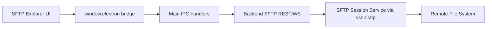
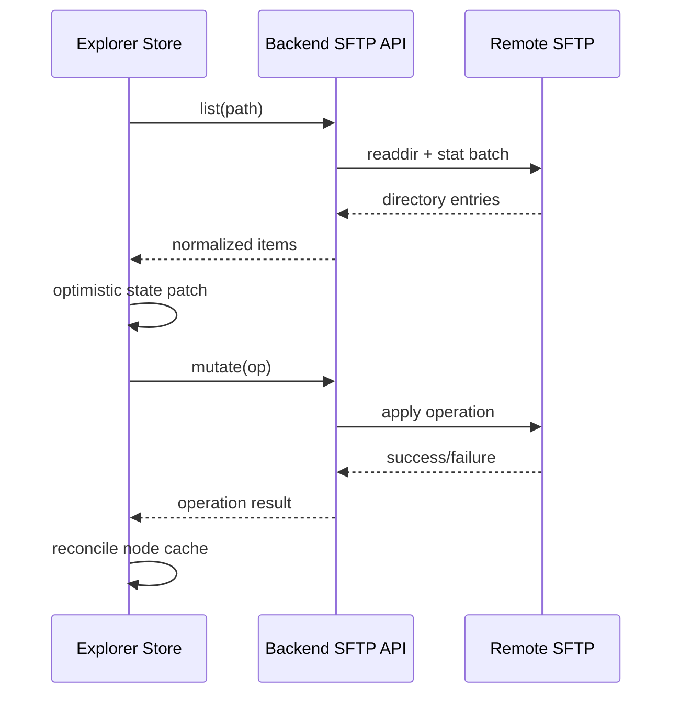

# SFTP File System

## 1. Current Status

SFTP file-system runtime is **not implemented yet** in current backend/main/renderer code paths.

Implemented clues today:

- API contract already includes `sftp` capability in protocol-level metadata.
- Renderer Home page contains disabled SFTP context action placeholder.
- No backend SFTP route/service or dedicated renderer SFTP page/session exists.

## 2. Planned Architecture (Design Baseline)

### Planned Layers

- **Renderer**: virtualized file explorer + transfer queue UI.
- **Main**: IPC contract boundary only (same pattern as SSH).
- **Backend**:
  - session registry keyed by `sessionId`.
  - SFTP operation APIs (list, stat, mkdir, rename, delete, upload, download).
  - stream-based transfer for large files.

## 3. Frontend State Synchronization Strategy (Planned)

Recommended synchronization model:

- Keep canonical tree cache keyed by normalized absolute path.
- Use optimistic mutation for rename/create/delete with rollback on failure.
- Revalidate parent directory after mutating operations.

## 4. Large File Transfer Strategy (Planned)

- Use stream/chunk pipeline instead of whole-file buffering.
- Track transfer progress as tuple: `{ bytesTransferred, totalBytes, speed, eta }`.
- Enforce per-transfer cancellation and global concurrency cap (for example 2-4 parallel transfers).
- Persist transfer task metadata to resume queue UI after renderer reload.

## 5. Recursive Directory Traversal Strategy (Planned)

- Use iterative queue (BFS/DFS) instead of deep recursion to avoid stack pressure.
- Emit progress snapshots periodically:
  - scanned directories count
  - file count
  - aggregated size
- Add operation guards:
  - skip symlink loops
  - configurable hidden-file policy
  - hard timeout and maximum node limit.

## 6. Error Model (Planned)

- Classify errors as:
  - authentication/session errors
  - permission denied
  - path not found / conflict
  - transient network errors.
- Map backend errors to stable UI-visible codes for retry behavior.

## 7. Delivery Checklist

Before enabling SFTP in UI menu:

1. Backend SFTP service + route contracts completed.
2. Main preload and IPC channels added.
3. Renderer SFTP page/session wiring completed.
4. `docs/developer/core/ipc-protocol.md` and `docs/developer/core/architecture.md` updated in same change.
