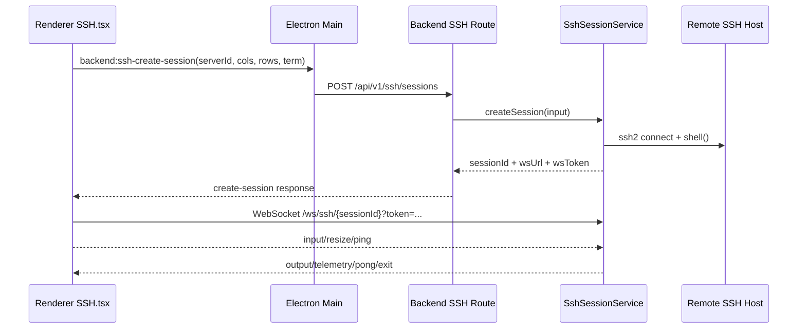
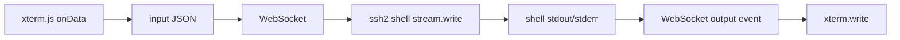

# SSH Terminal Implementation

## 1. Integration Overview (`ssh2` + `xterm.js`)

Cosmosh terminal path is split into control plane and data plane:

- **Control plane**: Renderer calls backend session creation through Main IPC bridge.
- **Data plane**: Renderer connects directly to backend WebSocket session endpoint and streams terminal I/O.

## 2. Backend Session Lifecycle

### Create Session

- Route: `POST /api/v1/ssh/sessions`
- Service: `SshSessionService.createSession`
- Steps:
  1. Load server record + encrypted credentials.
  2. Resolve trusted host fingerprints.
  3. Open SSH shell via `ssh2.Client.shell`.
  4. Register live session state in memory (`Map<sessionId, SshLiveSession>`).
  5. Return short-lived attach token + WS endpoint.

### Attach WebSocket

- Path: `/ws/ssh/{sessionId}?token=...`
- Invalid path/token/session is rejected (`1008`).
- Existing attached socket is replaced (`1012`) to support single active attach.
- Pending output is buffered before attach and flushed after ready.

### Close Session

- API-driven close: `DELETE /api/v1/ssh/sessions/{sessionId}`
- Transport-driven close: socket close/error, SSH stream close, SSH client error.
- Dispose behavior: send terminal `exit` event, clear telemetry timer, close SSH stream/client, close WS.

## 3. Data Stream Protocol

### Client → Server

- `input`: raw terminal input bytes as UTF-8 string.
- `resize`: terminal cols/rows with bounded normalization.
- `ping`: heartbeat.
- `close`: explicit disconnect request.

### Server → Client

- `ready`: attach acknowledged.
- `output`: shell stdout/stderr output.
- `telemetry`: CPU/memory/network + command history snapshot.
- `pong`: ping response.
- `error`: protocol/runtime error.
- `exit`: terminal session closed with reason.

## 4. Host Verification & Trust Flow

- SSH connect uses `hostHash: 'sha256'` and `hostVerifier`.
- If fingerprint is unknown:
  - backend returns `SSH_HOST_UNTRUSTED` payload.
  - renderer opens trust dialog.
  - user confirmation calls trust endpoint.
  - renderer retries create-session.

## 5. Exception Handling & Reconnect

### Current Behavior (Implemented)

- Session attach timeout: 30s.
- Any socket close/error transitions UI state to failed.
- Retry is **manual** via UI retry button (`SSH.tsx`), which creates a new session.
- No automatic exponential reconnection loop is implemented yet.

### Recommended Next Step (Planned)

- Add bounded auto-reconnect only for transient WS transport failures.
- Keep host-verification and auth failures as terminal (non-retriable) errors.

## 6. Performance Strategies in Current Code

- Renderer uses `FitAddon` + resize observer to keep shell size synchronized.
- Backend normalizes terminal sizes to prevent extreme allocations (`20-400 cols`, `10-200 rows`).
- Pending output queue avoids losing early SSH output before WS attach.
- Telemetry sampling is interval-based (5s) and lightweight text parsing to reduce per-frame cost.
- Command capture keeps bounded input buffer (512 chars per active line).

## 7. Developer Debug Checklist

When SSH session behavior is wrong, verify in order:

1. Session creation API payload and validation path.
2. Host verification branch (`SSH_HOST_UNTRUSTED` vs direct session creation).
3. WS attach token/sessionId matching.
4. Stream direction integrity (`input` write and `output` flush).
5. Session disposal path (API close vs transport close vs SSH error).
