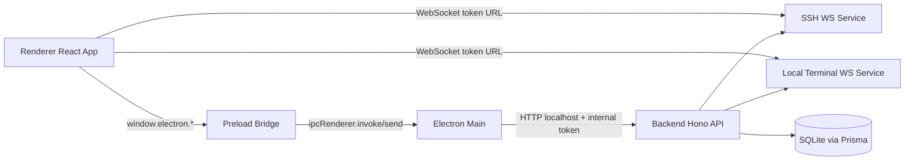
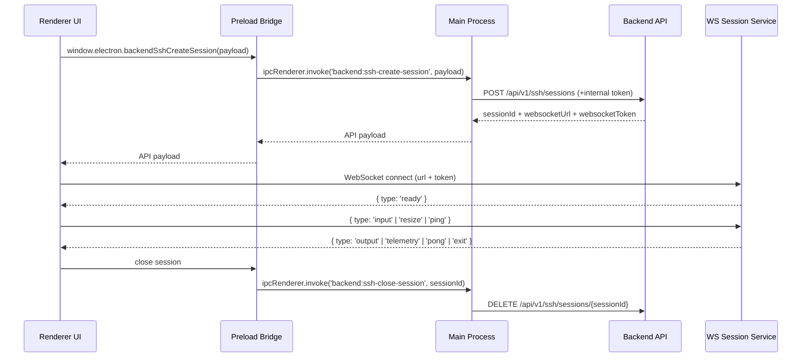
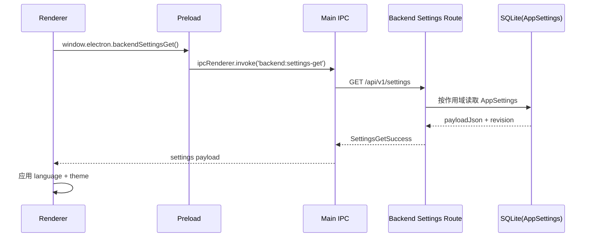
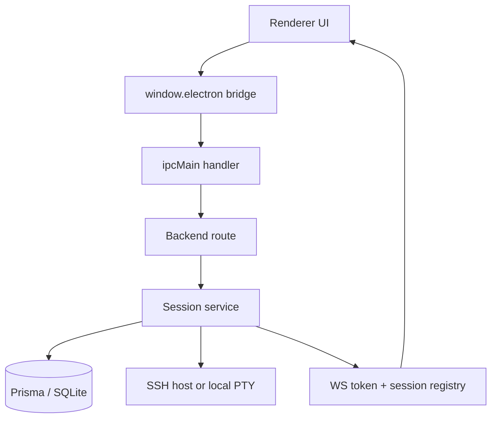
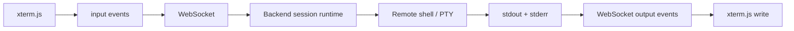
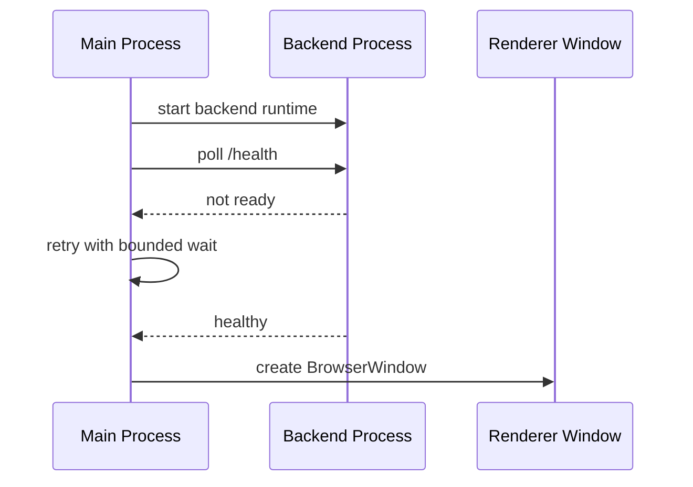
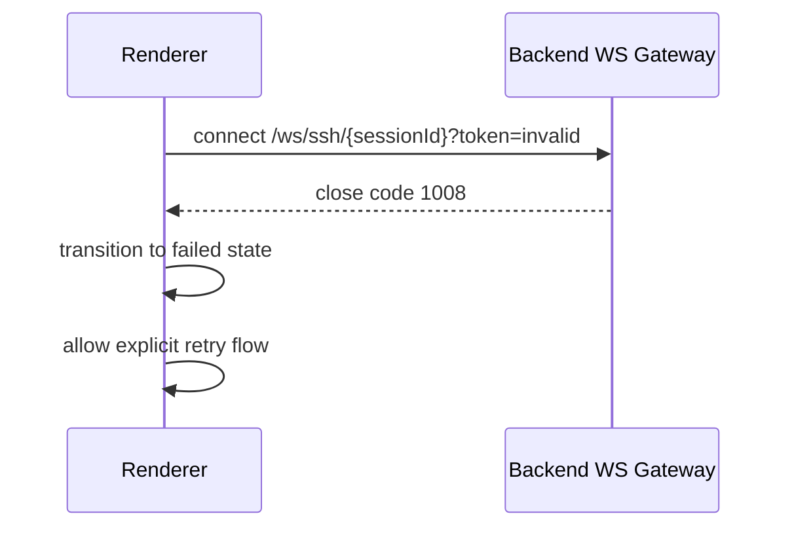
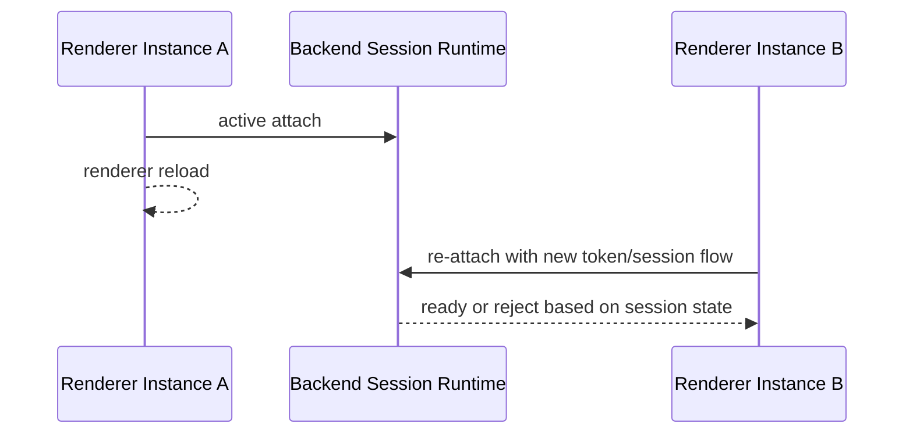
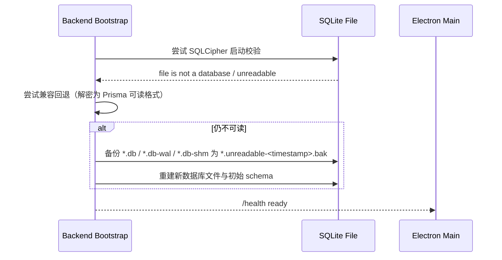

# Cosmosh 架构设计

## 1. 运行时拓扑

Cosmosh 采用 Electron 双进程模型，并嵌入后端服务：

- **Main 进程** (`packages/main/src/index.ts`)：应用生命周期、BrowserWindow 创建、preload 注入、IPC 注册、后端进程编排。
- **Preload Bridge** (`packages/main/src/preload.ts`)：通过 `contextBridge` 暴露严格受控 API。
- **Renderer 进程** (`packages/renderer/src`)：React UI、xterm UI、状态编排。
- **Backend 进程** (`packages/backend/src/index.ts`)：Hono HTTP API + SSH/本地终端 WebSocket 会话服务。

## 2. Main ↔ Renderer 职责划分

### Main 进程 (`packages/main/src/index.ts`)

- 启动后端进程，并在 `/health` 就绪后再打开 UI。
- 持有应用级能力：语言持久化（内存）、窗口/开发者工具/文件管理器操作。
- 将渲染层请求代理到后端端点，并注入：
  - 作为内部鉴权头的 `COSMOSH_INTERNAL_TOKEN`。
  - 用于后端 i18n 响应的 locale header。

### Renderer 进程 (`packages/renderer/src`)

- 仅通过 `window.electron` bridge 访问能力（不直接使用 Node API）。
- 通过后端 API 创建 SSH/本地终端会话。
- 通过 WebSocket 建立终端数据通道，并由 `xterm.js` 渲染。

## 3. IPC 生命周期（当前）

## 4. 安全模型

### Electron 表面加固

- `nodeIntegration: false`
- `contextIsolation: true`
- Renderer 仅获得显式 bridge API（`contextBridge.exposeInMainWorld`）。
- 特权操作保留在 Main/Backend 进程。

### Backend 访问边界

- 后端仅监听 localhost，并在 electron-main 模式下由内部运行时 token（`COSMOSH_INTERNAL_TOKEN`）保护。
- Main 进程注入头信息，不向 renderer 暴露内部 token。
- 凭据加密 key 由 `COSMOSH_SECRET_KEY` / 内部 token 哈希在后端启动时推导。
- HTTP i18n 采用请求级作用域：后端中间件优先从 `x-cosmosh-locale`（回退 `accept-language`）解析语言，并为每个请求注入翻译函数供路由统一生成响应消息。
- WS 运行时 i18n 采用会话级作用域：会话创建时携带已解析语言到 SSH/本地终端运行时，使 WS `error`/`exit` 消息与关闭原因保持本地化一致。

### 会话通道加固

- WebSocket 路径包含 sessionId 与 query token。
- token 不匹配或会话过期会立即关闭（`1008`）。
- 30 秒 attach 超时用于避免资源孤儿化。

## 5. 当前缺口 / 规划工作

- SFTP 运行时通道尚未实现；当前仅有 SSH 终端与本地终端会话通道。
- Renderer 的 Home 右键菜单已有 SFTP 占位入口，实际页面/会话接线仍在规划中。

## 5.1 设置运行时（已实现）

- 设置通过后端路由 `GET/PUT /api/v1/settings` 持久化。
- 存储模型为按作用域单行 JSON（`scopeAccountId` + `scopeDeviceId`）的 `AppSettings` 表。
- 默认作用域为本机（`deviceId=local-device`），并预留 account 作用域字段用于未来同步。
- Renderer 启动阶段（`packages/renderer/src/main.tsx`）会加载并应用已保存的语言与主题。
- 非视觉设置（如 SSH 运行时限制）当前仅做持久化与可发现，部分暂未绑定真实运行时行为。
- 所有设置定义（类型、默认值、约束、枚举集、UI 元数据、分类）统一存放在单一注册表：`packages/api-contract/src/settings-registry.ts`。增删设置项仅需编辑此文件（加 i18n 语言文件）。
- `packages/api-contract/src/settings.ts` 中的校验逻辑已改为通用的注册表驱动方式：每个 key 的规则（类型检查、枚举、范围、maxLength）在运行时从注册表派生，不再有手写的 switch/case。
- OpenAPI 中的 `SettingsValues` schema 有意设为宽松模式（`type: object`）；严格的 TypeScript 类型与约束仅存在于代码注册表中。
- Settings API 响应类型（`ApiSettingsGetResponse`、`ApiSettingsUpdateResponse`）在 `packages/api-contract/src/index.ts` 中手工定义，使用注册表中的严格 `SettingsValues`，不依赖 OpenAPI 生成类型。
- 已存储设置的读取解析采用前向兼容策略：对缺失/新增字段按字段回填默认值，而不是整份设置回退默认值。
- `PUT /api/v1/settings` 仍保持严格全量校验，确保持久化 payload 的结构稳定可预期。

## 6. 核心数据流视图

### 6.1 会话启动数据流

### 6.2 运行时流式数据流

### 6.3 失败边界模型

- **Renderer 边界**：负责视图状态与用户交互；失败应可通过 UI 重试恢复。
- **Main 边界**：负责能力路由与内部鉴权注入；失败不应泄露任何特权 token。
- **Backend 边界**：负责协议校验、会话生命周期与资源清理。
- **Remote 边界**：SSH 主机 / 本地 shell 波动视为外部故障，映射为稳定 UI 错误码。

## 7. 架构决策动机

- 保持 backend 为独立运行时进程，将协议与凭据处理与 renderer 攻击面隔离。
- 保持 preload 为最小桥接面，减少 API 暴露并维持严格进程契约。
- 终端高频 I/O 优先走 WS 数据面，避免 IPC 成为吞吐瓶颈。
- Main 进程作为编排/代理，而非业务承载层，便于未来服务端解耦演进。

## 8. 边界案例处理手册

### 8.1 启动时 Backend 未就绪

处理原则：

- 仅在 backend 健康检查通过后再打开 UI。
- 启动失败路径应清晰可观测。

### 8.2 WS Attach Token 不匹配

处理原则：

- token/session 不匹配属于安全敏感问题，必须失败即关闭。
- 恢复路径应通过全新 session/token 重新建立。

### 8.3 活跃会话期间 Renderer 重载

处理原则：

- 会话运行时必须防止陈旧 attach 状态污染。
- Renderer 重载应视作新生命周期并显式重建状态。

### 8.4 启动时 SQLite 文件不可读

处理原则：

- 相比直接崩溃，优先保证应用可启动性。
- 在重置前先备份不可读数据库文件，保留后续排障与数据恢复可能。
