# Cosmosh 架构设计

## 1. 运行时拓扑

Cosmosh 采用 Electron 双进程模型，并嵌入后端服务：

- **Main 进程** (`packages/main/src/index.ts`)：应用生命周期、BrowserWindow 创建、preload 注入、IPC 注册、后端进程编排。
- **Preload Bridge** (`packages/main/src/preload.ts`)：通过 `contextBridge` 暴露严格受控 API。
- **Renderer 进程** (`packages/renderer/src`)：React UI、xterm UI、状态编排。
- **Backend 进程** (`packages/backend/src/index.ts`)：Hono HTTP API + SSH/本地终端 WebSocket 会话服务，以及 SFTP 浏览、下载、文件操作会话与 SSH 端口转发运行时。

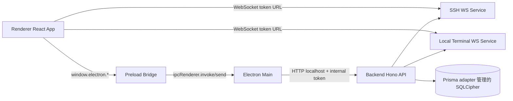
```mermaid
flowchart LR
  R[Renderer React App] -->|window.electron.*| P[Preload Bridge]
  P -->|ipcRenderer.invoke/send| M[Electron Main]
  M -->|HTTP localhost + internal token| B[Backend Hono API]
  R -->|WebSocket token URL| WS1[SSH WS Service]
  R -->|WebSocket token URL| WS2[Local Terminal WS Service]
  B --> WS1
  B --> WS2
  B --> DB[(Prisma adapter 管理的 SQLCipher)]
```

## 2. Main ↔ Renderer 职责划分

### Main 进程 (`packages/main/src/index.ts`)

- 应用启动阶段并行拉起 BrowserWindow 与 backend 预热流程。
- 维护单例的后端启动中的 Promise，避免并发触发重复拉起。
- Main 到 backend 的代理请求会在转发前确保 backend 已就绪。
- 在开发启动路径中，Main 采用增量预检（`packages/main/scripts/dev-preflight.cjs`），当产物是最新时会跳过 `@cosmosh/api-contract` / `@cosmosh/i18n` 的重复构建。同一 lifecycle 会在系统 Node 运行时下探测 SQLCipher native binding，并且只在当前 ABI 不兼容时重建。
- 开发身份由 `pnpm dev:profile`（`scripts/dev-profile.mjs`）管理。当选中身份或通过 `COSMOSH_DEV_PROFILE` 指定身份时，Main 会在窗口/backend 启动前应用该身份，使 Electron `userData`、SQLite 文件和 backend 专用 secret 存储都落到 `.cosmosh/dev-profiles/<name>/` 下。
- `packages/main/scripts/dev-main.cjs` 在 workspace 系统 Node 下运行，编译 Main，并通过仅开发态使用的 `COSMOSH_DEV_NODE_EXEC_PATH` 交接 canonical Node executable 给 Electron。
- Main 使用已校验的系统 Node executable 与 `tsx` 直接拉起开发态 backend，从而同时避免 package script 遗留孤儿进程以及 Electron/Node native ABI 冲突。打包 Main 仍使用 Electron 的 `process.execPath` 配合 `ELECTRON_RUN_AS_NODE=1` 启动已同步的 backend。
- 生产打包不依赖 app asar 解析 backend package。Main prebuild 会将已构建的 backend/api-contract/i18n 产物，以及经过筛选并递归同步的第三方运行时依赖复制到 `packages/main/resources-runtime/node_modules`，然后校验每个非 workspace 的 `@cosmosh/backend` 生产依赖都能从该目录解析。任何新增 backend 生产依赖都必须覆盖到 `packages/main/scripts/sync-backend-runtime.cjs`，否则安装包构建会在发布前失败，而不是发出启动后才缺模块的产物。
- 当 CI 提供 `COSMOSH_REMOTE_BOOTSTRAP_MANIFEST_URL` 时，打包流程还可以写入 `resources/remote-bootstrap/manifest-url.json`。Packaged main 只在环境变量之后把该资源作为 fallback 读取，因此仍保留本地 override 行为，同时让正式 tag release 安装包和 `main` 构建产物可以自动发现各自应使用的 bootstrap manifest。未打包的开发运行会再回退到滚动的 `remote-bootstrap-dev` manifest URL，因此本地测试远端增强无需每次设置 shell 环境变量。
- 持有应用级能力：语言持久化（内存）、窗口/开发者工具/文件管理器操作。
- 持有窗口/应用关闭守卫。Main 会阻止首次关闭，查询 backend 持有的 SSH/SFTP 注册表，将确认界面委托给 renderer，并且仅在不存在活动连接或用户明确确认中断后继续关闭。
- 将渲染层请求代理到后端端点，并注入：
  - 作为内部鉴权头的 `COSMOSH_INTERNAL_TOKEN`。
  - 用于后端 i18n 响应的 locale header。

#### 开发态 Backend 运行时边界

开发启动器负责交接系统 Node executable，因为它在 Electron 替换 `process.execPath` 之前运行。Main 仅接受能够解析到 canonical regular file 的绝对路径；在适用平台上要求 POSIX executable bits，拒绝 Electron host executable 本身，并在启动 Backend 前从子进程环境中移除交接变量。该值只属于开发编排元数据，不属于 Backend 环境契约。

开发与打包有意使用不同的 native target。Main 与 standalone Backend 的 `predev` lifecycle，以及 Backend 的 `predb:init`，都会调用 `ensure-sqlcipher-native.cjs --runtime=node --if-needed`；打包则无参数调用同一脚本，强制执行 Electron target 的 release rebuild。两个路径都会在构建后使用所选运行时打开并关闭内存数据库；探针失败会在 Backend 启动或 packaged runtime 同步前中止。在 Windows 上，切换 target 前必须关闭所有正在使用共享 binding 的 Cosmosh 进程，因为已加载的 `.node` 文件无法被替换。

### Backend 进程 (`packages/backend/src/index.ts`)

- 注册幂等的优雅关闭流程，覆盖运行时信号与致命进程事件。
- 暴露仅由 Main 关闭守卫使用、受内部 token 保护的运行时连接汇总/关闭操作；renderer 不获得批量断开 bridge。
- 关闭顺序固定：先停 WS 会话服务，再关闭 HTTP 监听，最后断开 Prisma/SQLite 连接句柄。
- Windows 终止信号（`SIGBREAK`）与 POSIX 信号共用同一路径，降低数据库文件锁残留概率。
- 本地终端 profile 发现改为短时内存缓存 + 并行探测，降低 Home/Settings 首次加载时重复扫描带来的等待。
- 主 SSH transport 认证成功后、交互 PTY 打开前，若全局与服务器级开关允许，`SshSessionService` 会通过 `RemoteBootstrapService` 执行远端增强 ensure。远端命令使用按需懒创建的临时 SSH transport，并复用相同的凭据、host-trust、压缩与代理策略；主 transport 调用 `shell()` 前会先启动临时 transport 的优雅关闭。这样主 transport 永远不会创建 bootstrap `exec` channel，既保留服务端登录消息，也能让新安装的 profile hook 在首次交互 shell 中生效。Backend 负责 manifest 加载、远端探测、已安装状态校验、按需下载编排、状态转发、运行时事件门禁与审计记录；`packages/remote-bootstrap` 负责远端用户级 Go 安装器，以及由 Go 生成的 helper 协议/能力契约。Manifest URL 优先来自 `COSMOSH_REMOTE_BOOTSTRAP_MANIFEST_URL`，其次是 packaged CI resource，未打包开发运行则再回退到仅开发使用的 `remote-bootstrap-dev` 默认值。正式 tag release 包指向版本化 release manifest；`main` 包指向固定的 `remote-bootstrap-dev` prerelease manifest；分支名包含 `remote-bootstrap` 的 push 构建可以指向分支专用临时 prerelease manifest，用于端到端 CI 测试。已安装契约为最新时跳过 asset 下载；ensure 失败会启动临时 transport 的关闭、禁用本次会话的增强数据，但不会阻止已认证的主 transport 打开普通 shell。
- `RemoteShellEventOscParser` 将可见输出与 helper 事件拆开后，`SshSessionService` 仍会保留原始 PTY 顺序，并按有序 frame 转发，而不是按类型重新分组。因此，位于 `command-start` 之前的输入回显与换行会先进入 renderer xterm，再捕获命令 marker 几何信息。WebSocket 未 attach 时，两类 frame 共用一个有界且保持到达顺序的队列；attach 会先发送当前控制状态，再按原顺序回放保留的 frame。
- `RemoteBootstrapService` 会合并并发 manifest 加载，并只缓存校验成功结果五分钟。Session 取消只停止单个等待者，不会中止共享请求；失败加载可立即重试。
- 启动阶段在 `initializeDatabase(...)` 内执行幂等 Prisma migration 文件同步，因此无论是安装后首次启动还是后续每次启动，都会在开放 HTTP 路由前将本地数据库结构收敛到当前后端契约。
- 生产环境使用 `PrismaSqlCipherAdapterFactory` 构造 Prisma；该 factory 会把 `better-sqlite3-multiple-ciphers` native binding 注入 Prisma 的 better-sqlite3 adapter，并在暴露连接前应用数据库密钥。Schema migration 与业务查询因此共享同一条 keyed SQLCipher 连接路径。
- 标准 SQLite 明文文件头会触发一次性的复制/rekey/校验/替换迁移。未知文件或错误密钥不会进入明文 fallback，固定迁移产物可在下一次启动恢复 rename 中断窗口。
- 简单的 Prisma `ALTER TABLE ... ADD COLUMN` migration 会先对照实时 SQLite 表元数据；若列已存在但 `_prisma_migrations` 缺少记录，启动会补记该 migration，而不是再次执行重复 DDL；非简单 migration 漂移仍然快速失败。
- Schema 同步采用快速失败策略：若运行时 migration 执行后仍无法满足必需表结构，backend 将中止启动，避免 API 进入部分可用/行为不确定状态。
- migration 台账元数据采用与 Prisma 兼容的 `_prisma_migrations` 结构，便于后续平滑切换到原生 `prisma migrate deploy/resolve` 工作流。

### Renderer 进程 (`packages/renderer/src`)

- 仅通过 `window.electron` bridge 访问能力（不直接使用 Node API）。
- 通过后端 API 创建 SSH/本地终端会话与 SFTP 浏览、下载、文件操作会话。
- 通过 WebSocket 建立终端数据通道，并由 `xterm.js` 渲染。
- 非 Home 的渲染页（包括 SSH 与基于 CodeMirror 的设置编辑器）采用懒加载，避免重型资源进入默认启动路径。
- Renderer 启动优先从本地缓存水合设置，再在后台向 backend 拉取权威值并同步覆盖。
- 开发态 StrictMode 改为通过 `VITE_ENABLE_STRICT_MODE=true` 显式开启，降低本地性能排查时重复 effect 执行带来的干扰。
- SSH 页面使用 tab 作用域的连接意图快照与 pane 作用域的运行时。每个 primary/secondary pane 独立持有 xterm、WebSocket/session、transport 状态、telemetry、补全状态、远端增强状态、调试历史与可信命令时间线 marker；所有 inbound message 统一经过 pane-aware reducer。时间线中的完整命令从 xterm 已渲染输入重建，并且只保存在对应 pane runtime 的内存中。
- 隐藏 tab 不会启动新的 SSH 连接副作用。重新激活时，可选的切回重连路径会分别检查每个失败 pane；第一次激活始终启动延迟创建的 primary pane。重试或重连任一 pane 时，所有同级 pane runtime 都会保持存活。
- Renderer 按 pane 消费 backend 的 `bootstrap-status`、`remote-enhancement-runtime-status` 与可信协议 v2 `remote-shell-event`。调试入口由 `remoteEnhancementsDebugEnabled` 控制，浮层始终展示其来源/活动 pane。

## 3. IPC 生命周期（当前）

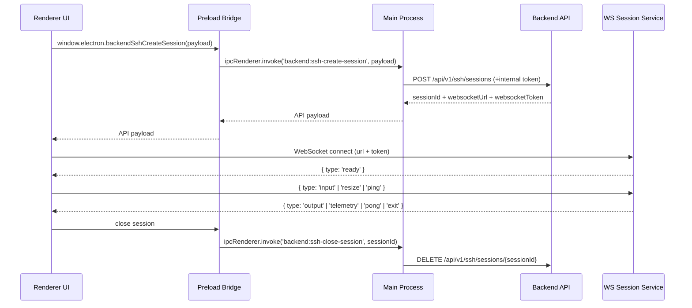
```mermaid
sequenceDiagram
  participant UI as Renderer UI
  participant PB as Preload Bridge
  participant MP as Main Process
  participant BE as Backend API
  participant WS as WS Session Service

  UI->>PB: window.electron.backendSshCreateSession(payload)
  PB->>MP: ipcRenderer.invoke('backend:ssh-create-session', payload)
  MP->>BE: POST /api/v1/ssh/sessions (+internal token)
  BE-->>MP: sessionId + websocketUrl + websocketToken
  MP-->>PB: API payload
  PB-->>UI: API payload

  UI->>WS: WebSocket connect (url + token)
  WS-->>UI: { type: 'ready' }
  UI->>WS: { type: 'input' | 'resize' | 'ping' }
  WS-->>UI: { type: 'output' | 'telemetry' | 'pong' | 'exit' }

  UI->>PB: close session
  PB->>MP: ipcRenderer.invoke('backend:ssh-close-session', sessionId)
  MP->>BE: DELETE /api/v1/ssh/sessions/{sessionId}
```

## 3.1 受保护的窗口关闭与应用退出生命周期

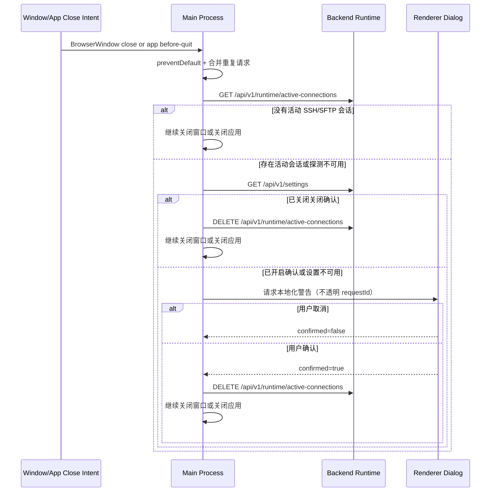
```mermaid
sequenceDiagram
  participant OS as Window/App Close Intent
  participant MP as Main Process
  participant BE as Backend Runtime
  participant RD as Renderer Dialog

  OS->>MP: BrowserWindow close or app before-quit
  MP->>MP: preventDefault + 合并重复请求
  MP->>BE: GET /api/v1/runtime/active-connections
  alt 没有活动 SSH/SFTP 会话
    MP->>MP: 继续关闭窗口或关闭应用
  else 存在活动会话或探测不可用
    MP->>BE: GET /api/v1/settings
    alt 已关闭关闭确认
      MP->>BE: DELETE /api/v1/runtime/active-connections
      MP->>MP: 继续关闭窗口或关闭应用
    else 已开启确认或设置不可用
      MP->>RD: 请求本地化警告（不透明 requestId）
      alt 用户取消
        RD-->>MP: confirmed=false
      else 用户确认
        RD-->>MP: confirmed=true
        MP->>BE: DELETE /api/v1/runtime/active-connections
        MP->>MP: 继续关闭窗口或关闭应用
      end
    end
  end
```

- “活动连接”指仍存在于 backend 服务注册表中的 SSH 或 SFTP 会话。本地终端和端口转发运行时明确不属于本次警告范围。
- `windowCloseConfirmationEnabled` 注册在“通用 > 行为”下，默认值为 `true`。仅当存在活动会话或活动状态探测不可用时，Main 才读取这项 backend 持久化设置。关闭该设置会跳过 renderer 对话框，但仍会在关闭窗口或应用前断开已注册的 SSH/SFTP 会话；设置读取失败时保留默认询问行为。
- Main 会先校验计数均为非负值且总数一致，再用于关闭判断。探测失败或响应畸形时会遵循已配置的确认行为，不会静默关闭，也不会永久阻止退出。
- 标题栏、最后一个标签页、菜单和快捷键产生的重复关闭请求共用一个进行中的决策。Main 会将 renderer 响应同时绑定到不透明 request ID 与所属 `webContents`；preload 负责校验请求，并在 React listener 挂载前暂存该请求。可响应 renderer 超时后按安全的取消处理；renderer 不可用或已销毁时则允许退出，避免永久阻塞。
- Windows 与 Linux 上，获准的主窗口关闭会进入完整应用关闭流程。macOS 上，仅关闭窗口时会先断开 SSH/SFTP 会话再销毁窗口，并保留应用运行时以供重新激活；退出应用仍执行完整关闭。
- 启动失败与致命进程退出会绕过交互确认，但继续执行既有 backend 与 SFTP 临时目录清理路径。

## 4. 安全模型

### Electron 表面加固

- `nodeIntegration: false`
- `contextIsolation: true`
- Renderer 仅获得显式 bridge API（`contextBridge.exposeInMainWorld`）。
- Renderer 的 Content Security Policy 将 `script-src` 限制为 `'self'` 加 `'wasm-unsafe-eval'`。WebAssembly 许可用于 `@xterm/addon-image` 等 renderer 打包库执行内联图片解码，不会开启通用 JavaScript `eval`。
- sandboxed preload 脚本不得在运行时导入 workspace package。它可以在编译期使用共享 API contract 类型，但 preload 内部使用的运行时校验器必须保持本地实现或被打包进 preload，避免 Electron 在 bridge 加载前解析项目模块。
- 特权操作保留在 Main/Backend 进程。
- Renderer 发起的应用窗口默认被拒绝。当前白名单仅允许同 renderer 的 SFTP 属性弹窗，这些子窗口复用安全 preload，并保持 `nodeIntegration` 关闭、`contextIsolation` 开启。

### Backend 访问边界

- 后端 HTTP 在所有运行模式下都显式绑定 IPv4 loopback 接口（`127.0.0.1`）。监听器不得依赖 Node server 默认值，因为默认值可能将 standalone 开发 API 暴露到非 loopback 网卡。
- Vite renderer 开发服务器同样显式绑定 `127.0.0.1`。Electron 开发加载 URL、renderer 弹窗可信 origin、renderer CSP 与 Backend CORS 必须使用这一精确 origin 和共享的 `COSMOSH_RENDERER_DEV_PORT`；`localhost` 不能作为可互换的开发 origin。
- electron-main 模式还会使用内部运行时 token（`COSMOSH_INTERNAL_TOKEN`）保护 `/api/v1/*`。standalone 模式即使不要求该 token，也必须保持仅 loopback 可访问。
- Main 进程注入头信息，不向 renderer 暴露内部 token。
- 开发态 DevTools extension：在未打包运行中、renderer 页面加载前，Main 会把 React DevTools 和自定义 backend 请求面板加载到 Electron default session。React DevTools 通过 `electron-devtools-installer` 获取；首次开发启动可能会把它下载到 Electron 开发态 `userData`，后续启动复用缓存文件。下载或加载失败只记录非致命 warning，离线开发仍可正常启动。Main 会把已经发生的 backend proxy 请求记录为脱敏后的内存 ring buffer，并通过 debug IPC 暴露给自定义面板。它不改变真实请求链路（`renderer -> preload IPC -> main -> backend`），不发送 mirror fetch，也不会在原生 Network tab 里增加伪造请求行。镜像数据在进入 renderer/DevTools 前会移除内部鉴权头、secret-like payload key 与本地绝对路径。生产包不会采集 trace、解析 React DevTools 依赖或加载任一 extension。如果开发态缺少面板，先查看 main 进程终端里的 `[debug]` extension load/skip/failure 日志。
- Main 还会对本地 SFTP 下载目标实施能力授权。应用工具 IPC 为发起请求的 renderer webContents 授权一个精确的规范化路径；backend 代理会拒绝没有该所有者授权的下载路径。临时预览/打开路径可复用，Downloads 与保存对话框路径在一次请求后即被消费。
- 凭据加密 key 由 `COSMOSH_SECRET_KEY` / 内部 token 哈希在后端启动时推导。
- HTTP i18n 采用请求级作用域：后端中间件优先从 `x-cosmosh-locale`（回退 `accept-language`）解析语言，并为每个请求注入翻译函数供路由统一生成响应消息。
- WS 运行时 i18n 采用会话级作用域：会话创建时携带已解析语言到 SSH/本地终端运行时，使 WS `error`/`exit` 消息与关闭原因保持本地化一致。
- i18n 运行时改为资源注入模型：各消费端在 `createI18n(...)` 注册阶段自行导入并注入语言 JSON，因此每个进程只打包所需作用域数据。

### 会话通道加固

- WebSocket 路径包含 sessionId 与 query token。
- token 不匹配或会话过期会立即关闭（`1008`）。
- 30 秒 attach 超时用于避免资源孤儿化。

### 发布供应链边界

- 普通 CI 与滚动 remote-bootstrap 通道和版本化公开发布保持分离。滚动 `remote-bootstrap-dev` 与 `remote-bootstrap-branch-*` 资产按设计允许替换；带 tag 的应用只使用对应的精确版本 manifest URL。
- GitHub Actions 固定到完整 commit SHA，并通过经过评审的 Dependabot pull request 更新。构建任务对仓库只读并暂存短期 workflow artifacts；只有最终 release 任务可以创建或更新 draft。
- 正式发布组装会校验完整平台资产清单、写入 `SHA256SUMS`、创建 GitHub provenance attestations，并拒绝修改已发布 release。
- Windows 签名当前使用策略门禁。`audit` 允许生成带醒目标记的未签名 draft 以验证流水线，`enforce` 则要求在创建 draft 前通过 Authenticode 签名、时间戳与已配置发布者身份验证。
- Draft 可变性是有意设计。首次公开发布前还需通过仓库侧 immutable releases、受保护的 `release` environment 与 `v*` tag ruleset 完成边界。操作契约与剩余配置见[发布安全](./release-security.md)。

## 5. 运行时能力

- SSH 与本地终端会话使用 WebSocket 数据通道承载终端 I/O。
- 当 Settings `remoteEnhancementsEnabled`、服务器记录 `remoteEnhancementsEnabled` 与 manifest URL 均允许时，SSH 会话会在主 transport 认证后、PTY 创建前 ensure 用户级远端增强运行时。第一次需要远端命令时才会懒创建独立 bootstrap transport；所有 probe/install/status `exec` channel 都只运行在该 transport，并在 `shell()` 成为主 transport 的第一个 session channel 前启动关闭。这个可选的 shell 打开前路径对设置读取、manifest I/O、bootstrap transport/proxy 建连和 exec 工作共享同一个 15 秒总预算。超时会取消活动工作、销毁临时 client，并以 `BOOTSTRAP_ENSURE_TIMEOUT` 打开普通 PTY。开关关闭时会上报 `REMOTE_ENHANCEMENTS_DISABLED`；缺少 manifest 配置会在创建任何 bootstrap transport 或远端 probe 前作为明确失败状态上报。Backend 会先查询已安装 Go binary；version、manifest asset SHA-256、protocol、helper 与 profile 状态均匹配时跳过下载，状态缺失或属于旧格式时触发重装并在安装后复验。正式 tag release 安装包、`main` 构建产物以及显式启用发布路径的 remote-bootstrap 分支构建，可以通过 packaged `remote-bootstrap/manifest-url.json` 资源提供默认 manifest URL，而 `COSMOSH_REMOTE_BOOTSTRAP_MANIFEST_URL` 仍是显式 override。未打包开发运行在没有 override 或 packaged resource 时使用 `remote-bootstrap-dev`。普通 PR 与分支构建默认不打入 manifest URL。Go 安装器只写入远端用户 XDG/home 文件与 shell profile hook；模块契约见 `packages/remote-bootstrap/README.md`。

- 远端 helper 数据采用 fail-closed 的 `pending` → `active` / `disabled` 状态机。Ensure 成功后先进入 `pending`，只有 10 秒内到达且匹配的 `integration-ready` 事件才能启用消费，错过 deadline 会得到 `HELPER_HANDSHAKE_TIMEOUT`。协议 v2 事件必须匹配交互 shell 打开前确认的 helper version、protocol version、shell、capability 集合及 capability 专属必填字段。Manifest/安装/设置失败、缺少契约字段的旧事件、缺少握手或任何运行期契约不匹配都不会影响普通 SSH，但会忽略 helper 派生状态，并清除 renderer 的可信 cwd/line 校准。
- Renderer 为每个 pane 分别保存当前 backend 运行状态与最多 200 条诊断历史，因此长会话淘汰旧事件后仍保留权威的当前诊断状态。结构化命令生命周期驱动 backend 命令计数/history 刷新及 pane-local xterm 命令时间线。Backend 命令计数/history 刷新可以保留原始 Enter 解析作为降级路径，但 renderer 时间线没有本地 fallback：只有通过认证且处于 active 状态的 helper 声明 `command-start` 时才显示。
- SFTP 使用请求/响应式 IPC + backend HTTP route 实现目录浏览、本地文件上传、下载、创建、重命名、复制、删除、批量文件操作与异步远端归档任务。
- 远端归档任务复用当前 SFTP 标签页已认证的 SSH client，但只执行 backend 生成的固定 POSIX 命令模板。`SftpArchiveService` 探测固定工具集合、为每个会话持有至多一个归档任务、在目标同级暂存输出、创建经过校验的缺失目标目录，并且只通过 HTTP/IPC 暴露结构化状态。解压使用可直接接收信号的远端可执行进程，随后进入可取消且复用 SFTP 目录元数据的暂存树校验阶段。Renderer 输入永远不会成为命令或 flag。
- Port Forwarding 使用请求/响应式 IPC + backend HTTP route 实现持久化规则 CRUD 与手动 start/stop。运行状态仅保存在 backend 内存中，因此 app/backend 重启后所有规则都会回到 stopped。
- SFTP 本地系统打开流程会通过现有 backend 下载端点将普通文件下载到 Cosmosh 受控临时根目录，再通过 main 进程 app utility IPC 仅打开已校验的临时文件。Windows 的打开方式使用 shell `openas` verb；PowerShell 主路径与 rundll32/shell32 fallback 会分别从内核所有的 `GLOBALROOT\SystemRoot\System32` 命名空间解析，不信任继承的环境变量、PATH 或 CWD，主路径再通过 Windows known-folder API 补充子进程环境。PowerShell 被阻止或不可用时，已校验的 rundll32 fallback 仍可使用内核锚定的最小环境运行。macOS 打包运行只接受 `process.resourcesPath` 下已编译的 NSWorkspace helper；仓库内二进制/源码 fallback 仅供开发态使用，在 `app.isPackaged` 为 true 时不可用。Linux 不显示打开方式。
- SFTP 目录上传/下载、chmod、通用字节传输取消/续传、更完整的持久化传输队列与 SSH terminal 会话复用仍属于后续规划。归档任务拥有独立的有界取消协议，不复用 terminal shell。

## 5.1 SSH 端口转发运行时（已实现）

- 端口转发规则通过 `PortForwardRule` 持久化到 SQLite，并按 local、remote、dynamic SOCKS 三类保存类型专属字段。
- `PortForwardSessionService` 负责活动 SSH client、`net.Server` 监听器、socket、channel、远端转发监听与关闭清理。
- Start 会通过共享的 `packages/backend/src/ssh/connect.ts` helper 打开 SSH client，因此钥匙链凭据解密与 strict host key 行为与 SSH/SFTP 保持一致。
- 本地转发在 backend 本机监听，并为每个进入的本地 socket 调用 `ssh2.Client.forwardOut(...)`。
- 远端转发调用 `client.forwardIn(...)`，并将 accept 后的 SSH channel 从 backend 本机连接到配置的目标 host/port。
- 动态转发实现 SOCKS5 no-auth TCP CONNECT，目标支持 IPv4、IPv6 与域名；不支持 UDP ASSOCIATE、BIND 与 SOCKS 认证。
- 默认本地监听地址是 `127.0.0.1`；允许非 localhost 监听，但 renderer 必须显示风险提示。
- 每条规则最多 64 个并发连接，单次连接建立超时为 15 秒。

## 5.2 设置运行时（已实现）

- 设置通过后端路由 `GET/PUT /api/v1/settings` 持久化。
- 存储模型为按作用域单行 JSON（`scopeAccountId` + `scopeDeviceId`）的 `AppSettings` 表。
- 默认作用域为本机（`deviceId=local-device`），并预留 account 作用域字段用于未来同步。
- Renderer 启动阶段（`packages/renderer/src/main.tsx`）会优先使用缓存设置应用语言与主题，并在后台与 backend 同步。
- Renderer 时间显示通过 `packages/renderer/src/lib/date-time-format.ts` 使用已持久化的时区、日期格式与时间格式设置；`system` 会保留操作系统时区，Settings UI 会列出当前运行时支持的 IANA 时区及其当前 UTC 偏移。
- Renderer 终端字符宽度兼容模式通过 `terminalCharacterWidthCompatibilityModeEnabled` 持久化；SSH server 记录可通过 `disableCharacterWidthCompatibilityMode` 按服务器禁用，本地终端只遵循全局设置。
- 远端增强使用`全局设置 && 持久化 SshServer 字段 && 请求 override !== false`。请求 override 只能收紧权限，不能重新启用 backend 当前状态中已关闭的服务器。`remoteEnhancementsDebugEnabled` 独立控制 pane 级诊断入口，不会启用远端运行时。
- 非视觉设置（如 SSH 运行时限制）当前仅做持久化与可发现，部分暂未绑定真实运行时行为。
- 所有设置定义（类型、默认值、约束、枚举集、JSON schema、UI 元数据、分类）统一存放在单一注册表：`packages/api-contract/src/settings-registry.ts`。增删设置项仅需编辑此文件（加 i18n 语言文件）。
- `packages/api-contract/src/settings.ts` 中的校验逻辑对通用标量规则采用注册表驱动方式（类型检查、枚举、范围、maxLength），并对需要运行时判断或结构化 JSON 归一化的设置保留窄范围自定义校验，例如 IANA 时区支持和 SFTP 目录列表视图。
- Settings UI 会将结构化 JSON 设置显式显示为设置行，但不渲染行内编辑器或单项 Settings Editor 操作。它们只提供一个 Settings Editor 链接，确保整对象编辑保持 schema 支持且集中管理，同时仍可通过常规单项菜单重置默认值。
- OpenAPI 中的 `SettingsValues` schema 有意设为宽松模式（`type: object`）；严格的 TypeScript 类型与约束仅存在于代码注册表中。
- Settings API 响应类型（`ApiSettingsGetResponse`、`ApiSettingsUpdateResponse`）在 `packages/api-contract/src/index.ts` 中手工定义，使用注册表中的严格 `SettingsValues`，不依赖 OpenAPI 生成类型。
- 已存储设置的读取解析采用前向兼容策略：对缺失/新增字段按字段回填默认值，而不是整份设置回退默认值。
- `PUT /api/v1/settings` 仍保持严格全量校验，确保持久化 payload 的结构稳定可预期。

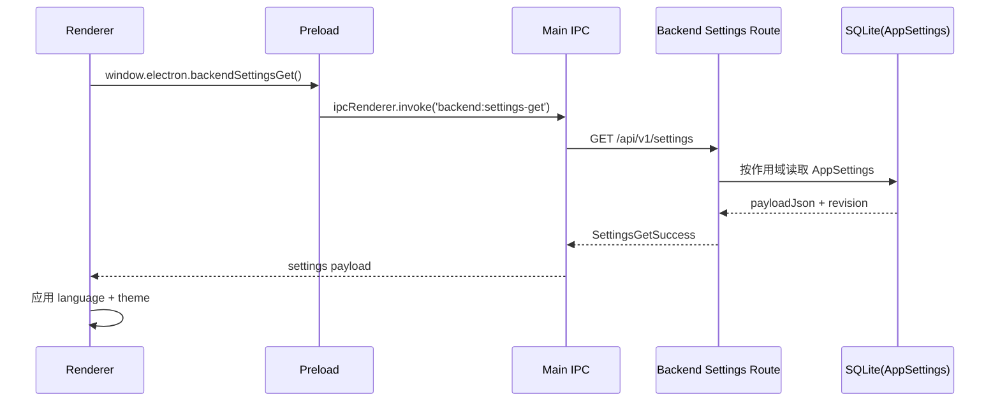
```mermaid
sequenceDiagram
  participant UI as Renderer
  participant PB as Preload
  participant MP as Main IPC
  participant BE as Backend Settings Route
  participant DB as SQLite(AppSettings)

  UI->>PB: window.electron.backendSettingsGet()
  PB->>MP: ipcRenderer.invoke('backend:settings-get')
  MP->>BE: GET /api/v1/settings
  BE->>DB: 按作用域读取 AppSettings
  DB-->>BE: payloadJson + revision
  BE-->>MP: SettingsGetSuccess
  MP-->>UI: settings payload
  UI->>UI: 应用 language + theme
```

## 5.3 本地优先审计运行时（已实现）

- 安全核心操作会写入 `AuditEvent`，并保留稳定关联字段（`requestId`、`sessionId`、`entityId`、`relatedRecordId`）以支持取证追踪。
- 现有 `SshLoginAudit` 继续保留用于 SSH 最近使用排序兼容；`AuditEvent` 作为跨领域统一审计流。
- 审计写入契约为“尽力而为且不阻塞主链路”：写入失败仅在后端记录日志，不会导致上层请求/会话动作失败。
- metadata 在落库前会执行脱敏（敏感键替换为占位符）并受序列化大小上限约束，防止异常膨胀。
- 保留策略由本地运行时驱动（默认 180 天），并由审计服务周期清理过期记录。
- 为未来同步预留 `AuditSyncCursor` 游标模型，但当前不引入强制远端依赖。

当前已接入的事件分类：

- `ssh-session`
- `ssh-host-trust`
- `ssh-server`
- `ssh-keychain`
- `port-forward`
- `settings`
- `mcp`

## 5.4 MCP 服务器运行时（已实现）

- Cosmosh 对外暴露一个可访问的 MCP 服务器，让外部 Agent（Claude Code/Desktop、Cursor）无需重新输入凭据即可使用已配置的 SSH 服务器。它由 `mcpEnabled` 设置门控，**默认关闭**。
- 传输为后端回环 Streamable HTTP 端点（`/mcp`，`127.0.0.1`）加上随应用附带、由外部客户端拉起的 `cosmosh-mcp` stdio 桥接；桥接仅做传输层 JSON-RPC 透传。
- `/mcp` 的认证独立于 `/api/v1/*` 内部令牌守卫：它要求 `Bearer` 配对令牌，禁用时返回 503，并开启 SDK 的 DNS-rebinding 防护，`allowedHosts` 限定为 `127.0.0.1`/`localhost`。会话是有状态的（`sessionIdGenerator: randomUUID`）。
- 桥接读取 `<userData>/mcp/bridge.json`（`{version, port, token, pid, appVersion, startedAt}`，目录 `0700` / 文件 `0600`）以发现当前端口与配对令牌。该文件仅在 MCP 启用期间存在，轮换时重写、禁用/退出时删除。
- 暴露六个工具：`list_servers`（不含凭据且可选择启用批准门控）、`open_connection`（始终弹窗征询用户）、`attach_terminal`（由用户选择现有合格 SSH pane）、`list_connections`、`run_command`（受策略门控且有界）与 `close_connection`。三种模式共用最多 8 个连接的上限与 10 分钟闲置超时。
- `open_connection` 默认使用 `terminal`：批准后创建并聚焦普通 Renderer SSH 标签页，再由 60 秒 Backend launch broker 绑定其 primary session。显式 `background` 保留隔离的 `ssh2.exec` 及独立 stdout/stderr/exit 元数据。`attached` 不向 Agent 枚举 pane；Renderer 选择 pane 后，仅通过内部管理 API 提交私有 session id。
- 可见终端自动化对完整可信 Remote Enhancements 契约（`command-start`、`command-end`、`prompt-ready` 与 `line-state`）执行 fail closed。每个 session 最多附加一个 Agent，且同时最多运行一条 Agent 命令。输出按匹配的可信 command id 截取；取消或超时只停止 MCP 等待，不发送 `Ctrl+C`。
- Agent 命令运行期间仍允许用户输入，并设置 `userIntervened`；Agent 状态栏提供显式停止（`Ctrl+C`）与 Detach 控件。Agent 或 UI 显式关闭拥有 Agent 创建标签页的生命周期；客户端断开、令牌吊销、禁用及闲置清理只解除 Agent attachment，并保留可见标签页。
- 启用全局 `mcpListServersRequiresApproval` 设置后，`list_servers` 会弹出应用内授权对话框；为保持向后兼容，该设置默认关闭。批准前，服务不会查询或返回服务器元数据。打开连接**始终**弹出授权对话框。命令执行遵循有效策略——当 `server.mcpCommandPolicy` 非 `default` 时取它，否则取全局 `mcpCommandPolicy`——解析为 `off`（拒绝）、`ask`（逐条弹窗）或 `allowWithinConnection`（首条弹窗，其余可在该连接内放行）。未回应的授权在 120 秒后按拒绝超时；若无渲染器窗口在线则只能超时。
- 每一次 MCP 操作都会以 `mcp` 类别写入审计流。完整的工具契约、端点与审计分类体系参见 [MCP 服务器](../runtime/mcp-server.md)。

## 6. 核心数据流视图

### 6.1 会话启动数据流

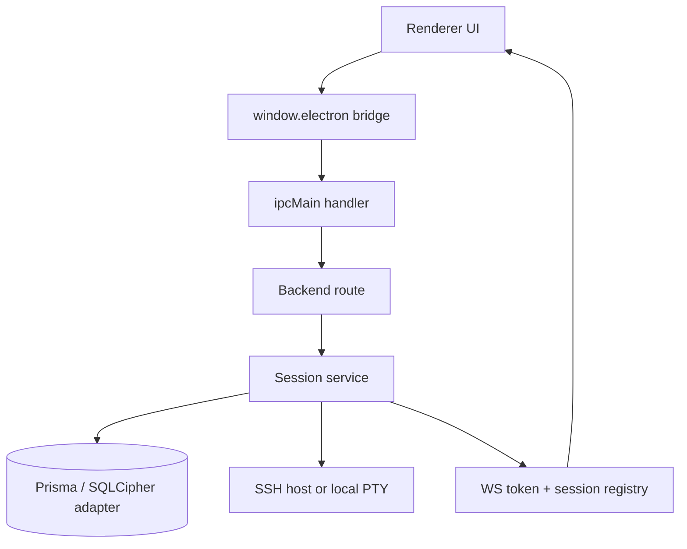
```mermaid
flowchart TD
  UI[Renderer UI] --> BRIDGE[window.electron bridge]
  BRIDGE --> MAIN[ipcMain handler]
  MAIN --> API[Backend route]
  API --> SERVICE[Session service]
  SERVICE --> DB[(Prisma / SQLCipher adapter)]
  SERVICE --> REMOTE[SSH host or local PTY]
  SERVICE --> TOKEN[WS token + session registry]
  TOKEN --> UI
```

### 6.2 运行时流式数据流

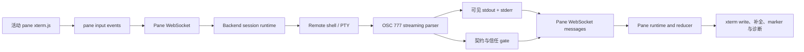
```mermaid
flowchart LR
  XT[活动 pane xterm.js] --> IN[pane input events]
  IN --> WS[Pane WebSocket]
  WS --> SVC[Backend session runtime]
  SVC --> REM[Remote shell / PTY]
  REM --> PARSER[OSC 777 streaming parser]
  PARSER --> OUT[可见 stdout + stderr]
  PARSER --> GATE[契约与信任 gate]
  OUT --> WS2[Pane WebSocket messages]
  GATE --> WS2
  WS2 --> REDUCER[Pane runtime and reducer]
  REDUCER --> XT2[xterm write、补全、marker 与诊断]
```

### 6.3 SFTP 传输进度数据流

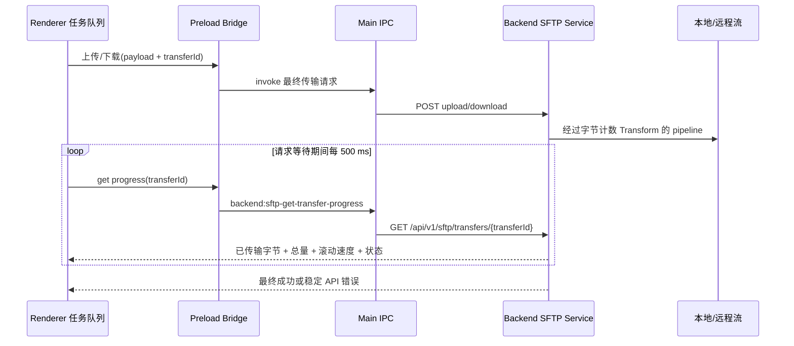
```mermaid
sequenceDiagram
  participant UI as Renderer 任务队列
  participant PB as Preload Bridge
  participant MP as Main IPC
  participant BE as Backend SFTP Service
  participant FS as 本地/远程流

  UI->>PB: 上传/下载(payload + transferId)
  PB->>MP: invoke 最终传输请求
  MP->>BE: POST upload/download
  BE->>FS: 经过字节计数 Transform 的 pipeline
  loop 请求等待期间每 500 ms
    UI->>PB: get progress(transferId)
    PB->>MP: backend:sftp-get-transfer-progress
    MP->>BE: GET /api/v1/sftp/transfers/{transferId}
    BE-->>UI: 已传输字节 + 总量 + 滚动速度 + 状态
  end
  BE-->>UI: 最终成功或稳定 API 错误
```

- 文件字节继续沿既有 backend 流路径传输；HTTP 与 IPC 只传递有界进度元数据。
- Backend 最多每 250 ms 采样一次速度，并在内存中保留终态记录 60 秒。Renderer 轮询会随最终传输请求结束。
- Renderer 传输进度附着在并发启动的 backend 任务上。任务始终使用接纳时捕获的 session id 轮询，字节进度仍以`transferId`为键；两条路径都不提供通用取消、续传或持久化历史。

### 6.4 SFTP Backend 任务调度数据流

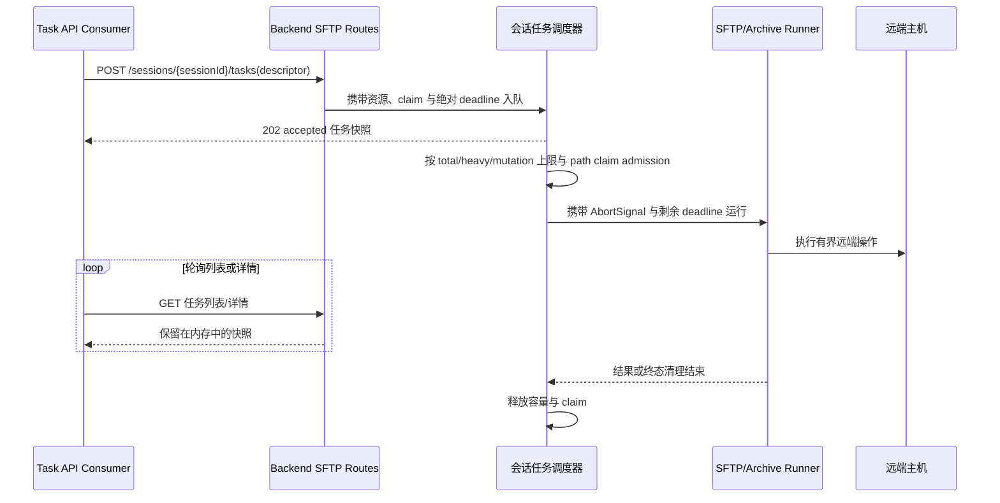
```mermaid
sequenceDiagram
  participant C as Task API Consumer
  participant API as Backend SFTP Routes
  participant SCH as 会话任务调度器
  participant SVC as SFTP/Archive Runner
  participant RH as 远端主机

  C->>API: POST /sessions/{sessionId}/tasks(descriptor)
  API->>SCH: 携带资源、claim 与绝对 deadline 入队
  SCH-->>C: 202 accepted 任务快照
  SCH->>SCH: 按 total/heavy/mutation 上限与 path claim admission
  SCH->>SVC: 携带 AbortSignal 与剩余 deadline 运行
  SVC->>RH: 执行有界远端操作
  loop 轮询列表或详情
    C->>API: GET 任务列表/详情
    API-->>C: 保留在内存中的快照
  end
  SVC-->>SCH: 结果或终态清理结束
  SCH->>SCH: 释放容量与 claim
```

- 每个 SFTP 会话拥有独立固定上限：`total=3`、`heavy=2` 与 `mutation=1`。相等以及祖先/后代 POSIX path claim 会串行，互不相交的兄弟 claim 可以并发。
- 支持的公共任务 descriptor 为 `create-file`、`create-directory`、`rename`、`upload`、`download` 与 `batch`。预览 `write-file` 保留同步 HTTP 契约，但会作为隐藏任务进入调度器；所有既有 SFTP operation route 都使用同一 service 协调边界。
- 绝对 deadline 包含排队等待。期限到达会立即发布 `failed`；运行中任务会继续持有容量与 claim，直到 runner 真正结束，超时 mutation 会发布 `outcomeUnknown: true`。
- 任务记录仅存在于内存中，在近期会话关闭后仍可读取；每个会话最多保留 512 条，并在 runner 释放七天后过期。Backend 停止时会清理全部记录。Task API 只暴露启动、列表与详情：没有公共任务取消、续传或持久化契约。
- Renderer 会把六种受支持 descriptor 全部通过 Main/preload 发送到该 API。无关任务并发启动；只有同步预览写入和持有独立状态的归档编排保留单独串行通道。

### 6.5 SFTP 远端归档数据流

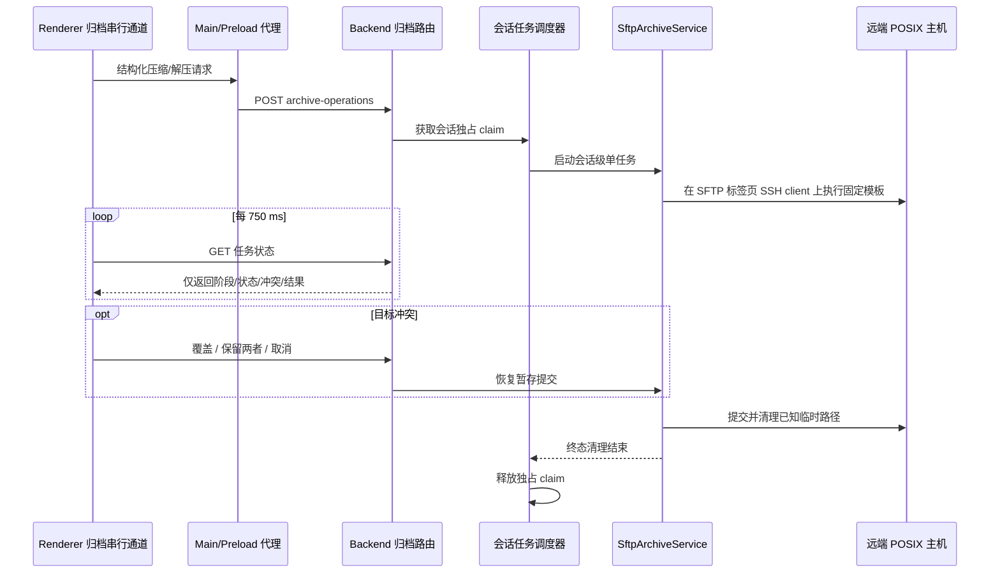
```mermaid
sequenceDiagram
  participant UI as Renderer 归档串行通道
  participant MP as Main/Preload 代理
  participant API as Backend 归档路由
  participant SCH as 会话任务调度器
  participant AS as SftpArchiveService
  participant RH as 远端 POSIX 主机

  UI->>MP: 结构化压缩/解压请求
  MP->>API: POST archive-operations
  API->>SCH: 获取会话独占 claim
  SCH->>AS: 启动会话级单任务
  AS->>RH: 在 SFTP 标签页 SSH client 上执行固定模板
  loop 每 750 ms
    UI->>API: GET 任务状态
    API-->>UI: 仅返回阶段/状态/冲突/结果
  end
  opt 目标冲突
    UI->>API: 覆盖 / 保留两者 / 取消
    API->>AS: 恢复暂存提交
  end
  AS->>RH: 提交并清理已知临时路径
  AS-->>SCH: 终态清理结束
  SCH->>SCH: 释放独占 claim
```

- 远端命令、工具输出与随机暂存路径只存在于 backend。公共契约仅传递路径、格式、级别、目标模式、阶段、冲突摘要与稳定错误。
- 归档能力探测会取得调度器的会话独占 claim，直到探测结束。归档启动会取得同一 claim，并持有到终态清理结束。两者都只接受可立即取得的独占权，无法取得时返回 `SFTP_ARCHIVE_BUSY`，不会在没有可轮询标识的情况下等待。Renderer 归档请求进入自身串行通道，因此多个归档操作保持选择顺序，而普通 backend 任务不会被全局串行化。
- 关闭会话时先请求取消归档任务并进行有界清理，再断开 SSH。批量关闭会并行等待各会话，并保持既有活动连接计数契约。

### 6.6 失败边界模型

- **Renderer 边界**：负责视图状态与用户交互；失败应可通过 UI 重试恢复。
- **Main 边界**：负责能力路由与内部鉴权注入；失败不应泄露任何特权 token。
- **Backend 边界**：负责协议校验、会话生命周期与资源清理。
- **Remote 边界**：SSH 主机 / 本地 shell 波动视为外部故障，映射为稳定 UI 错误码。

## 7. SSH 钥匙链凭据模型（2026-03）

- SSH 凭据改为存储在 `SshKeychain`，并通过 `SshServer.keychainId` 关联。
- `SshServer` 继续负责连接身份、主机/传输策略（`host`、`port`、`username`、`strictHostKey`、`enableSshCompression`）以及 renderer 终端兼容性标记（`disableCharacterWidthCompatibilityMode`），不再直接持有密码/私钥密文字段。
- SSH 传输压缩默认关闭。当服务器记录启用该标记时，backend 会将同一套压缩协商策略应用到 SSH shell 会话、SFTP 会话与端口转发 SSH client。
- 钥匙链的组织信息（文件夹、标签）复用与服务器相同的 `SshFolder` 与 `SshTag` 领域模型，不再维护独立的钥匙链专属文件夹/标签表。
- 服务器编辑页保持原有简单流程：仍可直接填写认证信息，后端会自动落地为隐藏钥匙链。
- 保持内联凭据模式的服务器更新可以省略 password/private-key 字段；后端会沿用现有加密值，仅当已存储凭据无法满足所选认证类型时拒绝更新。
- 公用钥匙链支持多服务器复用；隐藏钥匙链用于单服务器私有凭据。
- SSH 会话创建时统一通过 server → keychain 关系解析凭据后再建立 `ssh2` 连接。

## 7.1 开发身份运行时

开发身份模式是仅面向开发者的隔离层，用于验证全新安装流程。它不会改变打包生产环境的存储路径或数据库密钥策略。

第一次执行非帮助类 `pnpm dev:profile` 命令时，工具会自动把旧的隐式默认身份导入到 `.cosmosh/dev-profiles/default/`。导入会尽力复制旧工作区数据库、SQLite WAL/SHM 辅助文件、Electron `userData` 与 backend secret 存储。缺失或不可读的旧来源会写入身份 manifest，而不会中断命令。

`default` 身份是受管理的恢复快照，不是一次性测试身份。它可以通过 `pnpm dev:profile use default` 选中，也可以用 `pnpm dev:profile import-default --force --use` 重新导入并切换；普通的 `create default`、`reset default` 与 `delete default` 会被拒绝，以避免丢失恢复路径。

使用 `pnpm dev:profile` 创建、切换、重置、查看或删除本地测试身份：

- `pnpm dev:profile create fresh --use` 创建 `.cosmosh/dev-profiles/fresh/`，并将其设为默认开发身份。
- `pnpm dev:profile reset fresh` 仅清空该身份的运行数据，使下一次开发启动表现得像该身份的全新安装。
- `pnpm dev:profile delete fresh --force` 删除该身份；若它是当前身份，也会清空当前指针。
- `pnpm dev:profile run fresh --create --reset -- pnpm dev:main` 使用隔离且已重置的身份运行一次命令。根脚本 `pnpm dev:main:fresh` 是该流程的快捷方式。

每个身份拥有这些路径：

- `.cosmosh/dev-profiles/<name>/user-data`：在应用触碰存储前通过 `app.setPath('userData', ...)` 注入 Electron。
- `.cosmosh/dev-profiles/<name>/database/cosmosh.db`：作为 `COSMOSH_DB_PATH` 注入，并由 Main 与 Backend 的数据库路径解析器共同使用。
- `.cosmosh/dev-profiles/<name>/backend-storage`：作为 `COSMOSH_BACKEND_STORAGE_PATH` 注入，用于 backend 专用 secret 材料，例如 `secret.key`。
- `.cosmosh/dev-profiles/default/profile.json`：受管理 `default` 身份的导入 manifest，包含来源路径和每个来源的复制状态。

如果没有启用开发身份，直接开发启动仍使用旧的工作区数据库路径 `.dev_data/cosmosh.db` 和默认 Electron 开发存储。这样可以保留既有本地数据，除非开发者显式选择身份隔离。

## 8. 架构决策动机

- 保持 backend 为独立运行时进程，将协议与凭据处理与 renderer 攻击面隔离。
- 保持 preload 为最小桥接面，减少 API 暴露并维持严格进程契约。
- 终端高频 I/O 优先走 WS 数据面，避免 IPC 成为吞吐瓶颈。
- Main 进程作为编排/代理，而非业务承载层，便于未来服务端解耦演进。

## 9. 边界案例处理手册

### 9.1 启动时 Backend 未就绪

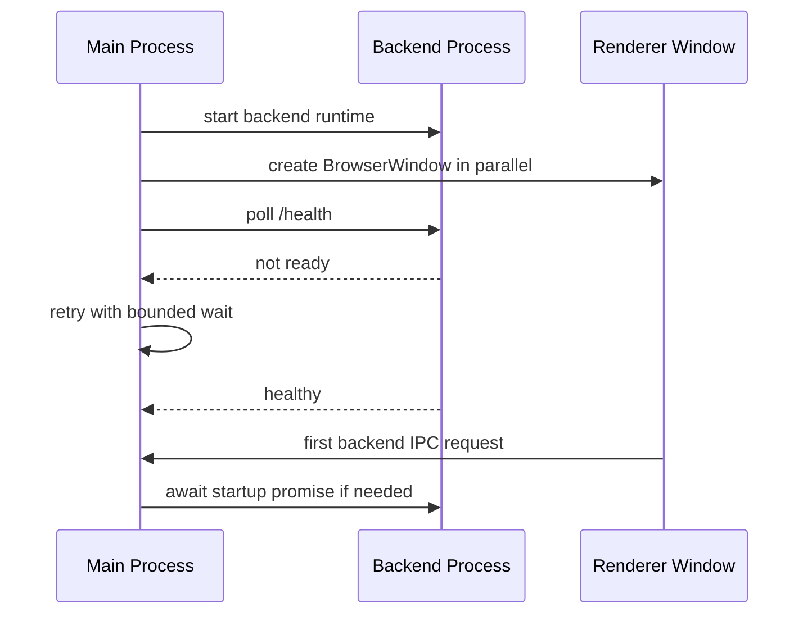
```mermaid
sequenceDiagram
  participant MAIN as Main Process
  participant BE as Backend Process
  participant UI as Renderer Window

  MAIN->>BE: start backend runtime
  MAIN->>UI: create BrowserWindow in parallel
  MAIN->>BE: poll /health
  BE-->>MAIN: not ready
  MAIN->>MAIN: retry with bounded wait
  BE-->>MAIN: healthy
  UI->>MAIN: first backend IPC request
  MAIN->>BE: await startup promise if needed
```

处理原则：

- UI 优先尽早可见，backend 在后台并行预热。
- 首个依赖 backend 的 IPC 在转发前必须确保 backend 已就绪。
- 启动失败路径应清晰可观测。

### 9.2 WS Attach Token 不匹配

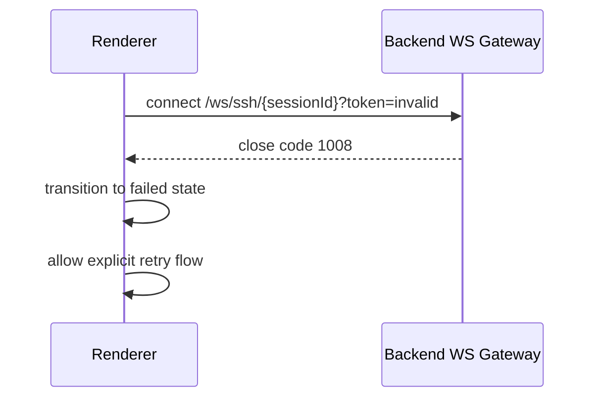
```mermaid
sequenceDiagram
  participant UI as Renderer
  participant WS as Backend WS Gateway

  UI->>WS: connect /ws/ssh/{sessionId}?token=invalid
  WS-->>UI: close code 1008
  UI->>UI: transition to failed state
  UI->>UI: allow explicit retry flow
```

处理原则：

- token/session 不匹配属于安全敏感问题，必须失败即关闭。
- 恢复路径应通过全新 session/token 重新建立。

### 9.3 活跃会话期间 Renderer 重载

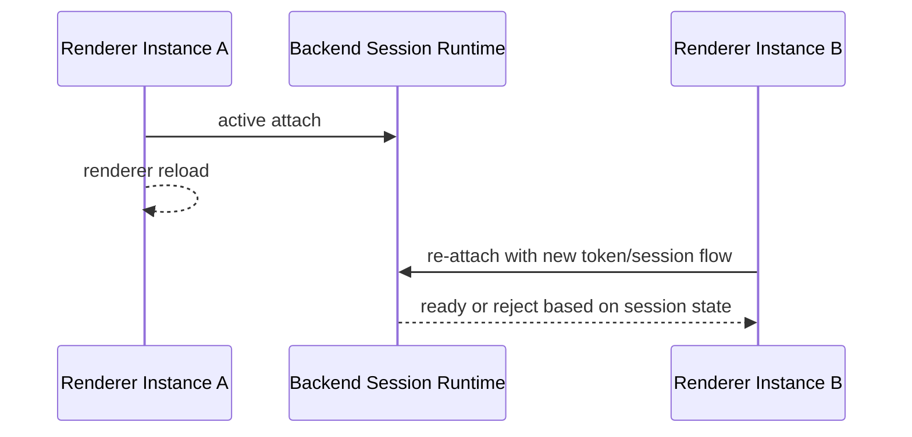
```mermaid
sequenceDiagram
  participant UI1 as Renderer Instance A
  participant WS as Backend Session Runtime
  participant UI2 as Renderer Instance B

  UI1->>WS: active attach
  UI1-->>UI1: renderer reload
  UI2->>WS: re-attach with new token/session flow
  WS-->>UI2: ready or reject based on session state
```

处理原则：

- 会话运行时必须防止陈旧 attach 状态污染。
- Renderer 重载应视作新生命周期并显式重建状态。

### 8.4 生产数据库加密与恢复

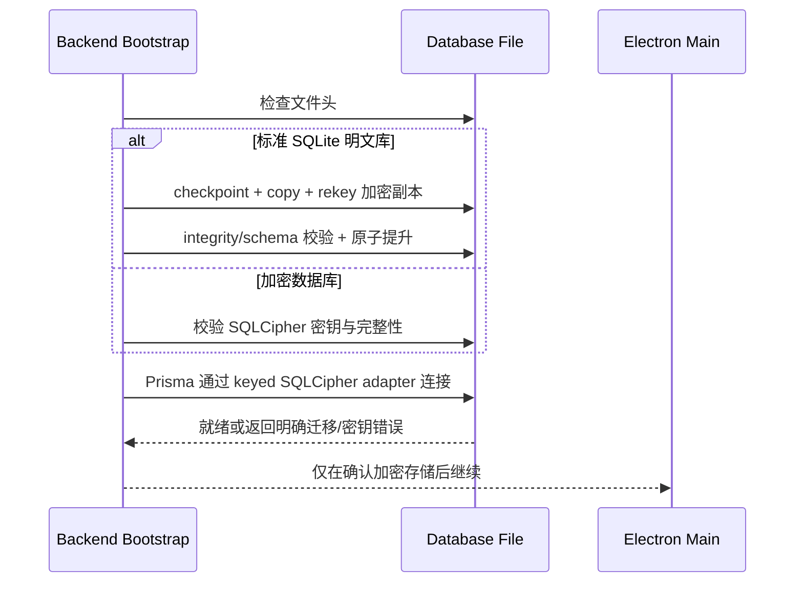
```mermaid
sequenceDiagram
  participant BE as Backend Bootstrap
  participant DB as Database File
  participant MAIN as Electron Main

  BE->>DB: 检查文件头
  alt 标准 SQLite 明文库
    BE->>DB: checkpoint + copy + rekey 加密副本
    BE->>DB: integrity/schema 校验 + 原子提升
  else 加密数据库
    BE->>DB: 校验 SQLCipher 密钥与完整性
  end
  BE->>DB: Prisma 通过 keyed SQLCipher adapter 连接
  DB-->>BE: 就绪或返回明确迁移/密钥错误
  BE-->>MAIN: 仅在确认加密存储后继续
```

处理原则：

- 生产环境不存在明文 Prisma fallback。只有标准明文文件头会进入一次性迁移；未知/损坏文件与错误密钥会直接失败且不会旋转密钥材料。
- 加密副本通过完整性与 schema 表数量校验前，源库始终保持权威。固定的 `.sqlcipher-migration`、`.plaintext-backup` 产物支持 rename 中断后的重启恢复。加密临时库验证失败时必须与明文备份一起保留并中止启动；恢复流程不得静默恢复明文库并用未经验证的密钥重新加密，从而造成数据库密钥轮换。

### 8.5 启动时 Schema 升级路径

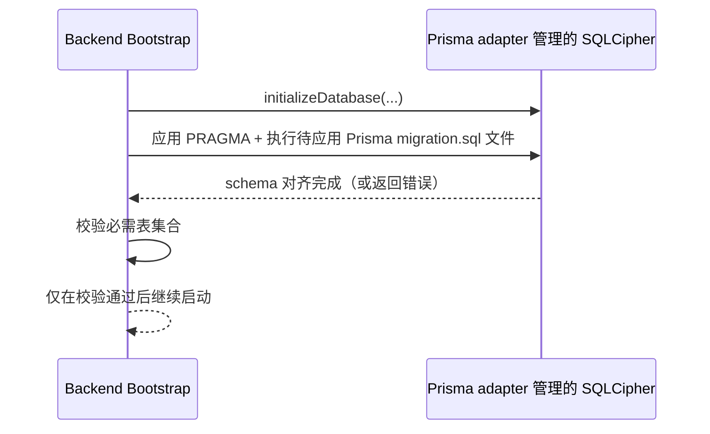
```mermaid
sequenceDiagram
  participant BE as Backend Bootstrap
  participant DB as Prisma adapter 管理的 SQLCipher

  BE->>DB: initializeDatabase(...)
  BE->>DB: 应用 PRAGMA + 执行待应用 Prisma migration.sql 文件
  DB-->>BE: schema 对齐完成（或返回错误）
  BE->>BE: 校验必需表集合
  BE-->>BE: 仅在校验通过后继续启动
```

处理原则：

- 运行时 migration 同步是幂等操作，并在每次启动执行。
- 在修复结构漂移时必须保持现有用户数据不被破坏。

## 10. 服务器代理运行时

- 全局设置定义 `serverProxyMode = off | system | custom` 与 `serverProxyUrl`，默认值为 `system`。
- 每个 `SshServer` 定义 `proxyMode = default | off | custom` 与可选 `proxyUrl`；`default` 继承全局策略。
- 仅当有效模式为 `system` 时，Renderer 才通过特权 Main IPC `app:resolve-system-proxy` 解析系统/PAC 代理规则。
- Backend 是策略最终裁决者。`packages/backend/src/ssh/proxy.ts` 会重新读取持久化全局设置、应用服务器覆盖、解析 Chromium 有序代理规则，并建立 HTTP、HTTPS CONNECT、SOCKS5 或显式 `DIRECT` socket。
- 预连接 socket 通过 `ssh2` 的 `ConnectConfig.sock` 注入，因此 SSH Shell、SFTP 与端口转发共用同一套代理实现。
- 代理候选共享 SSH 连接超时预算。代理失败不会静默回退直连；只有 `off` 模式或系统规则显式返回 `DIRECT` 时才允许直连。
- 审计 metadata 只记录代理模式和协议，不得记录代理 URL 或其中的凭据。
