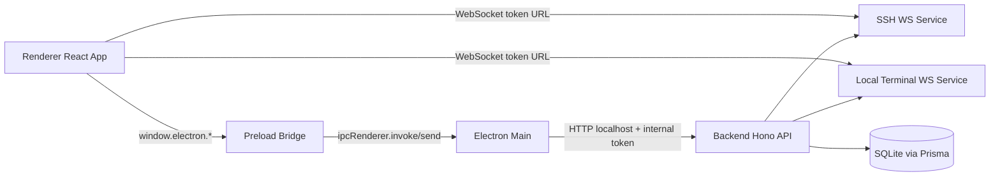
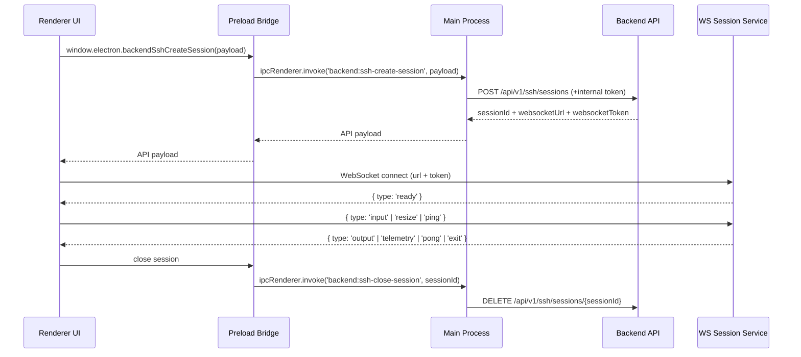
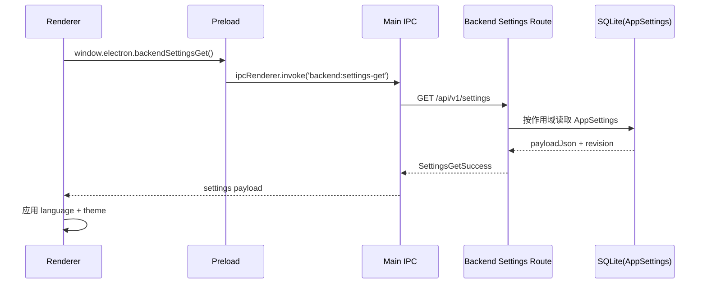
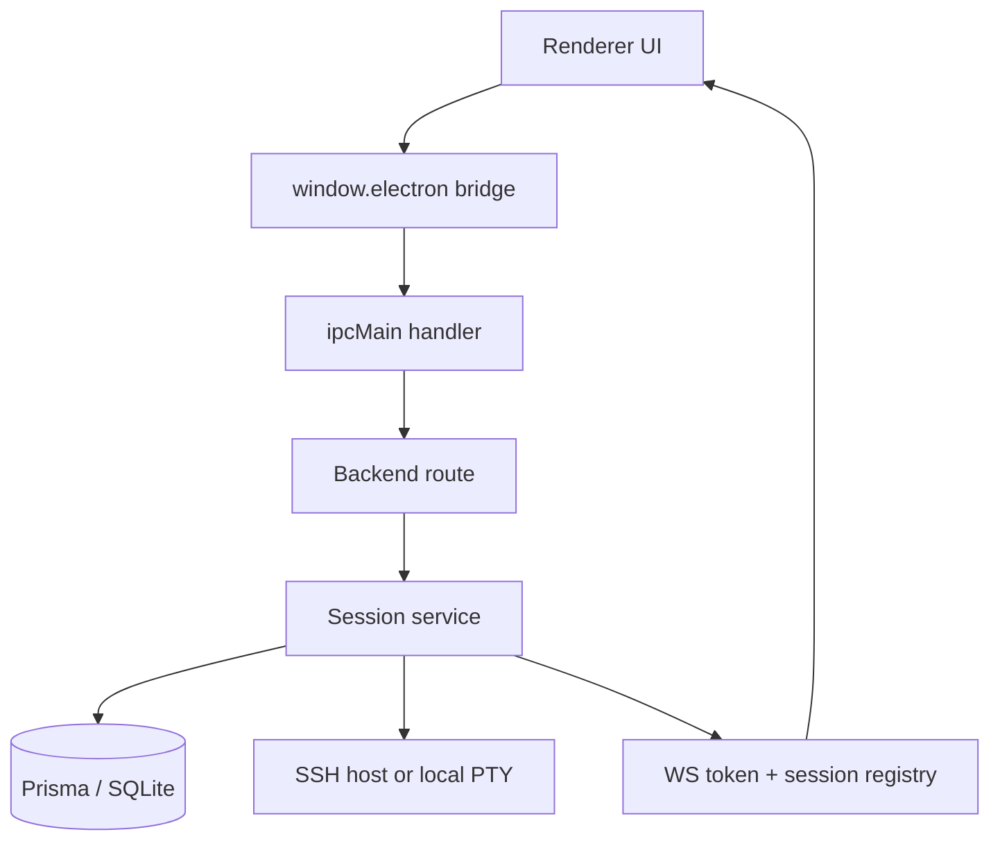
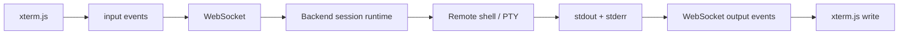
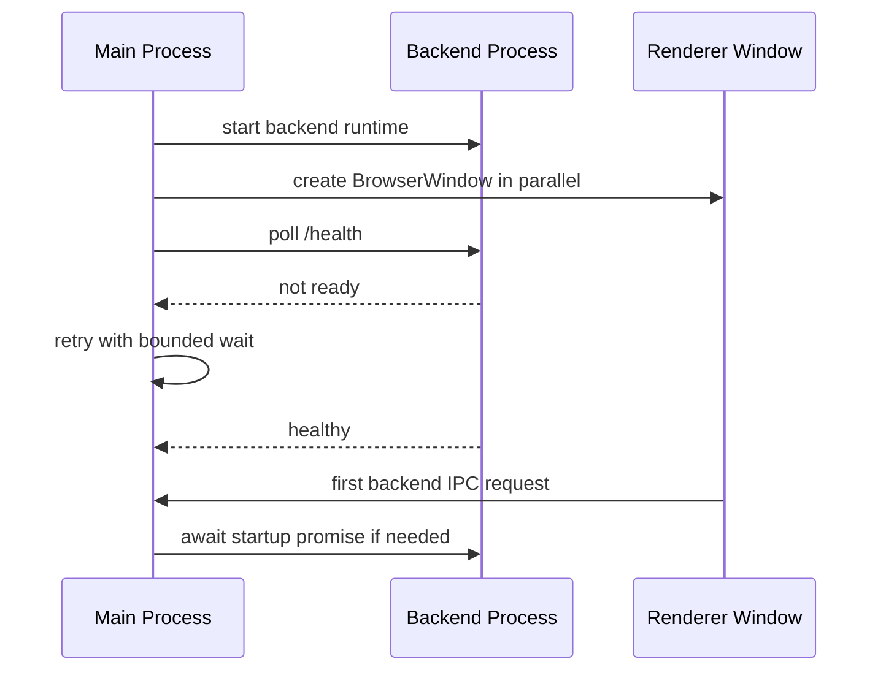
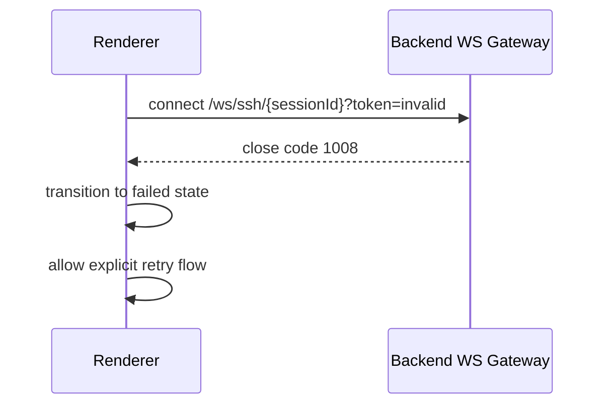
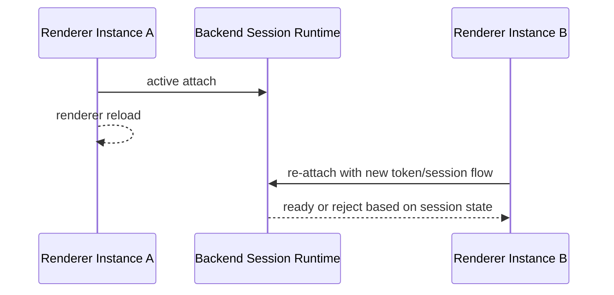
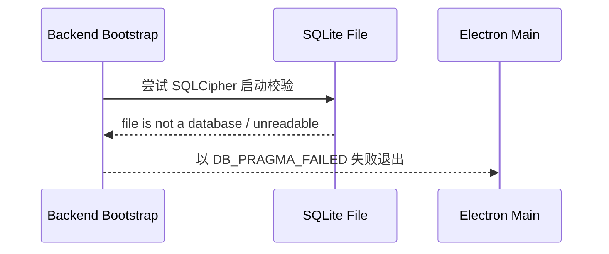
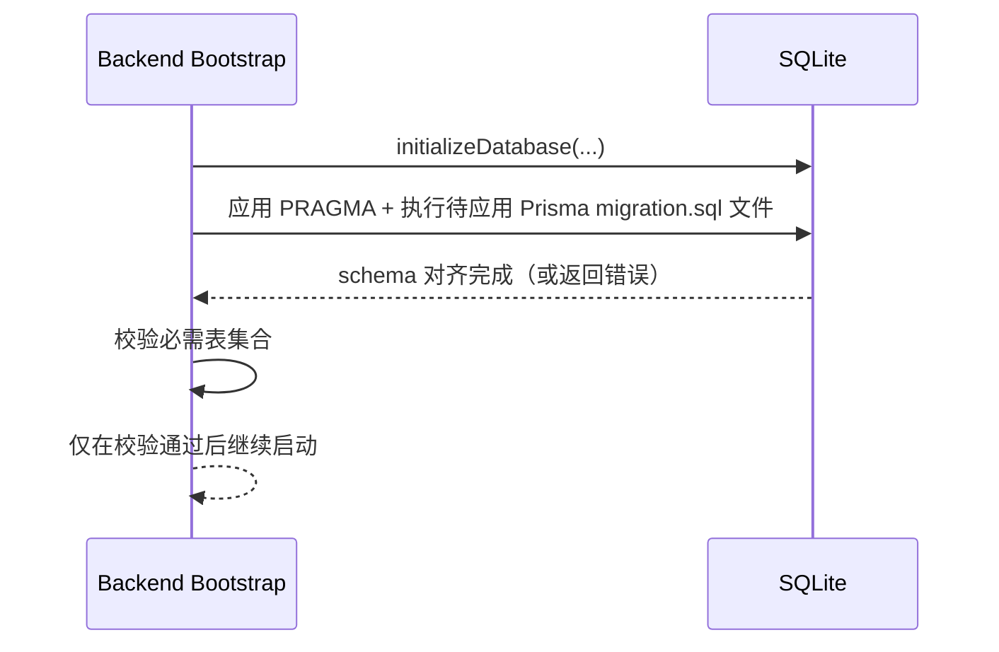

# Cosmosh 架构设计

## 1. 运行时拓扑

Cosmosh 采用 Electron 双进程模型，并嵌入后端服务：

- **Main 进程** (`packages/main/src/index.ts`)：应用生命周期、BrowserWindow 创建、preload 注入、IPC 注册、后端进程编排。
- **Preload Bridge** (`packages/main/src/preload.ts`)：通过 `contextBridge` 暴露严格受控 API。
- **Renderer 进程** (`packages/renderer/src`)：React UI、xterm UI、状态编排。
- **Backend 进程** (`packages/backend/src/index.ts`)：Hono HTTP API + SSH/本地终端 WebSocket 会话服务，以及 SFTP 浏览、下载、文件操作会话与 SSH 端口转发运行时。

```mermaid
flowchart LR
  R[Renderer React App] -->|window.electron.*| P[Preload Bridge]
  P -->|ipcRenderer.invoke/send| M[Electron Main]
  M -->|HTTP localhost + internal token| B[Backend Hono API]
  R -->|WebSocket token URL| WS1[SSH WS Service]
  R -->|WebSocket token URL| WS2[Local Terminal WS Service]
  B --> WS1
  B --> WS2
  B --> DB[(SQLite via Prisma)]
```

## 2. Main ↔ Renderer 职责划分

### Main 进程 (`packages/main/src/index.ts`)

- 应用启动阶段并行拉起 BrowserWindow 与 backend 预热流程。
- 维护单例的后端启动中的 Promise，避免并发触发重复拉起。
- Main 到 backend 的代理请求会在转发前确保 backend 已就绪。
- 在开发启动路径中，Main 采用增量预检（`packages/main/scripts/dev-preflight.cjs`），当产物是最新时会跳过 `@cosmosh/api-contract` / `@cosmosh/i18n` 的重复构建。
- Main 会以仅运行时且非 watch 的命令（`dev:runtime`）拉起 backend，避免嵌套 `predev` 重构建并降低笔记本持续风扇噪音。
- 持有应用级能力：语言持久化（内存）、窗口/开发者工具/文件管理器操作。
- 将渲染层请求代理到后端端点，并注入：
  - 作为内部鉴权头的 `COSMOSH_INTERNAL_TOKEN`。
  - 用于后端 i18n 响应的 locale header。

### Backend 进程 (`packages/backend/src/index.ts`)

- 注册幂等的优雅关闭流程，覆盖运行时信号与致命进程事件。
- 关闭顺序固定：先停 WS 会话服务，再关闭 HTTP 监听，最后断开 Prisma/SQLite 连接句柄。
- Windows 终止信号（`SIGBREAK`）与 POSIX 信号共用同一路径，降低数据库文件锁残留概率。
- 本地终端 profile 发现改为短时内存缓存 + 并行探测，降低 Home/Settings 首次加载时重复扫描带来的等待。
- 启动阶段在 `initializeDatabase(...)` 内执行幂等 Prisma migration 文件同步，因此无论是安装后首次启动还是后续每次启动，都会在开放 HTTP 路由前将本地数据库结构收敛到当前后端契约。
- 简单的 Prisma `ALTER TABLE ... ADD COLUMN` migration 会先对照实时 SQLite 表元数据；若列已存在但 `_prisma_migrations` 缺少记录，启动会补记该 migration，而不是再次执行重复 DDL；非简单 migration 漂移仍然快速失败。
- Schema 同步采用快速失败策略：若运行时 migration 执行后仍无法满足必需表结构，backend 将中止启动，避免 API 进入部分可用/行为不确定状态。
- migration 台账元数据采用与 Prisma 兼容的 `_prisma_migrations` 结构，便于后续平滑切换到原生 `prisma migrate deploy/resolve` 工作流。

### Renderer 进程 (`packages/renderer/src`)

- 仅通过 `window.electron` bridge 访问能力（不直接使用 Node API）。
- 通过后端 API 创建 SSH/本地终端会话与 SFTP 浏览、下载、文件操作会话。
- 通过 WebSocket 建立终端数据通道，并由 `xterm.js` 渲染。
- 非 Home 的渲染页（含 SSH 与设置编辑器/Monaco）采用懒加载，避免重型资源进入默认启动路径。
- Home 首屏数据按资源独立加载：SSH 文件夹、SSH 服务器、钥匙链、本地终端 profile 与端口转发规则各自请求完成后立即更新归属界面，避免慢速二级资源阻塞首屏服务器列表。
- Renderer 启动优先从本地缓存水合设置，再在后台向 backend 拉取权威值并同步覆盖。
- 开发态 StrictMode 改为通过 `VITE_ENABLE_STRICT_MODE=true` 显式开启，降低本地性能排查时重复 effect 执行带来的干扰。
- SSH 页面使用 tab 作用域的连接意图快照模型（不再依赖全局可变目标单例），重试与分屏互不串扰。
- 隐藏 tab 保留渲染但不会触发新的 SSH 连接副作用，连接流程仅允许 active tab 发起。

## 3. IPC 生命周期（当前）

```mermaid
sequenceDiagram
  participant UI as Renderer UI
  participant PB as Preload Bridge
  participant MP as Main Process
  participant BE as Backend API
  participant WS as WS Session Service

  UI->>PB: window.electron.backendSshCreateSession(payload)
  PB->>MP: ipcRenderer.invoke('backend:ssh-create-session', payload)
  MP->>BE: POST /api/v1/ssh/sessions (+internal token)
  BE-->>MP: sessionId + websocketUrl + websocketToken
  MP-->>PB: API payload
  PB-->>UI: API payload

  UI->>WS: WebSocket connect (url + token)
  WS-->>UI: { type: 'ready' }
  UI->>WS: { type: 'input' | 'resize' | 'ping' }
  WS-->>UI: { type: 'output' | 'telemetry' | 'pong' | 'exit' }

  UI->>PB: close session
  PB->>MP: ipcRenderer.invoke('backend:ssh-close-session', sessionId)
  MP->>BE: DELETE /api/v1/ssh/sessions/{sessionId}
```

## 4. 安全模型

### Electron 表面加固

- `nodeIntegration: false`
- `contextIsolation: true`
- Renderer 仅获得显式 bridge API（`contextBridge.exposeInMainWorld`）。
- sandboxed preload 脚本不得在运行时导入 workspace package。它可以在编译期使用共享 API contract 类型，但 preload 内部使用的运行时校验器必须保持本地实现或被打包进 preload，避免 Electron 在 bridge 加载前解析项目模块。
- 特权操作保留在 Main/Backend 进程。
- Renderer 发起的应用窗口默认被拒绝。当前白名单仅允许同 renderer 的 SFTP 属性弹窗，这些子窗口复用安全 preload，并保持 `nodeIntegration` 关闭、`contextIsolation` 开启。

### Backend 访问边界

- 后端 HTTP 在所有运行模式下都显式绑定 IPv4 loopback 接口（`127.0.0.1`）。监听器不得依赖 Node server 默认值，因为默认值可能将 standalone 开发 API 暴露到非 loopback 网卡。
- electron-main 模式还会使用内部运行时 token（`COSMOSH_INTERNAL_TOKEN`）保护 `/api/v1/*`。standalone 模式即使不要求该 token，也必须保持仅 loopback 可访问。
- Main 进程注入头信息，不向 renderer 暴露内部 token。
- Main 还会对本地 SFTP 下载目标实施能力授权。应用工具 IPC 为发起请求的 renderer webContents 授权一个精确的规范化路径；backend 代理会拒绝没有该所有者授权的下载路径。临时预览/打开路径可复用，Downloads 与保存对话框路径在一次请求后即被消费。
- 凭据加密 key 由 `COSMOSH_SECRET_KEY` / 内部 token 哈希在后端启动时推导。
- HTTP i18n 采用请求级作用域：后端中间件优先从 `x-cosmosh-locale`（回退 `accept-language`）解析语言，并为每个请求注入翻译函数供路由统一生成响应消息。
- WS 运行时 i18n 采用会话级作用域：会话创建时携带已解析语言到 SSH/本地终端运行时，使 WS `error`/`exit` 消息与关闭原因保持本地化一致。
- i18n 运行时改为资源注入模型：各消费端在 `createI18n(...)` 注册阶段自行导入并注入语言 JSON，因此每个进程只打包所需作用域数据。

### 会话通道加固

- WebSocket 路径包含 sessionId 与 query token。
- token 不匹配或会话过期会立即关闭（`1008`）。
- 30 秒 attach 超时用于避免资源孤儿化。

## 5. 运行时能力

- SSH 与本地终端会话使用 WebSocket 数据通道承载终端 I/O。
- SFTP 使用请求/响应式 IPC + backend HTTP route 实现目录浏览、本地文件上传、下载、创建、重命名、复制、删除与批量文件操作。
- Port Forwarding 使用请求/响应式 IPC + backend HTTP route 实现持久化规则 CRUD 与手动 start/stop。运行状态仅保存在 backend 内存中，因此 app/backend 重启后所有规则都会回到 stopped。
- SFTP 本地系统打开流程会通过现有 backend 下载端点将普通文件下载到 Cosmosh 受控临时根目录，再通过 main 进程 app utility IPC 仅打开已校验的临时文件。Windows 的打开方式使用 shell `openas` verb；macOS 使用打包的 NSWorkspace helper；Linux 不显示打开方式。
- SFTP 目录上传/下载、chmod、字节级传输进度/取消、更完整的传输队列与 SSH terminal 会话复用仍属于后续规划。

## 5.1 SSH 端口转发运行时（已实现）

- 端口转发规则通过 `PortForwardRule` 持久化到 SQLite，并按 local、remote、dynamic SOCKS 三类保存类型专属字段。
- `PortForwardSessionService` 负责活动 SSH client、`net.Server` 监听器、socket、channel、远端转发监听与关闭清理。
- Start 会通过共享的 `packages/backend/src/ssh/connect.ts` helper 打开 SSH client，因此钥匙链凭据解密与 strict host key 行为与 SSH/SFTP 保持一致。
- 本地转发在 backend 本机监听，并为每个进入的本地 socket 调用 `ssh2.Client.forwardOut(...)`。
- 远端转发调用 `client.forwardIn(...)`，并将 accept 后的 SSH channel 从 backend 本机连接到配置的目标 host/port。
- 动态转发实现 SOCKS5 no-auth TCP CONNECT，目标支持 IPv4、IPv6 与域名；不支持 UDP ASSOCIATE、BIND 与 SOCKS 认证。
- 默认本地监听地址是 `127.0.0.1`；允许非 localhost 监听，但 renderer 必须显示风险提示。
- 每条规则最多 64 个并发连接，单次连接建立超时为 15 秒。

## 5.2 设置运行时（已实现）

- 设置通过后端路由 `GET/PUT /api/v1/settings` 持久化。
- 存储模型为按作用域单行 JSON（`scopeAccountId` + `scopeDeviceId`）的 `AppSettings` 表。
- 默认作用域为本机（`deviceId=local-device`），并预留 account 作用域字段用于未来同步。
- Renderer 启动阶段（`packages/renderer/src/main.tsx`）会优先使用缓存设置应用语言与主题，并在后台与 backend 同步。
- Renderer 时间显示通过 `packages/renderer/src/lib/date-time-format.ts` 使用已持久化的时区、日期格式与时间格式设置；`system` 会保留操作系统时区，Settings UI 会列出当前运行时支持的 IANA 时区及其当前 UTC 偏移。
- Renderer 终端字符宽度兼容模式通过 `terminalCharacterWidthCompatibilityModeEnabled` 持久化；SSH server 记录可通过 `disableCharacterWidthCompatibilityMode` 按服务器禁用，本地终端只遵循全局设置。
- 非视觉设置（如 SSH 运行时限制）当前仅做持久化与可发现，部分暂未绑定真实运行时行为。
- 所有设置定义（类型、默认值、约束、枚举集、JSON schema、UI 元数据、分类）统一存放在单一注册表：`packages/api-contract/src/settings-registry.ts`。增删设置项仅需编辑此文件（加 i18n 语言文件）。
- `packages/api-contract/src/settings.ts` 中的校验逻辑对通用标量规则采用注册表驱动方式（类型检查、枚举、范围、maxLength），并对需要运行时判断或结构化 JSON 归一化的设置保留窄范围自定义校验，例如 IANA 时区支持和 SFTP 目录列表视图。
- Settings UI 会将结构化 JSON 设置显式显示为设置行，但不渲染行内编辑器或单项 Settings Editor 操作。它们只提供一个 Settings Editor 链接，确保整对象编辑保持 schema 支持且集中管理，同时仍可通过常规单项菜单重置默认值。
- OpenAPI 中的 `SettingsValues` schema 有意设为宽松模式（`type: object`）；严格的 TypeScript 类型与约束仅存在于代码注册表中。
- Settings API 响应类型（`ApiSettingsGetResponse`、`ApiSettingsUpdateResponse`）在 `packages/api-contract/src/index.ts` 中手工定义，使用注册表中的严格 `SettingsValues`，不依赖 OpenAPI 生成类型。
- 已存储设置的读取解析采用前向兼容策略：对缺失/新增字段按字段回填默认值，而不是整份设置回退默认值。
- `PUT /api/v1/settings` 仍保持严格全量校验，确保持久化 payload 的结构稳定可预期。

```mermaid
sequenceDiagram
  participant UI as Renderer
  participant PB as Preload
  participant MP as Main IPC
  participant BE as Backend Settings Route
  participant DB as SQLite(AppSettings)

  UI->>PB: window.electron.backendSettingsGet()
  PB->>MP: ipcRenderer.invoke('backend:settings-get')
  MP->>BE: GET /api/v1/settings
  BE->>DB: 按作用域读取 AppSettings
  DB-->>BE: payloadJson + revision
  BE-->>MP: SettingsGetSuccess
  MP-->>UI: settings payload
  UI->>UI: 应用 language + theme
```

## 5.3 本地优先审计运行时（已实现）

- 安全核心操作会写入 `AuditEvent`，并保留稳定关联字段（`requestId`、`sessionId`、`entityId`、`relatedRecordId`）以支持取证追踪。
- 现有 `SshLoginAudit` 继续保留用于 SSH 最近使用排序兼容；`AuditEvent` 作为跨领域统一审计流。
- 审计写入契约为“尽力而为且不阻塞主链路”：写入失败仅在后端记录日志，不会导致上层请求/会话动作失败。
- metadata 在落库前会执行脱敏（敏感键替换为占位符）并受序列化大小上限约束，防止异常膨胀。
- 保留策略由本地运行时驱动（默认 180 天），并由审计服务周期清理过期记录。
- 为未来同步预留 `AuditSyncCursor` 游标模型，但当前不引入强制远端依赖。

当前已接入的事件分类：

- `ssh-session`
- `ssh-host-trust`
- `ssh-server`
- `ssh-keychain`
- `port-forward`
- `settings`

## 6. 核心数据流视图

### 6.1 会话启动数据流

```mermaid
flowchart TD
  UI[Renderer UI] --> BRIDGE[window.electron bridge]
  BRIDGE --> MAIN[ipcMain handler]
  MAIN --> API[Backend route]
  API --> SERVICE[Session service]
  SERVICE --> DB[(Prisma / SQLite)]
  SERVICE --> REMOTE[SSH host or local PTY]
  SERVICE --> TOKEN[WS token + session registry]
  TOKEN --> UI
```

### 6.2 运行时流式数据流

```mermaid
flowchart LR
  XT[xterm.js] --> IN[input events]
  IN --> WS[WebSocket]
  WS --> SVC[Backend session runtime]
  SVC --> REM[Remote shell / PTY]
  REM --> OUT[stdout + stderr]
  OUT --> WS2[WebSocket output events]
  WS2 --> XT2[xterm.js write]
```

### 6.3 失败边界模型

- **Renderer 边界**：负责视图状态与用户交互；失败应可通过 UI 重试恢复。
- **Main 边界**：负责能力路由与内部鉴权注入；失败不应泄露任何特权 token。
- **Backend 边界**：负责协议校验、会话生命周期与资源清理。
- **Remote 边界**：SSH 主机 / 本地 shell 波动视为外部故障，映射为稳定 UI 错误码。

## 7. SSH 钥匙链凭据模型（2026-03）

- SSH 凭据改为存储在 `SshKeychain`，并通过 `SshServer.keychainId` 关联。
- `SshServer` 继续负责连接身份、主机/传输策略（`host`、`port`、`username`、`strictHostKey`、`enableSshCompression`）以及 renderer 终端兼容性标记（`disableCharacterWidthCompatibilityMode`），不再直接持有密码/私钥密文字段。
- SSH 传输压缩默认关闭。当服务器记录启用该标记时，backend 会将同一套压缩协商策略应用到 SSH shell 会话、SFTP 会话与端口转发 SSH client。
- 钥匙链的组织信息（文件夹、标签）复用与服务器相同的 `SshFolder` 与 `SshTag` 领域模型，不再维护独立的钥匙链专属文件夹/标签表。
- 服务器编辑页保持原有简单流程：仍可直接填写认证信息，后端会自动落地为隐藏钥匙链。
- 保持内联凭据模式的服务器更新可以省略 password/private-key 字段；后端会沿用现有加密值，仅当已存储凭据无法满足所选认证类型时拒绝更新。
- 公用钥匙链支持多服务器复用；隐藏钥匙链用于单服务器私有凭据。
- SSH 会话创建时统一通过 server → keychain 关系解析凭据后再建立 `ssh2` 连接。

## 8. 架构决策动机

- 保持 backend 为独立运行时进程，将协议与凭据处理与 renderer 攻击面隔离。
- 保持 preload 为最小桥接面，减少 API 暴露并维持严格进程契约。
- 终端高频 I/O 优先走 WS 数据面，避免 IPC 成为吞吐瓶颈。
- Main 进程作为编排/代理，而非业务承载层，便于未来服务端解耦演进。

## 9. 边界案例处理手册

### 9.1 启动时 Backend 未就绪

```mermaid
sequenceDiagram
  participant MAIN as Main Process
  participant BE as Backend Process
  participant UI as Renderer Window

  MAIN->>BE: start backend runtime
  MAIN->>UI: create BrowserWindow in parallel
  MAIN->>BE: poll /health
  BE-->>MAIN: not ready
  MAIN->>MAIN: retry with bounded wait
  BE-->>MAIN: healthy
  UI->>MAIN: first backend IPC request
  MAIN->>BE: await startup promise if needed
```

处理原则：

- UI 优先尽早可见，backend 在后台并行预热。
- 首个依赖 backend 的 IPC 在转发前必须确保 backend 已就绪。
- 启动失败路径应清晰可观测。

### 9.2 WS Attach Token 不匹配

```mermaid
sequenceDiagram
  participant UI as Renderer
  participant WS as Backend WS Gateway

  UI->>WS: connect /ws/ssh/{sessionId}?token=invalid
  WS-->>UI: close code 1008
  UI->>UI: transition to failed state
  UI->>UI: allow explicit retry flow
```

处理原则：

- token/session 不匹配属于安全敏感问题，必须失败即关闭。
- 恢复路径应通过全新 session/token 重新建立。

### 9.3 活跃会话期间 Renderer 重载

```mermaid
sequenceDiagram
  participant UI1 as Renderer Instance A
  participant WS as Backend Session Runtime
  participant UI2 as Renderer Instance B

  UI1->>WS: active attach
  UI1-->>UI1: renderer reload
  UI2->>WS: re-attach with new token/session flow
  WS-->>UI2: ready or reject based on session state
```

处理原则：

- 会话运行时必须防止陈旧 attach 状态污染。
- Renderer 重载应视作新生命周期并显式重建状态。

### 8.4 启动时 SQLite 文件不可读

```mermaid
sequenceDiagram
  participant BE as Backend Bootstrap
  participant DB as SQLite File
  participant MAIN as Electron Main

  BE->>DB: 尝试 SQLCipher 启动校验
  DB-->>BE: file is not a database / unreadable
  BE-->>MAIN: 以 DB_PRAGMA_FAILED 失败退出
```

处理原则：

- 生产环境采用严格策略：SQLCipher/Prisma 不兼容时快速失败，由运维修复。

### 8.5 启动时 Schema 升级路径

```mermaid
sequenceDiagram
  participant BE as Backend Bootstrap
  participant DB as SQLite

  BE->>DB: initializeDatabase(...)
  BE->>DB: 应用 PRAGMA + 执行待应用 Prisma migration.sql 文件
  DB-->>BE: schema 对齐完成（或返回错误）
  BE->>BE: 校验必需表集合
  BE-->>BE: 仅在校验通过后继续启动
```

处理原则：

- 运行时 migration 同步是幂等操作，并在每次启动执行。
- 在修复结构漂移时必须保持现有用户数据不被破坏。
