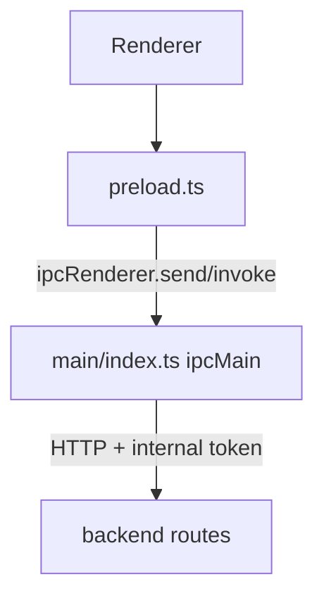

# IPC 协议字典

## 1. Channel 拓扑

## 2. Channel 字典

| Channel | IPC Type | Params | Return Schema | Main Handler Behavior |
|---|---|---|---|---|
| `app:close-window` | `send` | none | none | Closes focused window or main window |
| `i18n:get-locale` | `invoke` | none | `Promise<string>` | Returns current resolved locale |
| `i18n:set-locale` | `invoke` | `locale: string` | `Promise<string>` | Resolves/persists in-memory locale and updates title |
| `app:get-runtime-user-name` | `invoke` | none | `Promise<string>` | Returns OS username fallback chain |
| `app:get-version-info` | `invoke` | none | `Promise<{ appName: string; version: string; buildVersion: string; buildTime: string; commit: string; electron: string; chromium: string; node: string; v8: string; os: string }>` | 为关于页返回应用名称、版本号、构建时间与运行时技术信息 |
| `app:get-pending-launch-working-directory` | `invoke` | none | `Promise<string \| null>` | 返回当前待消费的上下文启动工作目录（来自 CLI 参数） |
| `app:get-database-security-info` | `invoke` | none | `Promise<{ runtimeMode: 'development' \| 'production'; resolverMode: 'development-fixed-key' \| 'safe-storage' \| 'master-password-fallback'; safeStorageAvailable: boolean; databasePath: string; securityConfigPath: string; hasEncryptedDbMasterKey: boolean; hasMasterPasswordHash: boolean; hasMasterPasswordSalt: boolean; hasMasterPasswordEnv: boolean; fallbackReady: boolean }>` | 为设置 → 高级页返回非敏感的数据库加密引导诊断信息 |
| `app:launch-working-directory` | `event (main -> renderer)` | `cwd: string` | none | 当第二实例触发时，向渲染层推送上下文启动工作目录 |
| `app:open-devtools` | `invoke` | none | `Promise<boolean>` | Opens devtools when unpackaged |
| `app:restart-backend-runtime` | `invoke` | none | `Promise<boolean>` | 在开发环境中原位重启 backend 运行时，无需重启整个应用 |
| `app:show-in-file-manager` | `invoke` | `targetPath?: string` | `Promise<boolean>` | Opens file/folder in OS file manager |
| `app:open-external-url` | `invoke` | `targetUrl: string` | `Promise<boolean>` | 使用系统默认浏览器打开受信任的 HTTP(S) 链接 |
| `app:set-windows-system-menu-symbol-color` | `invoke` | `symbolColor: string` | `Promise<boolean>` | 将 token 驱动的 Windows 标题栏系统菜单符号色应用到当前主窗口 overlay |
| `app:import-private-key` | `invoke` | none | `Promise<{ canceled: boolean; content?: string }>` | 调起系统文件选择器并在选择后返回 UTF-8 私钥内容 |
| `backend:test-ping` | `invoke` | none | `Promise<ApiTestPingResponse \| ApiErrorResponse>` | Calls backend health test endpoint |
| `backend:settings-get` | `invoke` | none | `Promise<ApiSettingsGetResponse \| ApiErrorResponse>` | GET 已持久化设置 |
| `backend:settings-update` | `invoke` | `payload: ApiSettingsUpdateRequest` | `Promise<ApiSettingsUpdateResponse \| ApiErrorResponse>` | PUT 设置快照 |
| `backend:ssh-list-servers` | `invoke` | none | `Promise<ApiSshListServersResponse \| ApiErrorResponse>` | GET SSH server list |
| `backend:ssh-create-server` | `invoke` | `payload: ApiSshCreateServerRequest` | `Promise<ApiSshCreateServerResponse \| ApiErrorResponse>` | POST create SSH server |
| `backend:ssh-update-server` | `invoke` | `serverId: string, payload: ApiSshUpdateServerRequest` | `Promise<ApiSshUpdateServerResponse \| ApiErrorResponse>` | PUT update SSH server |
| `backend:ssh-get-server-credentials` | `invoke` | `serverId: string` | `Promise<ApiSshGetServerCredentialsResponse \| ApiErrorResponse>` | GET decrypted credentials |
| `backend:ssh-list-folders` | `invoke` | none | `Promise<ApiSshListFoldersResponse \| ApiErrorResponse>` | GET folder list |
| `backend:ssh-create-folder` | `invoke` | `payload: ApiSshCreateFolderRequest` | `Promise<ApiSshCreateFolderResponse \| ApiErrorResponse>` | POST create folder |
| `backend:ssh-update-folder` | `invoke` | `folderId: string, payload: ApiSshUpdateFolderRequest` | `Promise<ApiSshUpdateFolderResponse \| ApiErrorResponse>` | PUT update folder |
| `backend:ssh-list-tags` | `invoke` | none | `Promise<ApiSshListTagsResponse \| ApiErrorResponse>` | GET tag list |
| `backend:ssh-create-tag` | `invoke` | `payload: ApiSshCreateTagRequest` | `Promise<ApiSshCreateTagResponse \| ApiErrorResponse>` | POST create tag |
| `backend:ssh-create-session` | `invoke` | `payload: ApiSshCreateSessionRequest` | `Promise<ApiSshCreateSessionResponse \| ApiSshCreateSessionHostVerificationRequiredResponse \| ApiErrorResponse>` | POST create SSH shell session |
| `backend:ssh-trust-fingerprint` | `invoke` | `payload: ApiSshTrustFingerprintRequest` | `Promise<ApiSshTrustFingerprintResponse \| ApiErrorResponse>` | POST trust host fingerprint |
| `backend:ssh-close-session` | `invoke` | `sessionId: string` | `Promise<{ success: boolean }>` | DELETE SSH session |
| `backend:ssh-delete-server` | `invoke` | `serverId: string` | `Promise<{ success: boolean }>` | DELETE SSH server |
| `backend:ssh-delete-folder` | `invoke` | `folderId: string` | `Promise<{ success: boolean }>` | DELETE SSH folder |
| `backend:local-terminal-list-profiles` | `invoke` | none | `Promise<ApiLocalTerminalListProfilesResponse \| ApiErrorResponse>` | GET local terminal profile list |
| `backend:local-terminal-create-session` | `invoke` | `payload: ApiLocalTerminalCreateSessionRequest` | `Promise<ApiLocalTerminalCreateSessionResponse \| ApiErrorResponse>` | POST 本地终端会话（Main 可能注入一次性 `cwd` 上下文） |
| `backend:local-terminal-close-session` | `invoke` | `sessionId: string` | `Promise<{ success: boolean }>` | DELETE local terminal session |

## 3. Schema 来源

- API payload 类型来自 `@cosmosh/api-contract`，并由 `packages/api-contract/openapi/cosmosh.openapi.yaml` 生成。
- Backend、Main IPC 代理与 renderer HTTP 调用端必须通过 `@cosmosh/api-contract` 中生成的 `API_PATHS` 及相关合同导出访问 API，不允许硬编码路由字符串。

## 3.1 终端 WebSocket 契约（Renderer ↔ Backend）

终端流式消息虽然不属于 Electron IPC channel，但同样属于跨进程契约面，必须与 IPC 变更一起维护版本一致性。

- 客户端到服务端（`/ws/ssh/{sessionId}` 与 `/ws/local-terminal/{sessionId}`）：
  - `input`、`resize`、`ping`、`close`、`history-delete`
  - `completion-request`，包含 `requestId`、`linePrefix`、`cursorIndex`、可选 `limit`、可选 `fuzzyMatch`、`trigger`（`typing` 或 `manual`）
- 服务端到客户端：
  - `ready`、`output`、`telemetry`、`history`、`pong`、`error`、`exit`
  - `completion-response`，包含 `requestId`、`replacePrefixLength` 与排序后的候选 `items`

当前实现说明：

- 补全消息在 `SshSessionService` 与 `LocalTerminalSessionService` 中处理，输入规范化由 `terminal/shared.ts` 统一，排序引擎由 `terminal/completion/engine.ts` 共享。

## 4. 变更规则

当新增/修改 channel 时，必须在一个变更中同步更新：

1. `packages/main/src/preload.ts`
2. `packages/main/src/index.ts`
3. `packages/renderer/src/vite-env.d.ts`
4. 相关 renderer transport/service 封装
5. 本文件（`docs/zh-CN/developer/core/ipc-protocol.md`）

## 5. Channel 新增模板

新增 channel 时建议按以下清单执行：

1. Channel 命名：`domain:action-name`
2. IPC 类型：`invoke` 或 `send`
3. 参数 schema：在 bridge 与 renderer 声明中显式类型化
4. 返回 schema：成功与错误结构
5. Main 行为：后端代理或本地特权动作
6. 安全说明：token/header 处理、权限边界、暴露范围
7. 文档同步：同一变更集更新中英文协议文档
