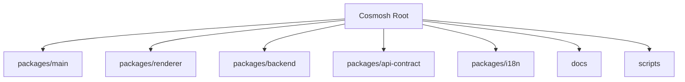
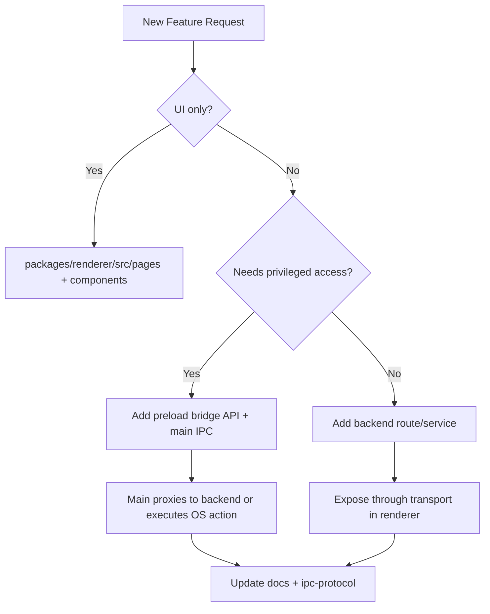

# Cosmosh 项目地图

## 1. Monorepo 布局

## 2. 目录职责

### `packages/main`

- **角色**：Electron 宿主进程。
- **关键文件**：
  - `src/index.ts`：应用启动、窗口配置、IPC 处理器、后端子进程管理。
  - `src/preload.ts`：安全渲染层桥接。
  - `src/security/database-encryption.ts`：数据库路径/密钥处理辅助。

### `packages/renderer`

- **角色**：React UI 层。
- **关键目录**：
  - `src/pages`：功能页面（`Home`、`SSH`、`SSHEditor` 等）。
  - `src/components/ui`：基于 Radix 的原子组件封装与样式契约。
  - `src/lib`：后端传输、i18n、设置启动应用（`app-settings.ts`）与工具抽象。
  - `theme`：生成 CSS Variables 的令牌源。

### `packages/backend`

- **角色**：内部 API + 会话编排运行时。
- **关键目录**：
  - `src/http/routes`：设置、SSH 实体与本地终端动作 REST 路由。
  - `src/ssh`：SSH 认证/会话逻辑（`ssh2`、known-host 信任、遥测）。
  - `src/settings`：设置默认值与请求校验解析。
  - `src/local-terminal`：本地 PTY 会话逻辑（`node-pty`）。
  - `src/db`：Prisma 初始化与数据库生命周期。

### `packages/api-contract`

共享协议常量、请求/响应类型、OpenAPI 源与生成产物。

### `packages/i18n`

main/backend/renderer 作用域共用的语言 JSON 源与运行时 i18n 包。

## 3. 功能落位规则

## 4. 命名与结构指南

- 进程间契约先落在 `api-contract`，再供 backend/main/renderer 消费。
- 渲染层副作用放在 `src/lib`（transport/services），不要直接写在展示组件中。
- 新增 IPC channel 必须通过 preload 暴露，并同步到 `renderer/src/vite-env.d.ts`。
- 对于后端能力：
  - 路由放在 `http/routes/*`
  - 业务/会话逻辑放在独立 service 模块
  - 输入校验采用 `ssh/validation.ts` 风格解析模块。

## 5. 尚未实现（规划中）

- 完整 SFTP 功能模块（后端服务、WebSocket/文件传输协议、renderer 资源管理器页面）。
- 尚无独立 `common` 共享包；当前共享通过 `api-contract` + `i18n` 实现。

## 6. 常见改动场景

### 新增 IPC 动作

1. 需要时先在 `packages/api-contract` 定义或复用契约类型。
2. 在 `packages/main/src/preload.ts` 暴露 bridge API。
3. 在 `packages/main/src/index.ts` 增加 `ipcMain` 处理和后端代理。
4. 在 `packages/renderer/src/lib` 接入 transport 封装。
5. 同步更新 `docs/zh-CN/developer/core/ipc-protocol.md`。

### 新增后端能力

1. 在 `packages/backend/src/http/routes` 新增路由。
2. 在对应领域模块（`ssh`、`local-terminal` 或新模块）新增 service 逻辑。
3. 增加输入边界校验/解析层。
4. 通过 main bridge 暴露给 renderer。
5. 同步架构与运行时文档。
