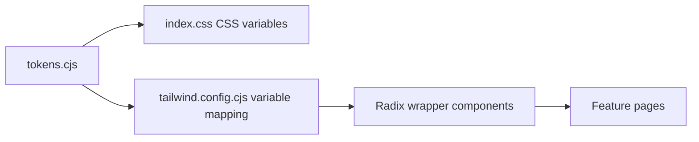
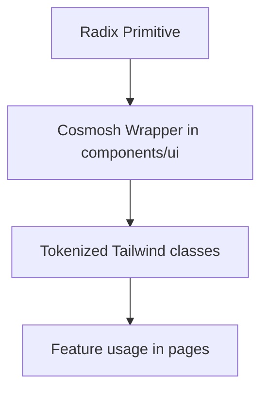

# UI/UX 规范

## 1. 设计系统流水线

规则：

- 主题值来源于 `packages/renderer/theme/tokens.cjs`。
- Tailwind color/radius/shadow 必须映射到 CSS Variables（功能代码中禁止硬编码临时色板）。
- UI 原子组件通过 `packages/renderer/src/components/ui/*` 封装后供页面消费。

## 2. 视觉一致性原则

- 所有视觉原语（颜色、圆角、阴影、模糊、间距）统一由 token 定义。
- 优先复用既有表面与控件样式，避免每个页面新增一次性样式。
- 焦点、悬停、激活、禁用状态需保持清晰可识别。

## 3. 字体规范

- 字体应保持紧凑、可读，并在各类控件和内容区间保持一致。
- 正文与控件字号基线应稳定，避免相邻组件出现突兀跳变。
- 标题、标签、辅助文案、状态信息需要明确层级。

## 4. 圆角逻辑

- 圆角语义在容器与交互控件之间应保持一致逻辑。
- 优先使用 token 级别的圆角预设，避免临时圆角值。
- 圆角选择需与组件用途匹配（容器、控件、浮层）。

## 5. Radix UI 封装原则

实现原则：

- Radix 原语仅通过内部封装使用（`dialog.tsx`、`menubar.tsx`、`toast.tsx` 等）。
- 样式契约集中在独立 style map（`menu-styles.ts`、`form-styles.ts`、`dialog-styles.ts`、`toast-styles.ts`）。
- 可访问性/状态选择器（`data-state`、碰撞处理、键盘语义）放在封装层内部。

## 6. 交互密度规则

- 布局应保持紧凑且可呼吸，优先保证信息扫描效率与高频操作效率。
- 同一功能区域内的控件节奏与间距应保持一致。
- 避免影响可读性和任务聚焦的纯装饰性样式。

## 7. 合规检查清单

合并 UI 变更前：

1. 新颜色/圆角/阴影值必须来自 token 流水线。
2. 新交互原语应为 `components/ui` 下的 Radix 封装。
3. 字体与间距遵循既有系统级比例。
4. 组件行为与状态反馈与现有封装保持一致。
