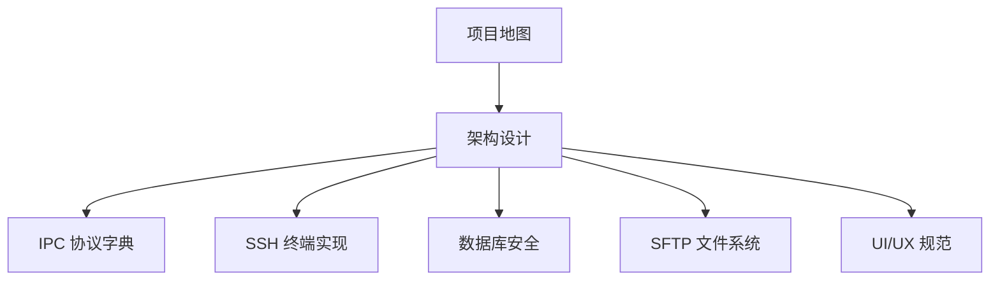

# 开发文档

本节是 Cosmosh 工程实现与治理规范的事实来源。

## 推荐阅读顺序

## 文档分区

- 核心
  - [项目地图](./core/project-map.md)
  - [架构设计](./core/architecture.md)
  - [IPC 协议字典](./core/ipc-protocol.md)
- 运行时能力
  - [SSH 终端实现](./runtime/ssh-terminal.md)
  - [数据库安全](./runtime/database-security.md)
  - [SFTP 文件系统](./runtime/sftp-file-system.md)
- 设计与治理
  - [UI/UX 规范](./design/ui-ux-standards.md)

## 任务导向入口

- 新增运行时能力：先看[项目地图](./core/project-map.md)，再看[架构设计](./core/architecture.md)，最后同步[IPC 协议字典](./core/ipc-protocol.md)。
- 调整 SSH 行为：优先阅读[SSH 终端实现](./runtime/ssh-terminal.md)，并同步协议说明到[IPC 协议字典](./core/ipc-protocol.md)。
- 排查数据库加密启动问题：优先阅读[数据库安全](./runtime/database-security.md)，再结合[架构设计](./core/architecture.md)核对进程职责。
- 调整界面交互：先遵循[UI/UX 规范](./design/ui-ux-standards.md)，再落地页面样式变更。

## 治理参考

- 文档治理与撰写规范集中维护在 `docs/README.md` 与仓库根目录 `AGENTS.md`。
