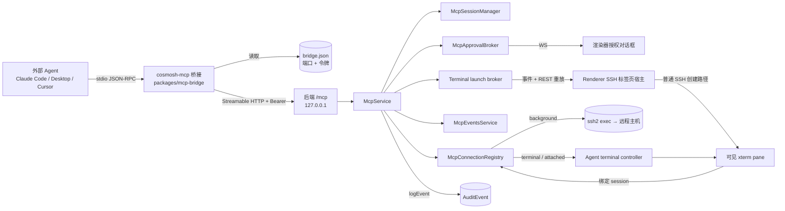

# Cosmosh MCP 服务器

Cosmosh MCP 暴露一个本地 [Model Context Protocol](https://modelcontextprotocol.io/) 服务器，让外部 AI Agent（Claude Code、Claude Desktop、Cursor 等 MCP 客户端）无需在别处重新填写主机或凭据，即可使用用户已在 Cosmosh 中配置好的 SSH 服务器。默认情况下，批准后的 Agent 连接是一个可见且自动聚焦的 Cosmosh SSH 标签页；Agent 也可显式请求隔离后台执行，或请求用户附加现有 SSH pane。该能力默认关闭，每次连接都需人工授权，且全部操作均被审计。

## 1. 产品规则

- 该能力**默认关闭**（`mcpEnabled` 设置，默认 `false`）。
- **打开 SSH 连接始终需要用户在 Cosmosh 窗口中显式授权**，没有旁路。
- `open_connection` 默认使用 `terminal`，创建并聚焦普通 Cosmosh SSH 标签页；`background` 保留隔离的 `ssh2.exec` 自动化；`attach_terminal` 允许用户选择现有合格 SSH pane，且不会向 Agent 暴露 Cosmosh 内部终端标识。
- 共享 PTY 执行只在完整且可信的 Remote Enhancements 命令生命周期上可用。信任缺失、prompt 未就绪、存在未提交用户输入或已有运行中命令时，系统会以稳定 terminal 错误 fail closed，绝不会静默改变 Agent 请求的模式。
- 连接授权绑定到对话框中显示的服务器名称、主机、端口与用户名。Cosmosh 会在 SSH 建连前立即复核该快照；任一字段变化都必须重新提示授权。
- 命令执行由可配置策略约束（`mcpCommandPolicy`，全局默认 `ask`），并支持每服务器覆盖（`SshServer.mcpCommandPolicy`，默认 `default` = 继承全局）：
  - `off` —— 拒绝 Agent 命令。
  - `ask` —— 每条命令都需确认对话框。
  - `allowWithinConnection` —— 连接内首条命令确认一次，用户可放行该连接内的其余命令。
- 每条命令执行前都会读取当前的每服务器策略。编辑服务器会使已有的连接内命令预授权失效。
- 每一次 MCP 操作 —— 客户端会话、授权决定、连接生命周期、每条已执行命令、令牌轮换 —— 都以 `mcp` 类别写入审计日志。参见[本地优先审计事件](./audit-events)。
- 授权请求与用户显式决定采用 fail-closed 审计：只有对应审计事件成功持久化后，Cosmosh 才会显示提示、接受决定或执行远程操作。

## 2. 架构



Agent 从不直接与后端通信。它启动 **`cosmosh-mcp` stdio 桥接**，桥接读取发现文件获取当前的 `{port, token}`，通过环回地址、带 `Bearer` 令牌，将 JSON-RPC 原样转发到后端 `/mcp` Streamable-HTTP 端点。后端 `McpService` 掌管工具面、三模式连接注册表、授权/launch broker 与审计。Renderer 订阅 MCP 事件 WebSocket，通过 REST 重放待处理 launch，并沿用普通 SSH tab/session 路径，因此可见 Agent 终端会继承 system proxy、host trust、Remote Bootstrap、xterm、split pane 与重连行为。

## 3. 后端结构（`packages/backend/src/mcp/`）

| 文件                        | 职责                                                                                                                          |
| --------------------------- | ----------------------------------------------------------------------------------------------------------------------------- |
| `constants.ts`              | 数值边界/超时与标识符（连接上限、超时、字节上限、发现文件名、服务器名、会话头）。                                             |
| `types.ts`                  | 内部运行时类型（`McpClock`、`McpConnectionState`、`McpClientSessionState`、`McpApprovalRecord` 等）与 `systemMcpClock`。      |
| `tools.ts`                  | 注册六个 MCP 工具及其 Zod 入参 schema 与响应整形；定义 `McpToolRuntime`。                                                     |
| `service.ts`                | `McpService` 门面：生命周期/启用门控、配对、授权门、工具运行时实现、审计；`handleRequest`/`validateBearer` 入口。             |
| `pairing.ts`                | `McpPairingService`：加密配对令牌生命周期 + `bridge.json` 发现文件管理。                                                      |
| `sessions.ts`               | `McpSessionManager`：MCP 协议会话、Streamable-HTTP 传输、DNS-rebinding 配置、会话审计/事件。                                  |
| `connection-registry.ts`    | `McpConnectionRegistry`：持有 background client 与可见 terminal attachment、session 归属、idle 计时和按模式关闭/detach 行为。 |
| `connection-capacity.ts`    | 活跃 background/可见连接及进行中 open/launch 共享的原子八连接预算。                                                           |
| `terminal-launch-broker.ts` | 内存态 60 秒 launch、事件发送、REST 重放、幂等 bind、取消与过期。                                                             |
| `approval-broker.ts`        | `McpApprovalBroker`：把授权请求转成 Promise，由决定/超时/拆除来兑现。                                                         |
| `exec.ts`                   | `executeMcpSshCommand`：有界 SSH 命令执行，捕获 stdout/stderr/exit/截断/耗时。                                                |
| `events-service.ts`         | `McpEventsService`：渲染器授权事件 WebSocket 监听器，使用一次性通道令牌。                                                     |

`packages/backend/src/ssh/agent-terminal.ts` 持有可测试的共享 PTY attachment/command 状态机。它消费 `SshSessionService` 提供的可信命令生命周期；MCP runtime 绝不从终端文本推断命令结束。

## 4. 工具

由 `tools.ts` 的 `registerMcpTools()` 注册，边界值定义于 `constants.ts`。

| 工具               | 输入                                                                                                          | 行为                                                                                                                                                                                                                              |
| ------------------ | ------------------------------------------------------------------------------------------------------------- | --------------------------------------------------------------------------------------------------------------------------------------------------------------------------------------------------------------------------------- |
| `list_servers`     | `query?`（字符串，≤200）                                                                                      | 返回 `{ servers, count }`；每项含 `serverId`、`name`、`host`、`port`、`username`、生效的 `commandPolicy`、`folder?`、`tags`、`note?`。绝不返回凭据。只读。                                                                        |
| `open_connection`  | `serverId`（必填）、`reason?`（字符串，≤500）、`mode?`（`terminal` 或 `background`，默认 `terminal`）         | 始终弹出授权提示。`terminal` 请求 renderer 创建并聚焦 SSH tab，再等待其 primary pane bind；`background` 打开隔离 SSH client。返回 `{ connection }` 或 `{ error, message }`。                                                      |
| `attach_terminal`  | `reason?`（字符串，≤500）                                                                                     | 始终弹出授权提示，选择器默认当前合格 SSH pane。Agent 只收到连接摘要，绝不会得到终端列表或内部 id。                                                                                                                                |
| `list_connections` | _（无）_                                                                                                      | 返回该 Agent 活跃连接的 `{ connections, count }`。只读。                                                                                                                                                                          |
| `run_command`      | `connectionId`（必填）、`command`（必填，≤8192 字节）、`timeoutMs?`（≤120000）、`maxOutputBytes?`（≤1048576） | 应用实时命令策略。`background` 返回 `{ mode, stdout, stderr, exitCode, exitSignal, truncated, timedOut, durationMs }`；`terminal`/`attached` 返回 `{ mode, output, exitCode, truncated, timedOut, durationMs, userIntervened }`。 |
| `close_connection` | `connectionId`（必填）                                                                                        | 无需弹窗。关闭 background client、detach attached pane，或关闭 Agent 创建的 terminal tab/session。返回 `{ closed: true, connectionId }`。                                                                                         |

失败原因会以枚举返回而非抛出。连接/open/attach 失败包括 `denied`、`timeout`、`audit-unavailable`、`server-not-found`、`server-changed`、`host-untrusted`、`limit-reached`、`terminal-launch-failed`、`terminal-automation-unavailable`、`terminal-not-ready`、`terminal-busy`、`no-eligible-terminal` 与 `failed`。命令失败另包括 `policy-off`、`connection-not-found`、`command-too-large` 与 `invalid-terminal-command`。

取消 MCP 工具调用会立即撤回其待审批请求。已批准的 `background` open 会把取消信号传递到 SSH bootstrap；调用方停止等待时，待处理的可见 launch 会被取消。共享 PTY 的 `run_command` 被取消或超时时只停止 MCP 等待与输出捕获，不发送 `Ctrl+C`；连接会保持 `busy`，直到收到可信 command end 和下一次 prompt。

`audit-unavailable` 是安全失败，而非临时权限结果。所需授权审计写入失败时，不会放出提示或执行任何远程操作。

`server-changed` 表示持久化的服务器目标已不再匹配授权对话框中显示的目标。Cosmosh 不会尝试 SSH 建连；Agent 必须重新列出服务器并发起新的请求。

后台 `ssh2.exec` 保留 stdout/stderr 分离与既有 transport error 语义。可见命令通过可信 `command-start` 到 `command-end` 的匹配 `commandId` 捕获合并 PTY 输出；用户输入始终可用，并在命令运行时设置 `userIntervened=true`。原始用户输入和命令输出都不会进入审计。

**限制（`constants.ts`）：** 最多 8 个并发连接（`MCP_MAX_CONNECTIONS`）、10 分钟 idle 清理（`MCP_CONNECTION_IDLE_TIMEOUT_MS`）、120 秒授权时效（`MCP_APPROVAL_TIMEOUT_MS`，到期 = 拒绝）、60 秒 terminal launch 时效、命令默认/上限超时 15 秒 / 120 秒、输出默认/上限 256 KiB / 1 MiB、命令上限 8 KiB、45 秒后台 SSH 连接超时。连接上限同时计算活跃 background/可见连接与已原子预留的进行中 open/launch。

## 5. `/mcp` 端点

由 `packages/backend/src/http/routes/mcp.ts` 的 `registerMcpEndpoint()` 注册（`app.all('/mcp', …)`，在 `create-app.ts` 中最后挂载）。请求处理：

1. MCP 未启用 → **503**（`API_CODES.mcpDisabled`）。
2. 缺失/无效的 `Authorization: Bearer <token>` → **401**（`API_CODES.authInvalidToken`）。令牌以恒定时间（`timingSafeEqual`）与活跃配对令牌比较。
3. 其余委托给 `McpService.handleRequest(c.req.raw)`。

会话使用 `WebStandardStreamableHTTPServerTransport`（`sessions.ts`），配置 `sessionIdGenerator: randomUUID`、`enableDnsRebindingProtection: true`，并采用精确的运行时白名单 `127.0.0.1:<httpPort>` 与 `localhost:<httpPort>`。MCP SDK 会比较完整的 `Host` 请求头（包括非默认端口），因此 `McpService` 会把当前后端监听端口传入各会话管理器。这样既保持严格的 DNS rebinding 防护，又只允许 Cosmosh 实际绑定的 loopback 端点。会话 id 承载于 `mcp-session-id` 头。会话仅由 JSON-RPC `initialize` POST 建立；未知会话 id 返回 JSON-RPC `-32001`（HTTP 404），无会话的非 POST 返回 `-32000`（HTTP 400），JSON 解析失败返回 `-32700`（HTTP 400）。`/mcp` 是 JSON-RPC，**刻意不纳入** OpenAPI schema。

## 6. 管理 REST（`/api/v1/mcp/*`）

面向渲染器的管理端点（位于共享内部令牌守卫之后），定义于 `packages/api-contract/src/protocol.ts`，由 `registerMcpManagementRoutes()` 处理：

| 方法 + 路径                                             | 用途                                                                                                                         |
| ------------------------------------------------------- | ---------------------------------------------------------------------------------------------------------------------------- |
| `GET /api/v1/mcp/status`                                | 运行时状态快照 + 发现文件/桥接启动器路径。                                                                                   |
| `POST /api/v1/mcp/pairing-token`                        | 轮换配对令牌；返回 `{ token, createdAt }`（明文仅显示一次）。                                                                |
| `DELETE /api/v1/mcp/pairing-token`                      | 吊销活跃令牌（无令牌则 404）。                                                                                               |
| `GET /api/v1/mcp/clients`                               | 列出活跃协议会话。                                                                                                           |
| `GET /api/v1/mcp/connections`                           | 列出活跃 Agent 连接。                                                                                                        |
| `DELETE /api/v1/mcp/connections/{connectionId}`         | 从 UI 关闭某个连接。                                                                                                         |
| `POST /api/v1/mcp/connections/{connectionId}/detach`    | 撤销可见 attachment，同时保留 SSH tab/session。                                                                              |
| `POST /api/v1/mcp/connections/{connectionId}/interrupt` | 仅当该 attachment 持有运行中 Agent 命令时发送 `Ctrl+C`。                                                                     |
| `GET /api/v1/mcp/approvals`                             | 列出待处理授权提示。                                                                                                         |
| `POST /api/v1/mcp/approvals/{approvalId}/decision`      | 提交决定，并可为 `attach_terminal` 携带仅 renderer 使用的 `terminalSessionId`；若所需审计写入失败，则返回 503 且不解析提示。 |
| `GET /api/v1/mcp/terminal-launches`                     | Renderer 重连后重放全部未过期的可见 tab launch。                                                                             |
| `DELETE /api/v1/mcp/terminal-launches/{launchId}`       | 取消尚未 bind 的 launch。                                                                                                    |
| `POST /api/v1/mcp/terminal-launches/{launchId}/bind`    | 将 ready 的 primary SSH session 恰好一次地绑定到 launch。                                                                    |
| `POST /api/v1/mcp/events-channel`                       | 铸造一次性渲染器 WebSocket 通道（禁用时 503）。                                                                              |

Launch 与 approval id 只属于带鉴权的 renderer/backend 控制面。MCP 响应绝不会暴露 tab id、pane id、SSH terminal session id、WebSocket token 或凭据。

## 7. 配对令牌与发现文件

配对令牌用于桥接对后端的认证。它以**加密形式**（AES-256-GCM，复用 `ssh/crypto.ts`）存于 `McpPairingToken` 模型；v1 仅保留单条活跃行，轮换即吊销上一条。由于后端端口每次启动都会变化，后端会把明文令牌写入桥接每次启动都读取的发现文件。

`McpPairingService.writeDiscoveryFile()` 仅在 MCP 启用期间写入 `<userData>/mcp/bridge.json`（禁用/退出时删除）：

```json
{
  "version": 1,
  "port": 51763,
  "token": "…base64url…",
  "pid": 12345,
  "appVersion": "0.1.0",
  "startedAt": "2026-07-26T12:00:00.000Z"
}
```

`mcp/` 目录以 `0700` 创建，文件以 `0600` 写入（`chmod` 为尽力而为；win32 依赖用户 ACL，与 `secret.key` 一致）。桥接按 `--discovery <path>` → `COSMOSH_MCP_DISCOVERY` → 平台默认 userData 位置的顺序解析路径。

## 8. stdio 桥接（`packages/mcp-bridge`）

一个独立包，由 esbuild 打成单一自包含 CJS 文件（`dist/cosmosh-mcp.cjs`，SDK 内联）：

- `src/discovery.ts` —— 解析 `bridge.json`（纯函数，有单测）。
- `src/proxy.ts` —— 传输层透传：`StdioServerTransport` ↔ `StreamableHTTPClientTransport`，逐条原样转发；外加一次廉价的可达性探测。
- `src/index.ts` —— CLI 入口（`-h`/`--help`、`-v`/`--version`）；当应用未运行、MCP 禁用或令牌失效时，打印单行可操作的 stderr 信息并以 `1` 退出。

**打包。** `packages/main` 的 `prebuild` 会构建桥接并运行 `scripts/sync-mcp-bridge.cjs`，把产物复制到 `packages/main/resources/helpers/mcp-bridge/cosmosh-mcp.cjs`（已 gitignore）。现有的 `resources/helpers → helpers` extraResources 映射会顺带发运它，无需改动 electron-builder。

**启动器。** 打包版启动时，`packages/main/src/mcp-bridge-launcher.ts` 会向 `<userData>/bin/` 写入一个小包装脚本 —— `cosmosh-mcp.cmd`（Windows）或 `cosmosh-mcp`（chmod 0755，macOS/Linux）—— 它以纯 Node 方式在 Electron 二进制下运行该产物（`ELECTRON_RUN_AS_NODE=1 "<exe>" "<cjs>" --discovery "<bridge.json>"`）。解析出的启动器路径通过 `COSMOSH_MCP_BRIDGE_LAUNCHER` 告知后端，并在 `GET /api/v1/mcp/status` 中作为 `bridgeLauncherPath` 暴露，供 MCP 面板生成客户端配置。开发模式下没有打包桥接，故启动器为空操作，面板回退为原始命令指引。

## 9. 客户端配置

由于启动器已固定 `--discovery`，所有客户端共用同一 `mcpServers` 结构。MCP 面板生成可直接粘贴的片段：

```json
{
  "mcpServers": {
    "cosmosh": {
      "command": "<桥接启动器路径>"
    }
  }
}
```

- **Claude Code** —— 添加到项目的 `.mcp.json`（Cursor 使用相同的 `mcpServers` 结构）。
- **Claude Desktop** —— 添加到 `claude_desktop_config.json` 后重启。
- **原始** —— 面向表单式客户端的 `command` / `args` / `env` 字段。

## 10. 审计分类（`category: 'mcp'`）

以 `mcp` 类别写入的动作（`entityType` 取值为 `mcp-session`、`mcp-connection`、`mcp-approval`、`mcp-pairing-token` 之一）：

| 动作                                                 | 触发时机                                                                                          |
| ---------------------------------------------------- | ------------------------------------------------------------------------------------------------- |
| `client-session-started` / `client-session-ended`    | Agent 会话初始化 / 释放。                                                                         |
| `pairing-token-generated` / `pairing-token-revoked`  | 令牌轮换 / 吊销（severity `warning`）。                                                           |
| `authorization-requested` / `authorization-resolved` | 提示被抛出 / 结束（resolved 事件携带 `decision`）。                                               |
| `connection-open`                                    | 每次 `open_connection` 或 `attach_terminal` 的结果，包含 mode 与仅状态类失败上下文。              |
| `connection-close`                                   | 任何连接拆除（tool / ui / idle / shutdown / error / disabled）。                                  |
| `command-execute`                                    | 每次 `run_command`，包含 mode、status、exit code、timeout、truncation 与 user-intervention 标志。 |
| `list-servers`                                       | 每次 `list_servers` 调用。                                                                        |

`authorization-requested` 与用户显式提交的 `authorization-resolved` 决定是同步必需写入。请求审计失败会丢弃尚未暴露的提示；决定审计失败会让提示保持待处理，并阻止等待中的工具调用继续。自动超时/撤回事件及非授权生命周期事件仍沿用本地优先审计服务的尽力而为错误策略。

审计 metadata 绝不包含 PTY 输出或原始用户输入。Agent 命令文本只在授权界面中显示，不会复制到 MCP 审计 metadata。

## 11. 契约、设置与持久化

- **共享类型：** `packages/api-contract/src/mcp.ts` —— 命令策略、`McpConnectionMode`、mode/status 连接摘要、terminal launch、授权与事件 payload；`terminal-protocol.ts` 持有 renderer 安全的 attachment 状态。
- **设置：** 设置注册表中的 `mcpEnabled`（默认 `false`）与 `mcpCommandPolicy`（默认 `ask`），位于 `mcp` 类别（分区 `mcpAccess` / `mcpPolicy`）。
- **持久化：** `SshServer.mcpCommandPolicy String @default("default")` 与 `McpPairingToken` 模型（`tokenEncrypted`、`label`、`createdAt`、`lastUsedAt`、`revokedAt`），迁移 `20260726000100_mcp_pairing_and_policy`。

## 12. 测试与验证

- **单元测试**（`tsx --test`）：backend MCP/SSH suites 覆盖授权与 required-audit fail closed、目标快照校验、共享连接容量、launch 重放/bind/过期、可信自动化门禁、单 attachment/单 command 归属、command-id 输出捕获、UTF-8 截断、用户介入、timeout 恢复、按模式生命周期、配对、background exec、策略解析与协议 session 隔离。Renderer tests 覆盖 terminal surface 合格性/默认选择、launch 去重/聚焦/bind 及关闭与保留语义。
- **手动 E2E：** 验证默认 open 创建并聚焦带 Agent 标记的可见 tab；命令和输出出现在 xterm；用户输入与 `Ctrl+C` 仍可用并设置 `userIntervened`；attach 当前/非当前 pane 均不泄漏内部 terminal id；`background` 不创建 tab 且保持 stdout/stderr 分离；Remote Enhancements 降级时 fail closed；显式 terminal close 会移除 Agent 创建的 tab，而 client 断开会保留并转成普通 tab。检查浅色/深色、单/split pane 与窄窗口布局。

## 已知限制（v1）

- Background 连接不携带 renderer 解析的 `systemProxyRules`；全局 `system` 代理模式可能退化为直连。默认可见 terminal 使用普通 renderer SSH 路径，因此会继承 system proxy 解析。
- 每条 SSH 连接由创建它的 MCP 协议 session 独占；其他 client 无法列出、执行或关闭该连接。
- Owner 断开、token 撤销、MCP 禁用或 idle 清理时，background 连接会关闭；可见 terminal/attached 连接会 detach 并保留用户 SSH tab。
- 共享 PTY 自动化依赖可信 Remote Enhancements，且只支持 SSH pane；本地终端 attachment 不属于 v1。
- 发现文件含明文令牌（用户 ACL 目录 + POSIX `0600`，与 `secret.key` 同一信任边界）；真正的门是授权提示与审计。
- 若没有打开的 Cosmosh 窗口，授权请求只能超时为*拒绝*。
- 单个配对令牌被所有客户端共用；按客户端令牌与主机信任代理为后续工作。
