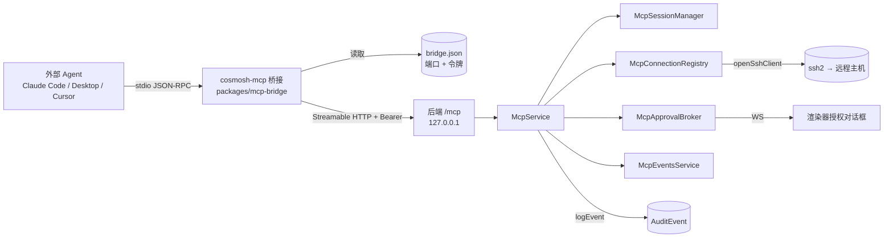

# Cosmosh MCP 服务器

Cosmosh MCP 暴露一个本地 [Model Context Protocol](https://modelcontextprotocol.io/) 服务器，让外部 AI Agent（Claude Code、Claude Desktop、Cursor 等 MCP 客户端）无需在别处重新填写主机或凭据，即可使用用户已在 Cosmosh 中配置好的 SSH 服务器。该能力默认关闭，每次连接都需人工授权，且全部操作均被审计。

## 1. 产品规则

- 该能力**默认关闭**（`mcpEnabled` 设置，默认 `false`）。
- **打开 SSH 连接始终需要用户在 Cosmosh 窗口中显式授权**，没有旁路。
- 连接授权绑定到对话框中显示的服务器名称、主机、端口与用户名。Cosmosh 会在 SSH 建连前立即复核该快照；任一字段变化都必须重新提示授权。
- 命令执行由可配置策略约束（`mcpCommandPolicy`，全局默认 `ask`），并支持每服务器覆盖（`SshServer.mcpCommandPolicy`，默认 `default` = 继承全局）：
  - `off` —— 拒绝 Agent 命令。
  - `ask` —— 每条命令都需确认对话框。
  - `allowWithinConnection` —— 连接内首条命令确认一次，用户可放行该连接内的其余命令。
- 每条命令执行前都会读取当前的每服务器策略。编辑服务器会使已有的连接内命令预授权失效。
- 每一次 MCP 操作 —— 客户端会话、授权决定、连接生命周期、每条已执行命令、令牌轮换 —— 都以 `mcp` 类别写入审计日志。参见[本地优先审计事件](./audit-events)。
- 授权请求与用户显式决定采用 fail-closed 审计：只有对应审计事件成功持久化后，Cosmosh 才会显示提示、接受决定或执行远程操作。

## 2. 架构



Agent 从不直接与后端通信。它启动 **`cosmosh-mcp` stdio 桥接**，桥接读取发现文件获取当前的 `{port, token}`，通过环回地址、带 `Bearer` 令牌，将 JSON-RPC 原样转发到后端 `/mcp` Streamable-HTTP 端点。后端 `McpService` 掌管工具面、SSH 连接注册表、授权 broker 与审计；渲染器订阅一个按会话的 WebSocket 来呈现授权对话框。

## 3. 后端结构（`packages/backend/src/mcp/`）

| 文件 | 职责 |
|---|---|
| `constants.ts` | 数值边界/超时与标识符（连接上限、超时、字节上限、发现文件名、服务器名、会话头）。 |
| `types.ts` | 内部运行时类型（`McpClock`、`McpConnectionState`、`McpClientSessionState`、`McpApprovalRecord` 等）与 `systemMcpClock`。 |
| `tools.ts` | 注册五个 MCP 工具及其 Zod 入参 schema 与响应整形；定义 `McpToolRuntime`。 |
| `service.ts` | `McpService` 门面：生命周期/启用门控、配对、授权门、工具运行时实现、审计；`handleRequest`/`validateBearer` 入口。 |
| `pairing.ts` | `McpPairingService`：加密配对令牌生命周期 + `bridge.json` 发现文件管理。 |
| `sessions.ts` | `McpSessionManager`：MCP 协议会话、Streamable-HTTP 传输、DNS-rebinding 配置、会话审计/事件。 |
| `connection-registry.ts` | `McpConnectionRegistry`：打开/跟踪/关闭 Agent SSH 连接、闲置计时、连接上限约束。 |
| `approval-broker.ts` | `McpApprovalBroker`：把授权请求转成 Promise，由决定/超时/拆除来兑现。 |
| `exec.ts` | `executeMcpSshCommand`：有界 SSH 命令执行，捕获 stdout/stderr/exit/截断/耗时。 |
| `events-service.ts` | `McpEventsService`：渲染器授权事件 WebSocket 监听器，使用一次性通道令牌。 |

## 4. 工具

由 `tools.ts` 的 `registerMcpTools()` 注册，边界值定义于 `constants.ts`。

| 工具 | 输入 | 行为 |
|---|---|---|
| `list_servers` | `query?`（字符串，≤200） | 返回 `{ servers, count }`；每项含 `serverId`、`name`、`host`、`port`、`username`、生效的 `commandPolicy`、`folder?`、`tags`、`note?`。绝不返回凭据。只读。 |
| `open_connection` | `serverId`（必填）、`reason?`（字符串，≤500） | 始终弹出授权提示，随后打开并注册 SSH 连接；返回 `{ connection }`（含 `connectionId`）或 `{ error, message }`。 |
| `list_connections` | *（无）* | 返回该 Agent 活跃连接的 `{ connections, count }`。只读。 |
| `run_command` | `connectionId`（必填）、`command`（必填，≤`MCP_MAX_COMMAND_BYTES` = 8192 字节）、`timeoutMs?`（≤120000）、`maxOutputBytes?`（≤1048576） | 应用命令策略，执行一条有界的非交互命令，返回 `{ stdout, stderr, exitCode, exitSignal, truncated, timedOut, durationMs }` 或 `{ error, message }`。 |
| `close_connection` | `connectionId`（必填） | 关闭并审计连接，无需弹窗。返回 `{ closed: true, connectionId }`。 |

失败原因是枚举返回（而非抛出）：`open_connection` → `denied | timeout | audit-unavailable | server-not-found | server-changed | host-untrusted | limit-reached | failed`；`run_command` → `denied | timeout | audit-unavailable | policy-off | connection-not-found | command-too-large | failed`。

取消 MCP 工具调用会立即撤回其待审批请求。已批准的 `open_connection` 还会把取消信号传递到 SSH 启动过程，避免不再等待结果的客户端留下延迟建立的连接。

`audit-unavailable` 是安全失败，而非临时权限结果。所需授权审计写入失败时，不会放出提示或执行任何远程操作。

`server-changed` 表示持久化的服务器目标已不再匹配授权对话框中显示的目标。Cosmosh 不会尝试 SSH 建连；Agent 必须重新列出服务器并发起新的请求。

**限制（`constants.ts`）：** 最多 8 个并发连接（`MCP_MAX_CONNECTIONS`）、10 分钟闲置关闭（`MCP_CONNECTION_IDLE_TIMEOUT_MS`）、120 秒授权时效（`MCP_APPROVAL_TIMEOUT_MS`，到期 = 拒绝）、命令默认/上限超时 15 秒 / 120 秒、输出默认/上限 256 KiB / 1 MiB、命令上限 8 KiB、45 秒 SSH 连接超时。

## 5. `/mcp` 端点

由 `packages/backend/src/http/routes/mcp.ts` 的 `registerMcpEndpoint()` 注册（`app.all('/mcp', …)`，在 `create-app.ts` 中最后挂载）。请求处理：

1. MCP 未启用 → **503**（`API_CODES.mcpDisabled`）。
2. 缺失/无效的 `Authorization: Bearer <token>` → **401**（`API_CODES.authInvalidToken`）。令牌以恒定时间（`timingSafeEqual`）与活跃配对令牌比较。
3. 其余委托给 `McpService.handleRequest(c.req.raw)`。

会话使用 `WebStandardStreamableHTTPServerTransport`（`sessions.ts`），配置 `sessionIdGenerator: randomUUID`、`enableDnsRebindingProtection: true`，并采用精确的运行时白名单 `127.0.0.1:<httpPort>` 与 `localhost:<httpPort>`。MCP SDK 会比较完整的 `Host` 请求头（包括非默认端口），因此 `McpService` 会把当前后端监听端口传入各会话管理器。这样既保持严格的 DNS rebinding 防护，又只允许 Cosmosh 实际绑定的 loopback 端点。会话 id 承载于 `mcp-session-id` 头。会话仅由 JSON-RPC `initialize` POST 建立；未知会话 id 返回 JSON-RPC `-32001`（HTTP 404），无会话的非 POST 返回 `-32000`（HTTP 400），JSON 解析失败返回 `-32700`（HTTP 400）。`/mcp` 是 JSON-RPC，**刻意不纳入** OpenAPI schema。

## 6. 管理 REST（`/api/v1/mcp/*`）

面向渲染器的管理端点（位于共享内部令牌守卫之后），定义于 `packages/api-contract/src/protocol.ts`，由 `registerMcpManagementRoutes()` 处理：

| 方法 + 路径 | 用途 |
|---|---|
| `GET /api/v1/mcp/status` | 运行时状态快照 + 发现文件/桥接启动器路径。 |
| `POST /api/v1/mcp/pairing-token` | 轮换配对令牌；返回 `{ token, createdAt }`（明文仅显示一次）。 |
| `DELETE /api/v1/mcp/pairing-token` | 吊销活跃令牌（无令牌则 404）。 |
| `GET /api/v1/mcp/clients` | 列出活跃协议会话。 |
| `GET /api/v1/mcp/connections` | 列出活跃 Agent 连接。 |
| `DELETE /api/v1/mcp/connections/{connectionId}` | 从 UI 关闭某个连接。 |
| `GET /api/v1/mcp/approvals` | 列出待处理授权提示。 |
| `POST /api/v1/mcp/approvals/{approvalId}/decision` | 提交决定（`approved` / `approvedForConnection` / `denied`）；若所需审计写入失败，则返回 503 且不解析提示。 |
| `POST /api/v1/mcp/events-channel` | 铸造一次性渲染器 WebSocket 通道（禁用时 503）。 |

## 7. 配对令牌与发现文件

配对令牌用于桥接对后端的认证。它以**加密形式**（AES-256-GCM，复用 `ssh/crypto.ts`）存于 `McpPairingToken` 模型；v1 仅保留单条活跃行，轮换即吊销上一条。由于后端端口每次启动都会变化，后端会把明文令牌写入桥接每次启动都读取的发现文件。

`McpPairingService.writeDiscoveryFile()` 仅在 MCP 启用期间写入 `<userData>/mcp/bridge.json`（禁用/退出时删除）：

```json
{
  "version": 1,
  "port": 51763,
  "token": "…base64url…",
  "pid": 12345,
  "appVersion": "0.1.0",
  "startedAt": "2026-07-26T12:00:00.000Z"
}
```

`mcp/` 目录以 `0700` 创建，文件以 `0600` 写入（`chmod` 为尽力而为；win32 依赖用户 ACL，与 `secret.key` 一致）。桥接按 `--discovery <path>` → `COSMOSH_MCP_DISCOVERY` → 平台默认 userData 位置的顺序解析路径。

## 8. stdio 桥接（`packages/mcp-bridge`）

一个独立包，由 esbuild 打成单一自包含 CJS 文件（`dist/cosmosh-mcp.cjs`，SDK 内联）：

- `src/discovery.ts` —— 解析 `bridge.json`（纯函数，有单测）。
- `src/proxy.ts` —— 传输层透传：`StdioServerTransport` ↔ `StreamableHTTPClientTransport`，逐条原样转发；外加一次廉价的可达性探测。
- `src/index.ts` —— CLI 入口（`-h`/`--help`、`-v`/`--version`）；当应用未运行、MCP 禁用或令牌失效时，打印单行可操作的 stderr 信息并以 `1` 退出。

**打包。** `packages/main` 的 `prebuild` 会构建桥接并运行 `scripts/sync-mcp-bridge.cjs`，把产物复制到 `packages/main/resources/helpers/mcp-bridge/cosmosh-mcp.cjs`（已 gitignore）。现有的 `resources/helpers → helpers` extraResources 映射会顺带发运它，无需改动 electron-builder。

**启动器。** 打包版启动时，`packages/main/src/mcp-bridge-launcher.ts` 会向 `<userData>/bin/` 写入一个小包装脚本 —— `cosmosh-mcp.cmd`（Windows）或 `cosmosh-mcp`（chmod 0755，macOS/Linux）—— 它以纯 Node 方式在 Electron 二进制下运行该产物（`ELECTRON_RUN_AS_NODE=1 "<exe>" "<cjs>" --discovery "<bridge.json>"`）。解析出的启动器路径通过 `COSMOSH_MCP_BRIDGE_LAUNCHER` 告知后端，并在 `GET /api/v1/mcp/status` 中作为 `bridgeLauncherPath` 暴露，供 MCP 面板生成客户端配置。开发模式下没有打包桥接，故启动器为空操作，面板回退为原始命令指引。

## 9. 客户端配置

由于启动器已固定 `--discovery`，所有客户端共用同一 `mcpServers` 结构。MCP 面板生成可直接粘贴的片段：

```json
{
  "mcpServers": {
    "cosmosh": {
      "command": "<桥接启动器路径>"
    }
  }
}
```

- **Claude Code** —— 添加到项目的 `.mcp.json`（Cursor 使用相同的 `mcpServers` 结构）。
- **Claude Desktop** —— 添加到 `claude_desktop_config.json` 后重启。
- **原始** —— 面向表单式客户端的 `command` / `args` / `env` 字段。

## 10. 审计分类（`category: 'mcp'`）

以 `mcp` 类别写入的动作（`entityType` 取值为 `mcp-session`、`mcp-connection`、`mcp-approval`、`mcp-pairing-token` 之一）：

| 动作 | 触发时机 |
|---|---|
| `client-session-started` / `client-session-ended` | Agent 会话初始化 / 释放。 |
| `pairing-token-generated` / `pairing-token-revoked` | 令牌轮换 / 吊销（severity `warning`）。 |
| `authorization-requested` / `authorization-resolved` | 提示被抛出 / 结束（resolved 事件携带 `decision`）。 |
| `connection-open` | 每次 `open_connection` 结果（成功或失败：limit-reached / host-untrusted / open-failed）。 |
| `connection-close` | 任何连接拆除（tool / ui / idle / shutdown / error / disabled）。 |
| `command-execute` | 每次 `run_command`（成功，或失败：policy-off / denied / timeout / superseded）。 |
| `list-servers` | 每次 `list_servers` 调用。 |

`authorization-requested` 与用户显式提交的 `authorization-resolved` 决定是同步必需写入。请求审计失败会丢弃尚未暴露的提示；决定审计失败会让提示保持待处理，并阻止等待中的工具调用继续。自动超时/撤回事件及非授权生命周期事件仍沿用本地优先审计服务的尽力而为错误策略。

## 11. 契约、设置与持久化

- **共享类型：** `packages/api-contract/src/mcp.ts` —— `McpCommandPolicy`（`off | ask | allowWithinConnection`，默认 `ask`）、`McpServerCommandPolicy`（新增 `default`，即每服务器默认值）、`resolveEffectiveMcpCommandPolicy`，以及授权/事件负载。
- **设置：** 设置注册表中的 `mcpEnabled`（默认 `false`）与 `mcpCommandPolicy`（默认 `ask`），位于 `mcp` 类别（分区 `mcpAccess` / `mcpPolicy`）。
- **持久化：** `SshServer.mcpCommandPolicy String @default("default")` 与 `McpPairingToken` 模型（`tokenEncrypted`、`label`、`createdAt`、`lastUsedAt`、`revokedAt`），迁移 `20260726000100_mcp_pairing_and_policy`。

## 12. 测试与验证

- **单元测试**（`tsx --test`）：后端 `test:mcp` 覆盖授权 broker（超时 → 拒绝、只解析一次、shutdown 全拒）、fail-closed 授权请求/决定审计、已授权目标快照校验、实时每服务器策略刷新与预授权撤销、配对（轮换吊销旧令牌、恒定时间比较、发现文件权限）、有界 exec（stdout/stderr/exit/截断）、策略矩阵（`off`/`ask`/`allowWithinConnection` × 全局/每服务器覆盖），以及使用精确 loopback Host 与动态端口建立会话、同时拒绝白名单之外 Host 的初始化场景。`@cosmosh/mcp-bridge` 包测试发现解析、可达性探测与透传。
- **手动 E2E：** 在开发模式启用 MCP，确认启用时创建 `bridge.json`、禁用/退出时删除；用 `npx @modelcontextprotocol/inspector` 直连 `/mcp`（错令牌 → 401、禁用 → 503）；用生成的 `.mcp.json` 接入 Claude Code，走一遍 列出 → 打开（先拒后批）→ 各策略下执行 → `allowWithinConnection` 升级 → 闲置超时，并在审计页逐事件核对；退出应用后确认桥接打印清晰报错；轮换令牌后确认在线桥接的下次请求失败。

## 已知限制（v1）

- MCP 打开的连接不携带渲染器解析的 `systemProxyRules`；全局 `system` 代理模式可能退化为直连。
- 每条 SSH 连接由创建它的 MCP 协议会话独占。其他客户端无法列出、执行或关闭该连接，所有者会话断开时会关闭其连接。
- 发现文件含明文令牌（用户 ACL 目录 + POSIX `0600`，与 `secret.key` 同一信任边界）；真正的门是授权提示与审计。
- 若没有打开的 Cosmosh 窗口，授权请求只能超时为*拒绝*。
- 单个配对令牌被所有客户端共用；按客户端令牌与主机信任代理为后续工作。
