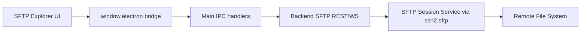
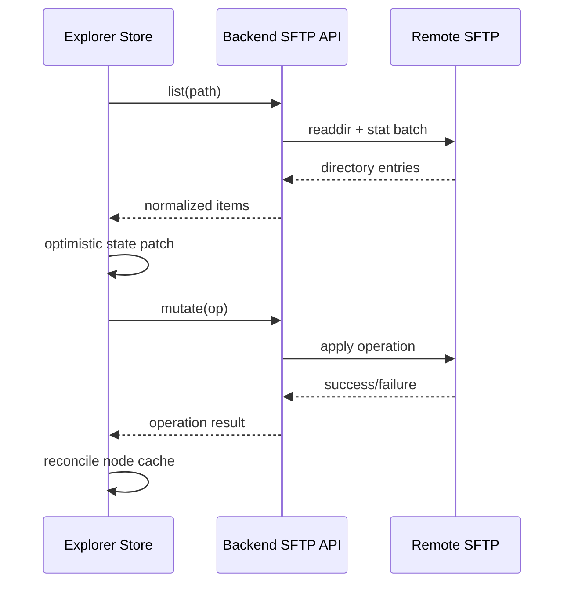

# SFTP 文件系统

## 1. 当前状态

SFTP 文件系统运行时在当前 backend/main/renderer 路径中**尚未实现**。

当前已具备的线索：

- API contract 在协议级 metadata 中已包含 `sftp` 能力。
- Renderer Home 页面已有禁用态 SFTP 右键菜单占位入口。
- 尚无 backend SFTP route/service，也没有专用 renderer SFTP page/session。

## 2. 规划架构（设计基线）

### 规划分层

- **Renderer**：虚拟化文件浏览器 + 传输队列 UI。
- **Main**：仅作为 IPC 契约边界（与 SSH 模式一致）。
- **Backend**：
  - 以 `sessionId` 为键的会话注册表。
  - SFTP 操作 API（list、stat、mkdir、rename、delete、upload、download）。
  - 面向大文件的流式传输。

## 3. 前端状态同步策略（规划中）

推荐同步模型：

- 使用归一化绝对路径作为 key 维护规范化树缓存。
- 对 rename/create/delete 采用 optimistic mutation，失败回滚。
- 变更后重新验证父目录。

## 4. 大文件传输策略（规划中）

- 采用 stream/chunk pipeline，避免整文件缓冲。
- 使用 `{ bytesTransferred, totalBytes, speed, eta }` 跟踪进度。
- 支持单任务取消与全局并发上限（例如 2-4 个并行任务）。
- 持久化传输任务元数据，支持 renderer 重载后恢复队列 UI。

## 5. 递归目录遍历策略（规划中）

- 使用迭代队列（BFS/DFS）替代深递归，避免栈压力。
- 周期性上报进度快照：
  - 已扫描目录数
  - 文件数
  - 聚合大小
- 增加操作保护：
  - 跳过符号链接循环
  - 可配置隐藏文件策略
  - 硬超时与最大节点限制。

## 6. 错误模型（规划中）

- 错误分类：
  - 认证/会话错误
  - 权限不足
  - 路径不存在/冲突
  - 瞬时网络错误。
- 将 backend 错误映射为稳定的 UI 可见错误码，支持一致重试策略。

## 7. 交付检查清单

在 UI 菜单启用 SFTP 前：

1. 完成 backend SFTP service + route contracts。
2. 完成 main preload 与 IPC channels。
3. 完成 renderer SFTP page/session 接线。
4. 在同一变更中更新 `docs/zh-CN/developer/core/ipc-protocol.md` 与 `docs/zh-CN/developer/core/architecture.md`。
