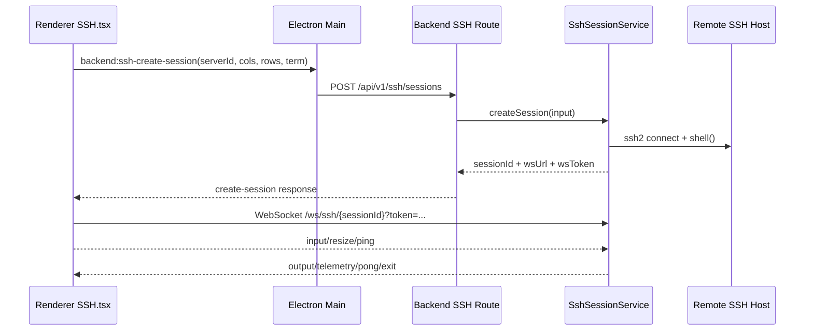
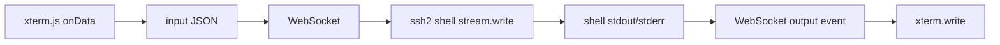

# SSH 终端实现

## 1. 集成概览（`ssh2` + `xterm.js`）

Cosmosh 终端链路分为控制面与数据面：

- **控制面**：Renderer 通过 Main 的 IPC bridge 调用后端创建会话。
- **数据面**：Renderer 直接连接后端 WebSocket 会话端点，传输终端 I/O 流。

## 2. 后端会话生命周期

### 创建会话

- 路由：`POST /api/v1/ssh/sessions`
- 服务：`SshSessionService.createSession`
- 步骤：
  1. 读取 server 记录与加密凭据。
  2. 解析可信主机指纹。
  3. 通过 `ssh2.Client.shell` 打开 SSH shell。
  4. 在内存中注册会话状态（`Map<sessionId, SshLiveSession>`）。
  5. 返回短期 attach token 与 WS 端点。

### 附加 WebSocket

- 路径：`/ws/ssh/{sessionId}?token=...`
- 非法路径/token/session 直接拒绝（`1008`）。
- 若已有附加 socket，将被替换（`1012`），保持单活连接。
- 会话 attach 前输出会缓存，ready 后统一回放。

### 关闭会话

- API 驱动关闭：`DELETE /api/v1/ssh/sessions/{sessionId}`
- 传输驱动关闭：socket close/error、SSH stream close、SSH client error。
- 释放行为：发送 terminal `exit` 事件，清理遥测定时器，关闭 SSH stream/client，关闭 WS。

## 3. 数据流协议

### Client → Server

- `input`：UTF-8 字符串形式的终端输入字节。
- `resize`：带边界归一化的 cols/rows。
- `ping`：心跳。
- `close`：显式断开请求。

### Server → Client

- `ready`：附加确认。
- `output`：shell stdout/stderr 输出。
- `telemetry`：CPU/内存/网络 + 命令历史快照。
- `pong`：ping 响应。
- `error`：协议/运行时错误。
- `exit`：会话关闭与原因。

## 4. 主机校验与信任流程

- SSH 连接使用 `hostHash: 'sha256'` 与 `hostVerifier`。
- 若指纹未知：
  - backend 返回 `SSH_HOST_UNTRUSTED` 载荷。
  - renderer 打开信任确认弹窗。
  - 用户确认后调用 trust endpoint。
  - renderer 重试 create-session。

## 5. 异常处理与重连

### 当前行为（已实现）

- attach 超时：30 秒。
- 任意 socket close/error 都会让 UI 进入失败状态。
- 重试为 **手动**（`SSH.tsx` 的 retry 按钮），本质是创建新会话。
- 当前尚未实现自动指数退避重连。

### 推荐下一步（规划中）

- 仅针对临时性 WS 传输故障加入有界自动重连。
- 对主机校验失败/认证失败保持不可重试终态。

## 6. 当前代码中的性能策略

- Renderer 使用 `FitAddon` + resize observer 保持终端尺寸同步。
- Backend 对终端尺寸做归一化限制（`20-400 cols`、`10-200 rows`）。
- 通过 pending output queue 避免 attach 前早期输出丢失。
- 遥测采用 5 秒定时采样 + 轻量文本解析，降低帧级开销。
- 命令捕获使用有界输入缓冲（每活动行 512 字符）。

## 7. 开发排查清单

当 SSH 会话行为异常时，按以下顺序检查：

1. 会话创建 API 的入参与校验路径。
2. 主机校验分支（`SSH_HOST_UNTRUSTED` 与直接建连分支）。
3. WS attach token 与 sessionId 是否匹配。
4. 数据流方向是否完整（`input` 写入与 `output` 回放）。
5. 会话释放路径是否正确（API close、传输关闭或 SSH 错误触发）。
