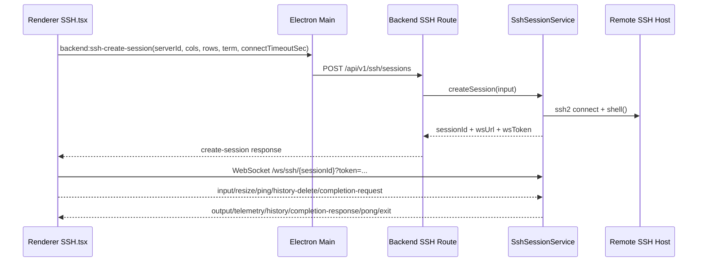
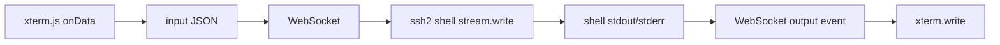

# SSH 终端实现

## 1. 集成概览（`ssh2` + `xterm.js`）

Cosmosh 终端链路分为控制面与数据面：

- **控制面**：Renderer 通过 Main 的 IPC bridge 调用后端创建会话。
- **数据面**：Renderer 直接连接后端 WebSocket 会话端点，传输终端 I/O 流。

## 2. 后端会话生命周期

### 创建会话

- 路由：`POST /api/v1/ssh/sessions`
- 服务：`SshSessionService.createSession`
- 请求字段：
  - `cols` / `rows`：终端视口尺寸。
  - `connectTimeoutSec`：来自设置项 `sshConnectionTimeoutSec` 的会话级 SSH 握手超时。
- 步骤：
  1. 读取 server 记录与加密凭据。
  2. 解析可信主机指纹。
  3. 通过 `ssh2.Client.shell` 打开 SSH shell。
  4. 写入 `SshLoginAudit` 记录：
     - 会话创建成功时写入 `result = success`，并记录 `sessionId` 与 `sessionStartedAt`。
     - 主机信任/认证/连接失败时写入 `result = failed`，并记录 `failureReason`。
  5. 在内存中注册会话状态（`Map<sessionId, SshLiveSession>`）。
  6. 返回短期 attach token 与 WS 端点。

### 附加 WebSocket

- 路径：`/ws/ssh/{sessionId}?token=...`
- 非法路径/token/session 直接拒绝（`1008`）。
- 若已有附加 socket，将被替换（`1012`），保持单活连接。
- 会话 attach 前输出会缓存，ready 后统一回放。

### 关闭会话

- API 驱动关闭：`DELETE /api/v1/ssh/sessions/{sessionId}`
- 传输驱动关闭：socket close/error、SSH stream close、SSH client error。
- 释放行为：发送 terminal `exit` 事件，清理遥测定时器，关闭 SSH stream/client，关闭 WS。
- 审计收尾：回写对应 `SshLoginAudit` 的 `sessionEndedAt` 与 `commandCount`。

## 2.1 连接审计与最近使用排序

- 服务列表中的 `lastLoginAudit` 映射为最近一次**成功连接**（`result = success`）。
- 这样“按上次使用排序”将基于真实成功连接，而不是失败尝试。
- 失败连接仍会写入 `SshLoginAudit`，用于后续日志查询/审计能力。

## 3. 数据流协议

### Client → Server

- `input`：UTF-8 字符串形式的终端输入字节。
- `resize`：带边界归一化的 cols/rows。
- `ping`：心跳。
- `close`：显式断开请求。
- `history-delete`：请求后端删除远端 shell 历史中的选中命令。
- `completion-request`：基于当前命令前缀与光标位置请求排序后的补全候选。

### Server → Client

- `ready`：附加确认。
- `output`：shell stdout/stderr 输出。
- `telemetry`：CPU/内存/网络 + 命令历史快照。
- `history`：仅历史快照推送，用于即时 UI 同步。
- `completion-response`：当前命令 token 的排序补全候选。
- `pong`：ping 响应。
- `error`：协议/运行时错误。
- `exit`：会话关闭与原因。

### 3.1 History 同步模型

- 后端命令历史来源于远端 history 探测与 shell 历史解析结果。
- 每次 SSH 会话建立后，后端都会执行远端 history 探测并解析为标准化命令列表。
- 远端历史来源按兼容顺序探测（shell 内建 + 常见历史文件），覆盖 Bash/Zsh/Fish/Ksh/Ash 等格式，并在可用时兼容 PowerShell PSReadLine 历史。
- 运行时 REPL 专用历史（例如 `.node_repl_history`）会被排除，不作为 shell 命令历史聚合来源。
- 当渲染层发送的 `input` 包含提交字符（`\r` / `\n`）时，后端会以“延迟 + 节流”策略触发 history 刷新，避免过度抓取。
- history 与 telemetry 解耦：telemetry 仍为定时采样，history 可通过 `history` 事件即时推送。
- `SSH.tsx` 的删除操作会发送 `history-delete`，后端会以 best-effort 方式清理远端历史文件后再执行同步。

### 3.2 自动补全模型

- 渲染层会在输入过程中以短延迟去抖触发 `completion-request`，并在用户手动按下 `Tab` 时主动立即触发一次。
- 后端补全引擎由 SSH 与本地终端会话服务共享，候选来源合并为：
  - 当前会话实时输入流提取的交互命令（历史信号，按会话隔离），
  - 同步得到的 shell 历史快照会合并进补全历史缓存，保证在会话初期也能提供历史补全，
  - 来自 inshellisense/Fig 资源的命令元数据（规范信号，按完整命令路径索引生成，而非仅根命令子集），
  - 在同一排序流水线中组合的运行时 provider（路径补全 provider 与交互式密钥提示 provider）。
- `packages/backend/scripts/generate-inshellisense.mjs` 会生成规范数据与按语言策略处理的补全说明资源：
  - `packages/backend/src/terminal/completion/generated-inshellisense.ts` 仅保留命令结构与 `descriptionI18nKey`（不再冗余内嵌原始英文说明文本）。
  - `packages/i18n/locales/en/backend-inshellisense.json` 会根据上游说明全量重建。
  - `packages/i18n/locales/zh-CN/backend-inshellisense.json` 仅保留“英文源文本未变化”的手工翻译键；新键不会自动回填，英文源变化或删除时会自动清理对应中文键。
- backend 作用域 i18n 会将 `backend-inshellisense.json` 合并到 `backend.json`，从而支持补全说明翻译，同时保持基础 backend 语料与生成语料分离。
- 生成器会清理 LS/PS Unicode 分隔符（`U+2028`/`U+2029`），避免生成 TypeScript 文件触发异常行终止符警告。
- 当前排序策略：
  - 先做命令路径感知匹配（例如 `git push -` 优先解析 `git push` 规范，再回退到根命令 `git`），
  - 前缀匹配优先，其次可选模糊子序列匹配，
  - 内置命令规范候选优先于通用 history 命中，
  - history 候选会在命令结构相关前提下按“距离最近一次执行的距离”动态加权。
- 候选展示为完整命令路径（例如 `git push --force`）。
- 选项解析具备参数语义感知：
  - 支持多选项连续组合输入且保持命令上下文稳定，
  - 对已知“需要参数值”的选项（来自 Fig `args` 元数据）可返回参数值候选，
  - 同一条命令中已使用的选项会被降噪过滤，减少重复干扰。
- 路径补全采用 provider 化并结合命令上下文：
  - 内置路径规则当前覆盖 `cd`（仅目录）、`cat`、`vim`，以及命令位的直接路径前缀（`./`、`../`、`/`、`~`），
  - 相对路径的部分输入（例如 `cd ../../c`）会基于会话跟踪的工作目录解析，并按“前缀优先、包含回退”匹配排序，
  - 当当前 token 以 `-` 开头时，优先保留参数/参数值补全，当前 token 的路径 provider 会被门控关闭。
- 交互式密钥提示检测基于输出流：
  - 后端会跟踪近期输出尾部并检测常见提示（`sudo` 密码、`su`/通用密码提示、密钥口令提示），
  - 当提示处于激活状态且会话存在可复用密钥时，补全会返回运行时 `secret` 动作项（`填充密码`）实现一步填充。
- 接受补全时仅替换光标前的当前 token 片段（`replacePrefixLength`），不会清空整行命令，因此可稳定支持多参数连续组合输入。
- `completion-response` 返回 `replacePrefixLength` 与候选项（`label`、`insertText`、`detail`、`source`、`kind`、`score`）。
- `detail` 会在后端会话服务发送响应前完成本地化，回退顺序为：翻译后的 `detailI18nKey` → 本地化来源标签（`历史记录` / `命令规范` / 运行时标签，如 `目录`、`文件`、`填充密码`）。
- 候选可见时的键盘规则：
  - `ArrowUp/ArrowDown` 切换当前候选，并由补全导航独占消费，
  - `Tab` 接受当前候选，
  - `Escape` 关闭候选面板，
  - `Enter` 仍保持 shell 提交语义。
- 候选面板布局约束：
  - 面板锚点会在终端可视区域内进行夹取，
  - 面板宽度会适度扩大以容纳高信息密度说明，并保持视口夹取，
  - 面板内容区使用最大高度与纵向滚动（`max-h`）保证长候选列表可完整访问，
  - 长命令与说明文本使用截断，避免横向溢出。

## 4. 主机校验与信任流程

- SSH 连接使用 `hostHash: 'sha256'` 与 `hostVerifier`。
- 若指纹未知：
  - backend 返回 `SSH_HOST_UNTRUSTED` 载荷。
  - renderer 打开信任确认弹窗。
  - 用户确认后调用 trust endpoint。
  - renderer 重试 create-session。

## 5. 异常处理与重连

### 当前行为（已实现）

- attach 超时：30 秒。
- 任意 socket close/error 都会让 UI 进入失败状态。
- 重试为 **手动**（`SSH.tsx` 的 retry 按钮），本质是创建新会话。
- 当前尚未实现自动指数退避重连。

### 推荐下一步（规划中）

- 仅针对临时性 WS 传输故障加入有界自动重连。
- 对主机校验失败/认证失败保持不可重试终态。

## 6. 当前代码中的性能策略

- Renderer 在初始化 SSH 终端时，将设置项 `sshMaxRows` 绑定到 xterm `scrollback`。
- Renderer 使用 `FitAddon` + resize observer 保持终端尺寸同步。
- Backend 对终端尺寸做归一化限制（`20-400 cols`、`10-200 rows`）。
- 通过 pending output queue 避免 attach 前早期输出丢失。
- 遥测采用 5 秒定时采样 + 轻量文本解析，降低帧级开销。
- history 刷新使用防抖 + 节流策略，平衡实时性与远端执行开销。

## 6.1 渲染层可配置的 xterm 选项（设置驱动）

渲染层现在会在 `SSH.tsx` 初始化 `Terminal` 时，将设置项映射到 `ITerminalOptions`，用于控制终端运行时行为。

- **主题 / SSH 样式**：
  - `altClickMovesCursor`、`cursorBlink`
  - `fontFamily`、`fontSize`
- **主题 / 高级样式**：
  - `cursorInactiveStyle`、`cursorStyle`、可选 `cursorWidth`
  - `customGlyphs`、`fontWeight`、`fontWeightBold`、`letterSpacing`、`lineHeight`
- **终端 / 高级终端配置**：
  - `drawBoldTextInBrightColors`
  - `scrollSensitivity`、`fastScrollSensitivity`、`minimumContrastRatio`
  - `screenReaderMode`、`scrollOnUserInput`、`smoothScrollDuration`、`tabStopWidth`

说明：

- 对可选数值（如 `cursorWidth`）采用防御式解析；为空或不合法时回退到 xterm 默认行为。
- 原有 `sshMaxRows` 仍保持映射到 xterm `scrollback`。

## 6.2 终端分屏交互模型

- 渲染层在 `SSH.tsx` 中提供受限分屏序列：
  1. 单终端，
  2. 左右双栏，
  3. 横向三栏，
  4. 最右侧终端再纵向拆分为上下两栏。
- 分屏入口在终端右键菜单（`拆分终端`），关闭入口同样在右键菜单（`关闭终端`）。
- 当前实现最多同时展示 4 个终端窗格。
- 每个分屏窗格会针对同一已解析目标（同一 SSH 服务器/本地 profile）独立创建后端终端会话，从而支持独立输入输出。
- 新增分屏窗格从空白视口启动，仅接入并展示该窗格自己的会话流，避免来自其他窗格的陈旧缓冲内容串入。
- 关闭窗格会释放该窗格自身 session/socket，其他窗格会继续运行。
- 补全弹层锚点必须始终基于当前激活窗格容器计算，主窗格容器 ref 在重渲染时不能覆盖镜像窗格的激活几何信息。

## 7. 开发排查清单

当 SSH 会话行为异常时，按以下顺序检查：

1. 会话创建 API 的入参与校验路径。
2. 主机校验分支（`SSH_HOST_UNTRUSTED` 与直接建连分支）。
3. WS attach token 与 sessionId 是否匹配。
4. 数据流方向是否完整（`input` 写入与 `output` 回放）。
5. 会话释放路径是否正确（API close、传输关闭或 SSH 错误触发）。

## 8. Windows 右键启动与本地终端工作目录

- 安装器集成选项可在资源管理器右键菜单注册“在 Cosmosh 中打开终端”。
- 安装器会写入 shell verb 元数据（`MUIVerb`、图标）以兼容资源管理器右键菜单解析路径。
- 资源管理器通过 `--working-directory <path>` 启动 Cosmosh。
- 启用终端启动应用注册时，安装器还会生成 `%LOCALAPPDATA%\Microsoft\WindowsApps\cosmosh.cmd` 作为稳定 CLI 启动 shim。
- Main 进程解析该参数并保存为一次性启动上下文。
- 渲染层如何处理该上下文由设置项 `terminalContextLaunchBehavior` 控制：
  - `openDefaultLocalTerminal`：自动打开 SSH 页签并使用默认本地终端配置。
  - `openLocalTerminalList`：打开 Home 并聚焦到本地终端列表。
  - `off`：忽略上下文启动自动跳转。
- 当选择 `openDefaultLocalTerminal` 时，会优先使用设置项 `defaultLocalTerminalProfile`（`auto` 或来自当前本地终端列表的具体 profile id），若不可用则回退到首个可用配置。
- 若 Cosmosh 已在运行，`second-instance` 会通过 IPC 事件把启动上下文推送到渲染层。
- `second-instance` 在解析上下文时会同时使用 CLI 参数与 Electron 提供的 `workingDirectory` 兜底，降低仅聚焦不触发新终端的情况。
- 在下一次创建本地终端会话（`POST /api/v1/local-terminals/sessions`）时，Main 会透传一次 `cwd`。
- Backend 会校验 `cwd`，若路径不可用则回退到 `os.homedir()`。

## 9. macOS CLI 启动与本地终端工作目录

- 在 macOS 打包版本中，Main 会准备用户级启动脚本：`~/Library/Application Support/Cosmosh/bin/cosmosh`。
- 该脚本以 `--working-directory "$PWD"` 启动应用，因此会继承当前终端目录作为启动上下文。
- Main 会尝试在常见 PATH 目录（`/opt/homebrew/bin`、`/usr/local/bin`）创建到该脚本的符号链接；若无权限不会导致应用启动失败。
- 若因权限限制无法创建符号链接，应用会继续启动并在日志给出提示，用户可手动将脚本目录加入 PATH 或自行创建符号链接。
- 启动后上下文处理链路与 Windows 一致：Main 解析待消费 cwd，并在下一次本地终端会话创建时透传。
